# Chatnation Analytics — Architecture & Deployment Guide

> A comprehensive document covering system architecture, solutions architecture, database design, and deployment for the Kra Analytics Platform.

---

## Table of Contents

1. [System Architecture](#1-system-architecture)
2. [Solutions Architecture](#2-solutions-architecture)
3. [Database Design](#3-database-design)
4. [Deployment](#4-deployment)

---

## 1. System Architecture

### 1.1 Overview

The Analytics Platform is a high-performance event collection and analytics system built for **Kra** (Kenya Revenue Authority). It collects, processes, stores, and visualises user behavioural data from **web** and **WhatsApp** channels. The system treats fragmented interactions—from messaging interfaces to embedded web environments—as a single, continuous session.

### 1.2 System Context Diagram

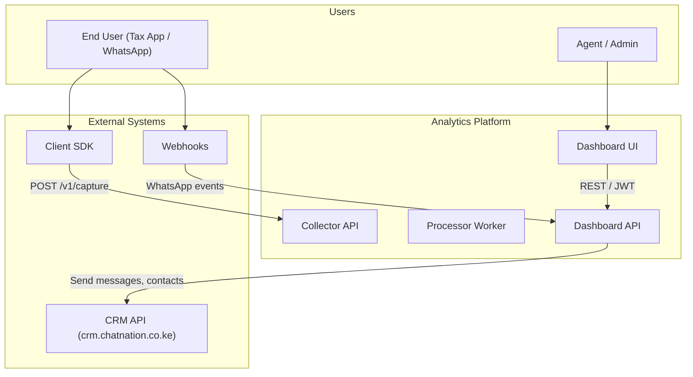

### 1.3 High-Level Data Flow (Mermaid)

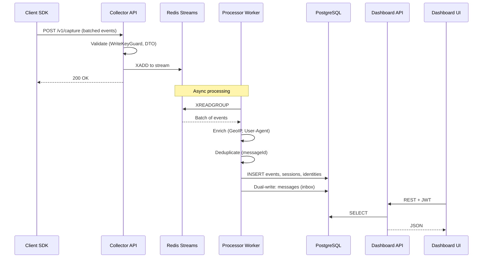

### 1.4 Component Architecture

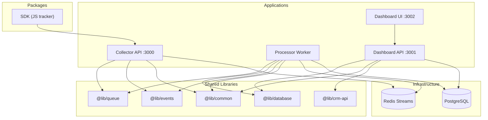

| Component | Location | Port | Purpose |
|-----------|----------|------|---------|
| **Collector API** | `apps/collector/` | 3000 | Ingest events, validate (WriteKeyGuard), queue to Redis Streams. Uses Fastify. |
| **Processor Worker** | `apps/processor/` | N/A | Consume Redis, enrich (GeoIP/UA), dedupe, write to PostgreSQL. Dual-writes to events + messages. |
| **Dashboard API** | `apps/dashboard-api/` | 3001 | NestJS REST API: analytics, auth, agent inbox, teams, settings, CRM integrations. |
| **Dashboard UI** | `packages/dashboard-ui/` | 3002 (dev) / 3000 (Docker) | Next.js 14 (App Router), shadcn/ui, Recharts. |
| **SDK** | `packages/sdk/` | N/A | JavaScript tracker: batching, offline support, identify/session. |

### 1.5 Full Project Structure

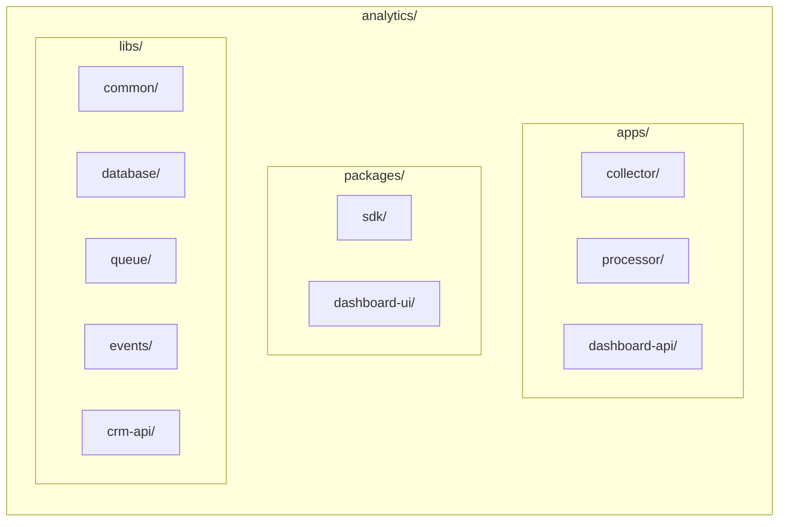

### 1.6 Collector Service (Detail)

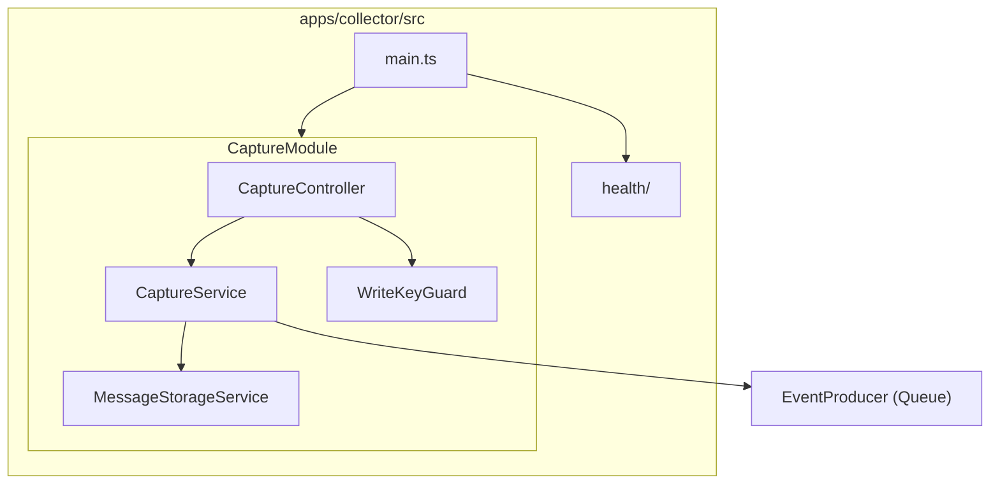

| Endpoint | Method | Auth | Purpose |
|----------|--------|------|---------|
| `POST /v1/capture` | POST | X-Write-Key | Batch event ingestion |
| `GET /v1/health` | GET | None | Health check |

### 1.7 Processor Service (Detail)

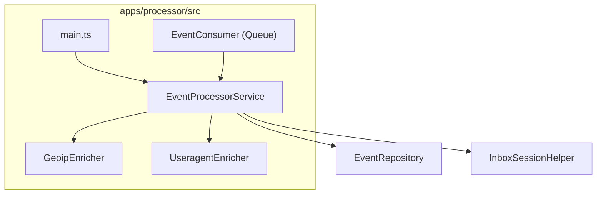

**Pipeline:** Consume batch → deduplicate (messageId) → enrich (GeoIP, UA) → saveBatch(events) → processSessions → syncToAgentSystem (messages) → processCsatEvents.

### 1.8 Dashboard API — Module Map

```mermaid
flowchart TB
    subgraph DashboardAPI["Dashboard API Modules"]
        Auth["AuthModule"]
        Tenants["TenantsModule"]
        ApiKeys["ApiKeysModule"]
        CrmInt["CrmIntegrationsModule"]
        Overview["OverviewModule"]
        Funnel["FunnelModule"]
        Sessions["SessionsModule"]
        Events["EventsModule"]
        Whatsapp["WhatsappModule"]
        WhatsappAnalytics["WhatsappAnalyticsModule"]
        AiAnalytics["AiAnalyticsModule"]
        AgentSystem["AgentSystemModule"]
        Trends["TrendsModule"]
        Journeys["JourneysModule"]
        AgentInboxAnalytics["AgentInboxAnalyticsModule"]
        CsatAnalytics["CsatAnalyticsModule"]
        DangerZone["DangerZoneModule"]
        Audit["AuditModule"]
        Media["MediaModule"]
        Email["EmailModule"]
    end

    subgraph Endpoints["Key API Paths"]
        Auth --> |"/auth/*"| AuthE["signup, login, me"]
        Tenants --> |"/tenants/*"| TenantsE["current, invitations"]
        Overview --> |"/overview"| OverviewE["KPIs"]
        Funnel --> |"/funnel"| FunnelE["Journey funnels"]
        Sessions --> |"/sessions"| SessionsE["Session list"]
        Events --> |"/events"| EventsE["Event stream"]
        WhatsappAnalytics --> |"/whatsapp-analytics/*"| WaE["WhatsApp stats"]
        AiAnalytics --> |"/ai-analytics/*"| AiE["AI metrics"]
        AgentSystem --> |"/agent/*"| AgentE["inbox, teams, contacts"]
        CsatAnalytics --> |"/csat-analytics/*"| CsatE["CSAT reports"]
        Audit --> |"/audit-logs"| AuditE["Audit trail"]
        Media --> |"/media/*"| MediaE["upload, serve"]
    end
```

| Module | Purpose |
|--------|---------|
| **AuthModule** | Signup, login, JWT, 2FA, password reset |
| **TenantsModule** | Tenants, invitations, navigation labels |
| **ApiKeysModule** | SDK write keys (admin) |
| **CrmIntegrationsModule** | CRM connections (WhatsApp API) |
| **OverviewModule** | Dashboard KPIs (sessions, users, conversion) |
| **FunnelModule** | Journey funnel analysis |
| **SessionsModule** | Session list and detail |
| **EventsModule** | Event stream by session |
| **WhatsappModule** | WhatsApp webhooks, handover |
| **WhatsappAnalyticsModule** | WhatsApp volume, heatmap, agents |
| **AiAnalyticsModule** | AI intent, latency, errors |
| **AgentSystemModule** | Inbox, teams, contacts, assignment |
| **TrendsModule** | Analytics trends over time |
| **JourneysModule** | Self-serve vs assisted journeys |
| **AgentInboxAnalyticsModule** | Agent inbox metrics |
| **CsatAnalyticsModule** | CSAT scores and distribution |
| **DangerZoneModule** | Tenant deletion |
| **AuditModule** | Audit log query |
| **MediaModule** | File upload, serve (agent attachments) |
| **EmailModule** | Resend (invites, password reset) |

### 1.9 Dashboard UI — Page Structure

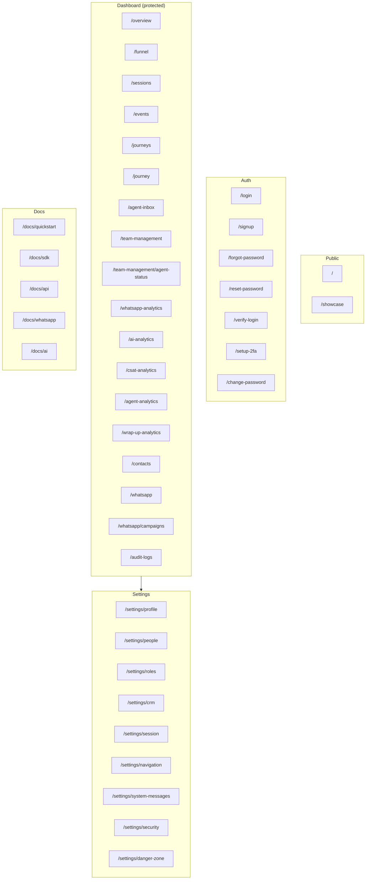

### 1.10 Shared Libraries (`libs/`)

| Library | Purpose |
|---------|---------|
| `@lib/common` | WriteKeyGuard, RateLimitGuard, ValidationPipe, HttpExceptionFilter, ResponseInterceptor, LoggingInterceptor |
| `@lib/database` | TypeORM entities, repositories (Event, Session, Identity, Project, Tenant, etc.), InboxSessionHelper |
| `@lib/queue` | EventProducer, EventConsumer, QueueModule (Redis Streams) |
| `@lib/events` | CaptureBatchDto, CaptureEventDto, event type helpers |
| `@lib/crm-api` | CRM client (contacts, campaigns, send message) |

### 1.11 Technology Stack

| Layer | Technology |
|-------|------------|
| Runtime | Node.js 20+ |
| Collector | NestJS 11, Fastify adapter |
| Dashboard API | NestJS 11, Express adapter |
| Frontend | Next.js 14 (App Router), React 18 |
| Database | PostgreSQL 15 (TypeORM) |
| Queue | Redis 7 (Streams) |
| Auth | JWT, bcrypt, Passport, HttpOnly cookies (BFF proxy) |
| UI | shadcn/ui, Tailwind, Recharts, Zustand, React Query |

### 1.12 Agent System Architecture

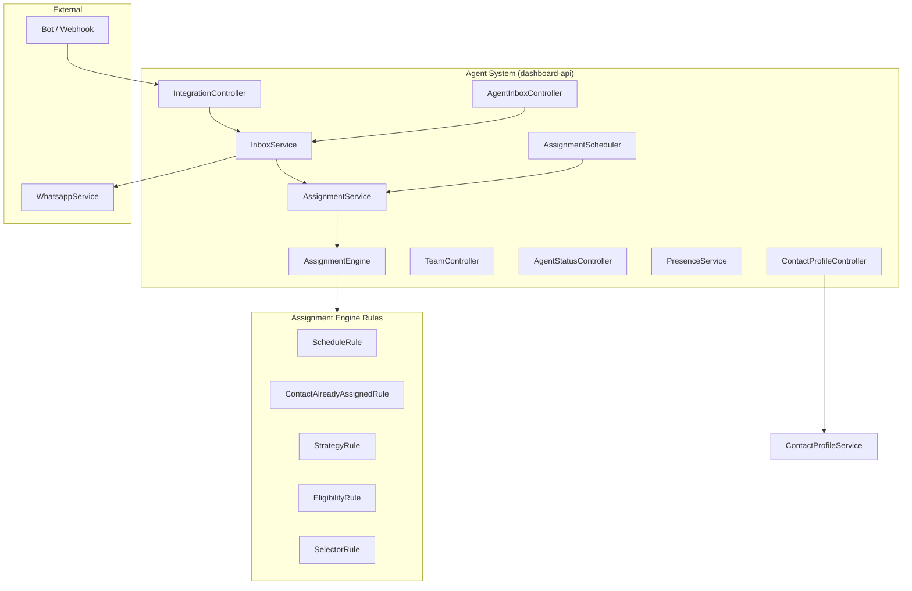

- **Inbox**: Session list, send message, accept, resolve, transfer, presence.
- **Assignment Engine**: ScheduleRule → ContactAlreadyAssignedRule → StrategyRule → EligibilityRule → SelectorRule.
- **Strategies**: round_robin, least_active, least_assigned, hybrid, manual.

---

## 2. Solutions Architecture

### 2.1 Domain Context

The platform serves **Kra** (Kenya Revenue Authority) with:

- **Kra Tax App**: MRI (Monthly Rental Income), TOT (Turnover Tax), NIL filing journeys.
- **CRM Integration**: WhatsApp and contact analytics via `crm.chatnation.co.ke`.
- **Event-based analytics**: Webhooks feed data into the Collector; CRM API used only for operational tasks (sending messages, managing contacts).

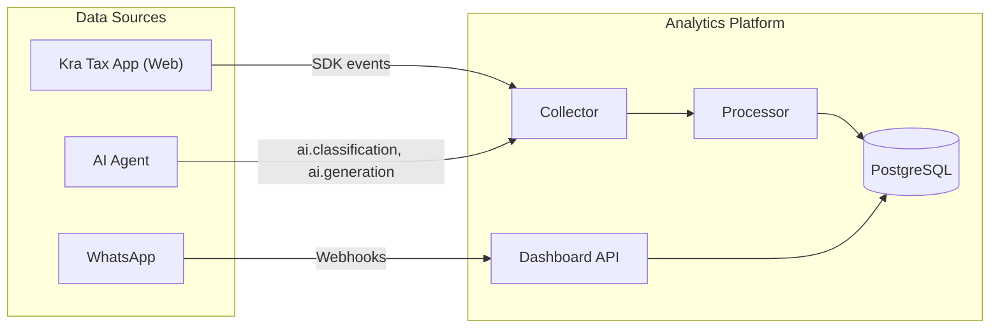

### 2.2 Identity & Session Model

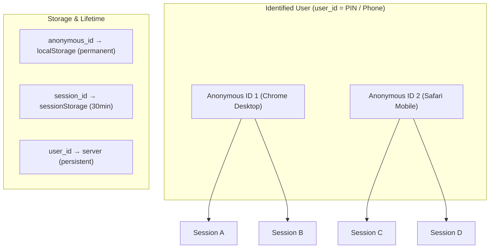

| ID Type | Storage | Lifetime | Source |
|---------|---------|----------|--------|
| `anonymous_id` | localStorage | Permanent (until cleared) | SDK |
| `session_id` | sessionStorage | 30-min inactivity timeout | SDK |
| `user_id` | Server-side | Persistent | `identify()` call |
| `external_id` | — | — | WhatsApp phone ID |
| `handshake_token` | — | — | Cross-channel identity link (Web ↔ WhatsApp) |

### 2.3 Event Lifecycle (End-to-End)

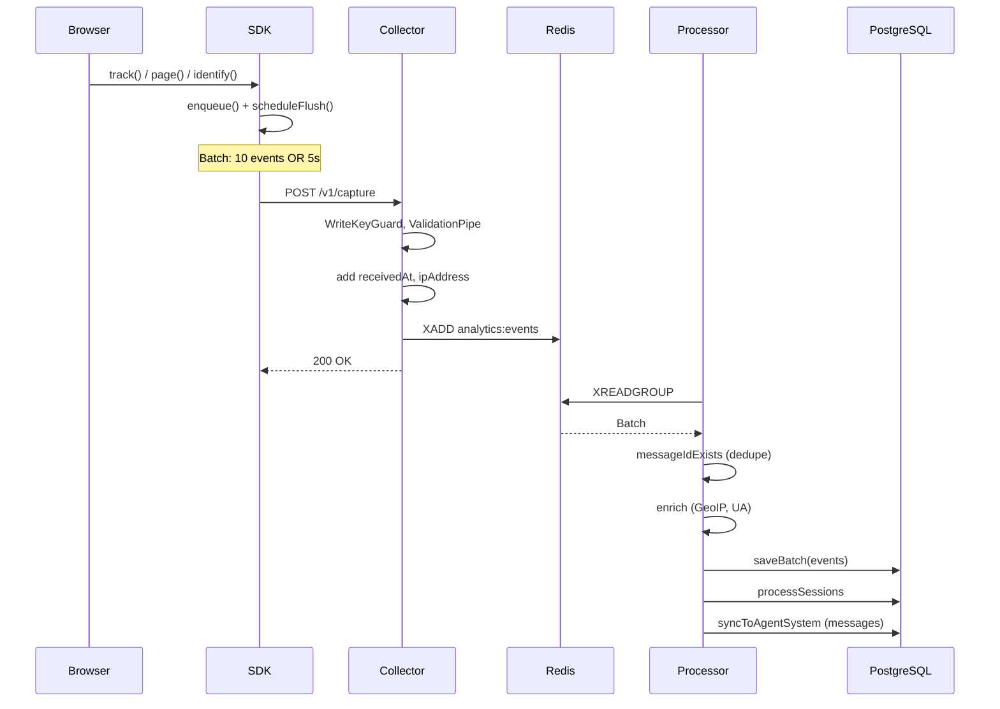

### 2.4 Data Flow by Channel

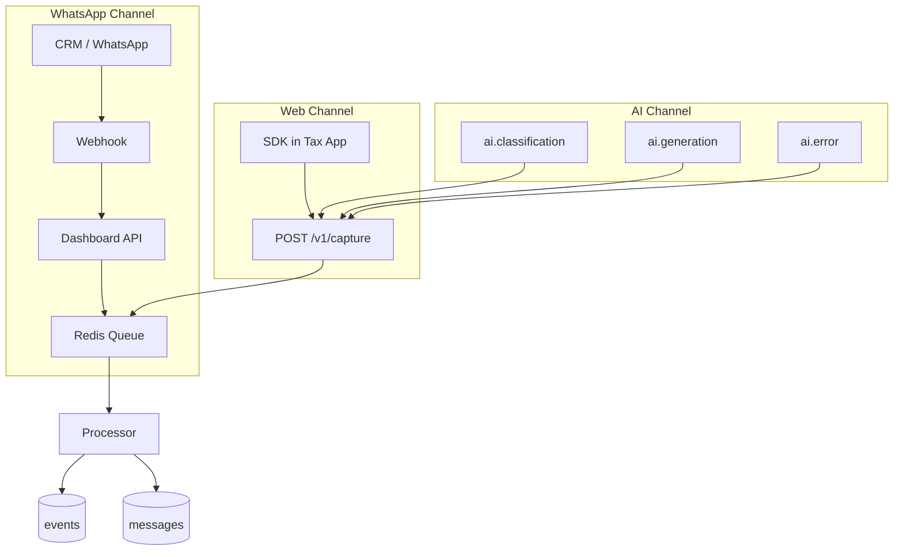

### 2.5 Key Tax App Journeys (Funnels)

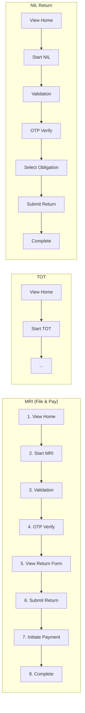

**Journey A: File & Pay (MRI)** — 1. View Home → 2. Start MRI → 3. Validation → 4. OTP Verify → 5. View Return Form → 6. Submit Return → 7. Initiate Payment → 8. Complete

**Journey B: TOT** — Same steps as MRI with TOT-specific flows.

**Journey C: NIL Return** — 1. View Home → 2. Start NIL → 3. Validation → 4. OTP Verify → 5. Select Obligation → 6. Submit Return → 7. Complete

### 2.6 Custom Events Dictionary (Tax App)

| Event Name | Trigger | Key Properties |
|------------|---------|----------------|
| `page_view` | Route change | path, referrer, title |
| `button_click` | Button tracking | label, id, page_location |
| `validation_success` | PIN/ID validated | obligation_type |
| `otp_success` | OTP verified | method (whatsapp/sms) |
| `filing_started` | Lands on return form | obligation_type |
| `return_filed` | Filing API success | receipt_number, obligation, amount |
| `payment_initiated` | Pay clicked | amount, prn |
| `app_error` | Error boundary / API error | error_code, message |

### 2.7 WhatsApp & Agent Flow

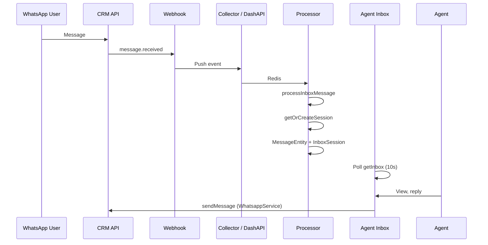

### 2.8 Bot Handover Flow

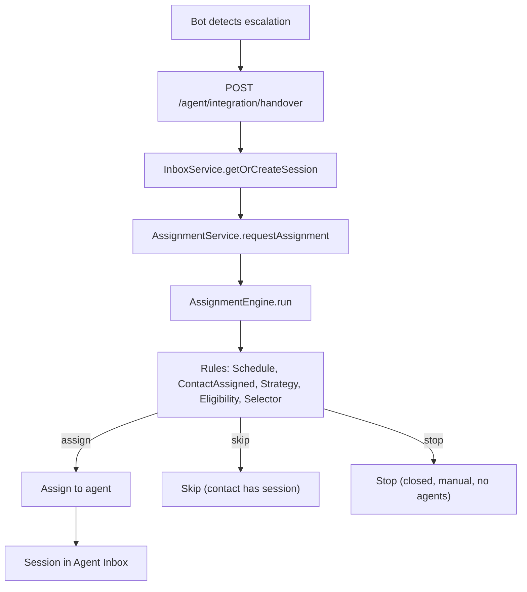

### 2.9 RBAC (Role-Based Access Control)

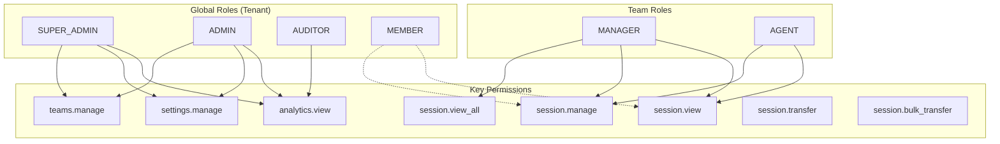

| Global Role | Capabilities |
|-------------|--------------|
| **SUPER_ADMIN** | Full access: billing, settings, teams, analytics |
| **ADMIN** | Manage settings, teams; view analytics |
| **AUDITOR** | Read-only analytics and logs |
| **MEMBER** | Limited global visibility; team-scoped access |

| Team Role | Capabilities |
|-----------|--------------|
| **MANAGER** | Manage team, view all team sessions |
| **AGENT** | View and respond to assigned sessions |

### 2.10 Authentication Flow (HttpOnly Cookie)

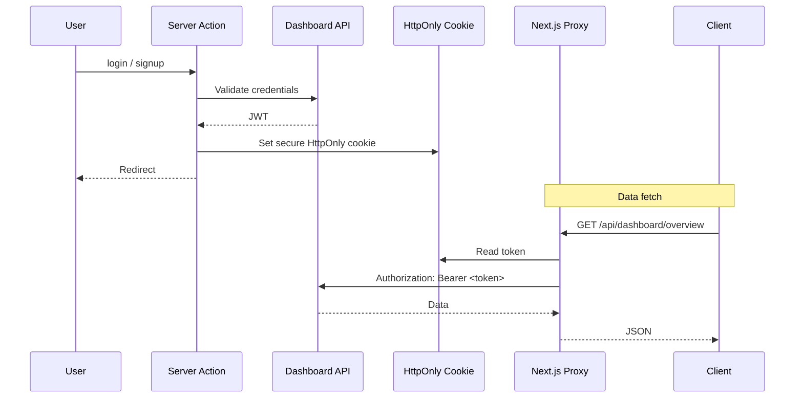

- **BFF pattern**: Next.js API route (`app/api/[...path]/route.ts`) reads HttpOnly cookie and injects `Authorization: Bearer` header before proxying to Dashboard API.
- **No localStorage**: Tokens never exposed to client JS (XSS-safe).

### 2.11 Event Strategy

| Source | Method | Examples |
|-------|--------|----------|
| **Client-side** | SDK (track, page, identify) | Route changes, clicks, form submits |
| **Server-side** | Server Actions | return_filed, payment_success (reliable) |
| **WhatsApp** | Webhooks → Collector | message.received, message.sent |
| **AI** | Events to Collector | ai.classification, ai.generation, ai.error |
| **Privacy** | PII masking | Phone normalised (digits only), PIN hashed where needed |

### 2.12 Multi-Tenancy

- **Deployment mode**: `whitelabel` for Kra (single tenant; signup enabled only for initial bootstrap when no tenants exist).
- **Tenant model**: Organisation with members, projects, CRM integrations, API keys.
- **Data isolation**: All queries filter by `tenantId`.

---

## 3. Database Design

### 3.1 Technology

- **Database**: PostgreSQL 15
- **ORM**: TypeORM
- **Migrations**: TypeORM migrations in `libs/database/src/migrations/`
- **Schema**: Managed via entities; `synchronize: false` in production.

### 3.2 Entity Relationship Overview

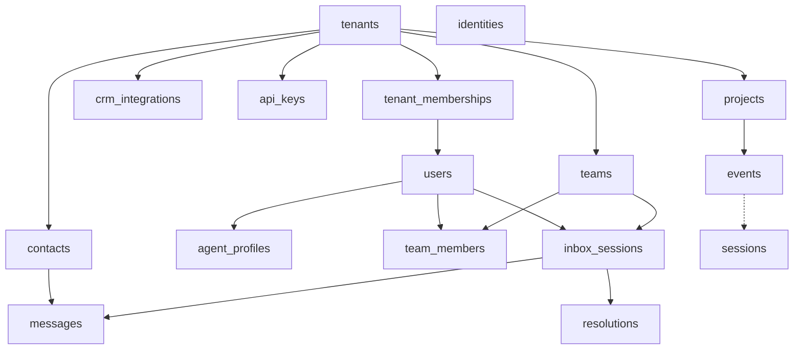

### 3.3 Core Analytics Tables

#### `events`

Primary event storage. Every tracked action becomes a row.

| Column | Type | Description |
|--------|------|-------------|
| eventId | uuid (PK) | Unique event identifier |
| messageId | uuid (unique) | Deduplication key |
| tenantId | varchar(50) | Tenant for multi-tenancy |
| projectId | varchar(50) | Project within tenant |
| eventName | varchar(100) | e.g. page_view, button_click, return_filed |
| eventType | varchar(20) | page, track, identify |
| timestamp | timestamptz | Client-side event time |
| receivedAt | timestamptz | Server receipt time |
| anonymousId | varchar(100) | Device/browser ID |
| userId | varchar(100) | Nullable; set after identification |
| sessionId | varchar(100) | Session grouping |
| channelType | varchar(20) | web, whatsapp, mobile |
| externalId | varchar(100) | e.g. WhatsApp phone number |
| handshakeToken | varchar(100) | Cross-channel identity link |
| pagePath, pageUrl, pageTitle, pageReferrer | varchar/text | Page context |
| userAgent, deviceType, osName, osVersion, browserName, browserVersion | varchar/text | Device (enriched) |
| ipAddress | inet | Client IP |
| countryCode, city | varchar | Geo (enriched) |
| properties | jsonb | Event-specific custom data |
| sdkVersion | varchar(20) | SDK version |
| processedAt | timestamptz | When processor finished |

**Indexes:** `(tenantId, timestamp)`, `(sessionId)`, `(eventName, timestamp)`.

#### `sessions`

Session-level aggregates (visit = session).

| Column | Type | Description |
|--------|------|-------------|
| sessionId | uuid (PK) | Session identifier |
| tenantId | varchar(50) | Tenant |
| anonymousId | varchar(100) | Anonymous ID |
| userId | varchar(100) | If identified |
| startedAt, endedAt | timestamptz | Session bounds |
| durationSeconds | int | Computed duration |
| eventCount, pageCount | smallint | Pre-aggregated counts |
| entryPage, referrer | varchar/text | First-touch attribution |
| utmSource, utmMedium, utmCampaign | varchar(100) | UTM params |
| deviceType, countryCode | varchar | Device/geo |
| converted | boolean | Conversion flag |
| conversionEvent | varchar(100) | Which event was conversion |

**Indexes:** `(tenantId, startedAt)`, `(userId)`.

#### `identities`

Links anonymous IDs to known users.

| Column | Type | Description |
|--------|------|-------------|
| id | uuid (PK) | Auto-generated |
| tenantId | varchar(50) | Tenant |
| anonymousId | varchar(100) | Browser/device ID |
| userId | varchar(100) | Logged-in identifier |
| linkedAt | timestamptz | When linked |
| linkSource | varchar(20) | identify, login |
| traits | jsonb | User traits |

**Indexes:** `(tenantId, anonymousId)`, `(tenantId, userId)`.

#### `projects`

Analytics projects within a tenant.

| Column | Type | Description |
|--------|------|-------------|
| projectId | uuid (PK) | Auto-generated |
| tenantId | uuid | FK to tenants |
| name | varchar(100) | Project name |
| writeKey | varchar(100) unique | SDK write key |
| allowedOrigins | text[] | CORS origins |
| settings | jsonb | Project config |
| createdAt, updatedAt | timestamptz | Timestamps |

### 3.4 Multi-Tenancy & Auth Tables

#### `tenants`

| Column | Type | Description |
|--------|------|-------------|
| id | uuid (PK) | Auto-generated |
| slug | varchar unique | URL-friendly ID |
| name | varchar | Organisation name |
| plan | enum | free, starter, pro, enterprise |
| settings | jsonb | Branding, session config, system messages |
| isActive | boolean | Active flag |
| createdAt, updatedAt | timestamptz | Timestamps |

#### `users`

| Column | Type | Description |
|--------|------|-------------|
| id | uuid (PK) | Auto-generated |
| email | varchar unique | Login email |
| passwordHash | varchar | Bcrypt hash |
| name | varchar | Display name |
| emailVerified | boolean | Verification status |
| avatarUrl | varchar | Profile picture |
| lastLoginAt | timestamptz | Last login |
| twoFactorEnabled | boolean | 2FA flag |
| phone | varchar(20) | Phone for 2FA |
| passwordChangedAt | timestamptz | For password expiry |

#### `tenant_memberships`

Composite PK: (userId, tenantId). Links users to tenants with roles.

| Column | Type | Description |
|--------|------|-------------|
| userId | uuid (PK) | FK to users |
| tenantId | uuid (PK) | FK to tenants |
| role | varchar | owner, admin, member |
| isActive | boolean | Active membership |

#### `crm_integrations`

CRM (WhatsApp) connections per tenant.

| Column | Type | Description |
|--------|------|-------------|
| id | uuid (PK) | Auto-generated |
| tenantId | uuid | FK to tenants |
| name | varchar | Friendly name |
| apiUrl | varchar | CRM base URL |
| apiKeyEncrypted | varchar | AES-256-GCM encrypted |
| isActive | boolean | Active status |

#### `api_keys`

SDK write keys for event ingestion.

| Column | Type | Description |
|--------|------|-------------|
| id | uuid (PK) | Auto-generated |
| tenantId | uuid | FK to tenants |
| name | varchar | Key name |
| keyPrefix | varchar | First chars for identification |
| keyHash | varchar | SHA-256 hash (full key shown once) |
| type | varchar | write, read |
| isActive | boolean | Active status |

### 3.5 Agent System Tables

#### `inbox_sessions`

WhatsApp chat sessions for agent inbox.

| Column | Type | Description |
|--------|------|-------------|
| id | uuid (PK) | Auto-generated |
| tenantId | varchar(50) | Tenant |
| contactId | varchar(100) | End-user phone/external ID |
| contactName | varchar(100) | Display name |
| status | enum | unassigned, assigned, resolved |
| channel | varchar | whatsapp |
| assignedAgentId | uuid | FK to users |
| assignedTeamId | uuid | FK to teams |
| assignedAt, acceptedAt | timestamptz | Assignment timestamps |
| lastMessageAt, lastReadAt, lastInboundMessageAt | timestamptz | Activity |
| context | jsonb | Intent, bot handoff data |
| priority | int | Urgency |
| createdAt, updatedAt | timestamptz | Timestamps |

#### `messages`

Individual messages (tied to contact; optional session link).

| Column | Type | Description |
|--------|------|-------------|
| id | uuid (PK) | Auto-generated |
| tenantId | varchar(50) | Tenant |
| contactId | varchar(50) | Contact (primary relationship) |
| sessionId | uuid | Optional; FK to inbox_sessions, SET NULL on delete |
| externalId | varchar | Provider message ID |
| direction | enum | inbound, outbound |
| type | enum | text, image, video, audio, document, location, etc. |
| content | text | Message body |
| metadata | jsonb | Media URLs, captions |
| senderId | uuid | Agent user ID for outbound |
| createdAt | timestamptz | Timestamp |

#### `contacts`

People who have sent at least one message.

| Column | Type | Description |
|--------|------|-------------|
| tenantId | varchar(50) (PK) | Tenant |
| contactId | varchar(100) (PK) | Normalised phone/ID |
| name | varchar(200) | Display name |
| pin, yearOfBirth, email | varchar/int | Profile fields |
| metadata | jsonb | Extra fields |
| firstSeen, lastSeen | timestamptz | Timestamps |
| messageCount | int | Count |
| deactivatedAt | timestamptz | Deactivation |

#### `resolutions`

Resolution records for closed sessions.

| Column | Type | Description |
|--------|------|-------------|
| id | uuid (PK) | Auto-generated |
| sessionId | uuid | FK to inbox_sessions |
| status | varchar | resolved, etc. |
| resolvedBy | uuid | Agent user ID |
| formData | jsonb | Resolution form data |

#### `teams`, `team_members`

Teams for routing; members have team-level roles (manager, agent).

#### `agent_profiles`, `agent_sessions`, `shifts`, `assignment_configs`

Agent availability, sessions, shifts, and assignment configuration.

### 3.6 Supporting Tables

- **invitations**: Pending tenant invitations
- **roles**, **role_permissions**: RBAC role definitions and permissions
- **audit_log**: Audit trail of sensitive actions
- **two_fa_verification**, **password_reset_tokens**: Auth helpers
- **user_sessions**: Active login sessions
- **session_takeover_requests**: Agent takeover requests
- **contact_notes**: Notes on contacts
- **entity_archive**: Soft-delete archive

---

## 4. Deployment

### 4.1 Prerequisites

- Node.js 20+
- Docker and Docker Compose (for containerised deployment)
- PostgreSQL 15
- Redis 7

### 4.2 Environment Variables

Copy `.env.example` to `.env` and configure:

| Variable | Service | Purpose |
|----------|---------|---------|
| `NODE_ENV` | All | development / production |
| `DB_HOST`, `DB_PORT`, `DB_USERNAME`, `DB_PASSWORD`, `DB_DATABASE` | All backend | PostgreSQL connection |
| `REDIS_HOST`, `REDIS_PORT` | Collector, Processor | Redis connection |
| `COLLECTOR_PORT` | Collector | Default 3000 |
| `DASHBOARD_API_PORT` | Dashboard API | Default 3001 |
| `DASHBOARD_UI_PORT` | Dashboard UI | Default 3002 |
| `JWT_SECRET` | Dashboard API | JWT signing (required) |
| `JWT_EXPIRY` | Dashboard API | e.g. 7d |
| `ENCRYPTION_KEY` | Dashboard API | 64 hex chars for API key encryption |
| `DEPLOYMENT_MODE` | Dashboard API | `whitelabel` (Kra) or `saas` |
| `NEXT_PUBLIC_API_URL` | Dashboard UI | Dashboard API base URL for client |
| `SERVER_API_URL` | Dashboard UI | Server-side API URL (Docker) |
| `FRONTEND_URL` | Dashboard API | Base URL for emails, invites |
| `RESEND_API_KEY`, `EMAIL_FROM` | Dashboard API | Email (invites, password reset) |
| `WHATSAPP_ACCESS_TOKEN`, `WHATSAPP_PHONE_NUMBER_ID` | Optional | WhatsApp integration |

**Security note:** Do not use default values for `JWT_SECRET`, `ENCRYPTION_KEY`, or `ADMIN_API_SECRET` in production.

### 4.3 Docker Compose (Local / Staging)

**Start infrastructure and services:**

```bash
# From repo root
cp .env.example .env
# Edit .env with your values

# Start PostgreSQL, Redis, Collector, Processor, Dashboard API, Dashboard UI
npm run docker:up
```

**Services:**

- `postgres` — PostgreSQL 15
- `redis` — Redis 7 with append-only persistence
- `collector` — Collector API (port 3000)
- `processor` — Processor worker
- `dashboard-api` — Dashboard API (port 3001); runs migrations on startup
- `dashboard-ui` — Next.js app (port 3000 in container; map via `DASHBOARD_UI_PORT`)

**Volumes:** `postgres_data`, `redis_data`, `media_uploads` (for agent inbox uploads).

### 4.4 Docker Images

**Root Dockerfile** (multi-stage):

- **collector**: Exposes port 3000; runs `dist/apps/collector/main.js`
- **processor**: Runs `dist/apps/processor/main.js`
- **dashboard-api**: Runs migrations via `scripts/docker-dashboard-api-entrypoint.sh`, then starts API

**Dashboard UI Dockerfile** (`packages/dashboard-ui/Dockerfile`):

- Next.js standalone build
- Exposes port 3000
- Uses `output: "standalone"` in `next.config.ts`

### 4.5 Build & Run (Without Docker)

```bash
# Install dependencies
npm install

# Build all packages
npm run build

# Start infrastructure (Docker)
npm run docker:up
# Or run PostgreSQL and Redis manually

# Run migrations
npm run db:migrate

# Start services (separate terminals or background)
npm run start:collector:dev
npm run start:processor:dev
npm run start:dashboard-api:dev
npm run start:dashboard-ui:dev
```

### 4.5.1 Quick Start (No Source Code / Production)

If you just want to run the application without cloning the repository or building from source, follow these steps.

**1. Create a directory and download the configuration:**

```bash
mkdir analytics-deploy && cd analytics-deploy

# Download docker-compose.yml
curl -O https://raw.githubusercontent.com/chatnationwork/analytics/main/docker-compose.yml

# Download .env.example (rename to .env)
curl -o .env https://raw.githubusercontent.com/chatnationwork/analytics/main/.env.example
```

**2. Configure Environment:**

Edit the `.env` file with your production values (database credentials, JWT secret, etc.).

```bash
nano .env
```

**3. Run the Application:**

Since the images are public on GHCR, Docker will pull them automatically.

```bash
# Pull latest images
docker-compose pull

# Start services in background
docker-compose up -d
```

**Note:** You do not need the source code because the `image` directive in `docker-compose.yml` points to the pre-built images on GitHub Container Registry.

### 4.6 Production Deployment (Kubernetes)

**Suggested layout:**

- **Collector**: Deployment with 3+ replicas, Ingress for `/v1/capture`
- **Processor**: Deployment with 2+ replicas (consumer group)
- **Dashboard API**: Deployment with 2+ replicas
- **Dashboard UI**: Deployment or static hosting (standalone output)
- **PostgreSQL**: Managed service or StatefulSet with persistent volume
- **Redis**: Managed service or Redis Cluster

**Health checks:** Use `/health` on Collector and Dashboard API.

**Migrations:** Run before or during Dashboard API startup (as in Docker entrypoint).

### 4.7 Deployment Checklist

**Pre-deployment:**

- [ ] Environment variables configured (no defaults for secrets)
- [ ] Database migrations applied (`npm run db:migrate`)
- [ ] CORS origins and write keys configured
- [ ] SSL certificates for public endpoints

**Post-deployment verification:**

- [ ] Health endpoints return 200
- [ ] Test event sent to Collector and visible in DB
- [ ] Dashboard loads and shows data
- [ ] Agent inbox and CRM integration work (if used)

### 4.8 Key Scripts

| Script | Description |
|--------|-------------|
| `npm run build` | Build SDK, Collector, Processor, Dashboard API, Dashboard UI |
| `npm run start:dev` | Start Collector, Processor, Dashboard API, Dashboard UI concurrently |
| `npm run docker:up` | Start Docker Compose stack |
| `npm run docker:down` | Stop Docker Compose stack |
| `npm run db:migrate` | Run TypeORM migrations |
| `npm run db:generate` | Generate new migration from entity changes |

---

## Related Documentation

- [docs/architecture/system_overview.md](./architecture/system_overview.md) — System overview
- [docs/architecture/solutions_overview.md](./architecture/solutions_overview.md) — Solutions context
- [docs/guides/deployment.md](./guides/deployment.md) — Detailed deployment guide
- [docs/architecture/multi_tenancy.md](./architecture/multi_tenancy.md) — Auth & multi-tenancy
- [docs/architecture/system_context.md](./architecture/system_context.md) — Master context & doc index
