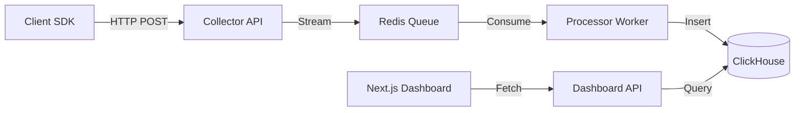

# Analytics System Master Context

> **System Overview**: This document describes the **Analytics Service**, a standalone, high-performance platform collecting and visualizing user behavior data. It is application-agnostic but currently integrated with the **Tax App** and the **CRM System**.

---

## 1. High-Level Architecture

The system follows an event-driven ingestion pipeline designed for high throughput and near real-time analytics.

**Pipeline Flow:**
1.  **SDK/Client**: Captures events (`page_view`, `click`) -> Sends to Collector.
2.  **Collector API**: Validates & pushes raw events to **Redis Streams**.
3.  **Processor Worker**: Dequeues, enriches (GeoIP, UA), and inserts into **ClickHouse**.
4.  **Dashboard API**: Queries ClickHouse for aggregated stats.
5.  **Next.js Dashboard**: Visualizes data via React Query & Recharts.

**Diagram:**

**Key Docs:**
*   [System Architecture](file:///home/saruni/chatnation/analytics/docs/system_architecture.md)
*   [Solutions Architecture](file:///home/saruni/chatnation/analytics/docs/solutions_architecture.md) (Tax App Integration)

---

## 2. Technology Stack

### Backend (NestJS Monorepo)
*   **Framework**: NestJS (Modular, DDD-inspired).
*   **Apps**:
    *   `apps/collector`: Lightweight ingestion API.
    *   `apps/processor`: Background worker for enrichment.
    *   `apps/dashboard-api`: Serving analytics queries.
*   **Database**:
    *   **ClickHouse**: Primary event storage (Columnar, OLAP).
    *   **PostgreSQL**: Metadata config (Projects, API Keys).
    *   **Redis**: Hot queue (Streams).

### Frontend (Next.js)
*   **Framework**: Next.js 14 (App Router).
*   **State**: Zustand (Global filters), React Query (Server state).
*   **UI**: Shadcn/UI + Tailwind CSS.
*   **Charts**: Recharts.

**Key Docs:**
*   [NestJS Architecture](file:///home/saruni/chatnation/analytics/docs/nestjs_architecture.md)
*   [Next.js Dashboard Architecture](file:///home/saruni/chatnation/analytics/docs/nextjs_dashboard_architecture.md)

---

## 3. Data Model & Identity

### 3.1 Identity Resolution
We track users across sessions using a hierarchy:
1.  **Anonymous ID**: UUID in `localStorage` (Device level).
2.  **User ID**: Authenticated ID (PIN/Phone) linked via `identify` call.
3.  **Session ID**: Auto-generated, 30-min timeout.

### 3.2 Event Schema
*   **Standard Fields**: `event_id`, `timestamp`, `event_name`, `anonymous_id`.
*   **Context**: `ip`, `user_agent`, `page_path`, `referrer`.
*   **Properties**: Flexible JSON payload (e.g., `amount`, `obligation_type`).

**Key Docs:**
*   [Data Model](file:///home/saruni/chatnation/analytics/docs/data_model.md)

---

## 4. Integration Points

### 4.1 CRM Integration
A specific subsystem for WhatsApp & Contact analytics.
*   **Master Doc**: [CRM System Context](file:///home/saruni/chatnation/analytics/docs/CRM_SYSTEM_CONTEXT.md)
*   Integrates with `https://crm.chatnation.co.ke`.

### 4.2 Tax App Integration
Tracks user journeys for filing returns.
*   **Funnels**:
    *   **MRI**: File & Pay Monthly Rental Income.
    *   **TOT**: Turnover Tax.
    *   **NIL**: Nil Returns.
*   **Key Events**: `validation_success`, `otp_verified`, `return_filed`.

---

## 5. Deployment & Infrastructure

Designed for **Kubernetes** production deployment with **Docker Compose** for local dev.

**Environment Variables**:
*   `REDIS_URL`: Queue connection.
*   `CLICKHOUSE_HOST`: DB Access.
*   `MAXMIND_LICENSE_KEY`: For GeoIP enrichment.

**Key Docs:**
*   [Deployment Guide](file:///home/saruni/chatnation/analytics/docs/deployment_guide.md)

---

## 6. Testing Strategy

We employ a multi-layer testing approach:
1.  **Unit**: Jest for logic (ID generation, validation).
2.  **Integration**: Supertest for API endpoints (Collector throughput).
3.  **CRM Integration**: Live API verification.
4.  **E2E**: Full journey tracking checks.

**Commands:**
*   `npm test`: Run unit tests.
*   `npm run test:e2e`: Run E2E suite.

**Key Docs:**
*   [Testing Strategy](file:///home/saruni/chatnation/analytics/docs/testing_strategy.md)
