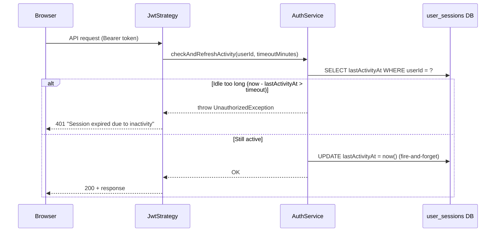

# Server-Side Inactivity Timeout

Enforces automatic session expiry when a user has been idle (no API calls) for longer than the configured threshold. This replaces the old purely client-side approach that relied on `react-idle-timer` and could be bypassed by computer sleep.

## How It Works



Every authenticated request flows through `JwtStrategy.validate()`, which:
1. Validates the JWT and session (existing checks)
2. Reads `lastActivityAt` from `user_sessions`
3. Compares elapsed time against `tenant.settings.session.inactivityTimeoutMinutes`
4. If expired → 401 "Session expired due to inactivity"
5. If active → refreshes `lastActivityAt` (fire-and-forget, no latency impact)

## Architecture

### Two-Layer Defence

| Layer | Purpose | Handles |
|-------|---------|---------|
| **Server (JwtStrategy)** | Source of truth — rejects stale sessions | All cases, including sleep/wake |
| **Client (SessionManager)** | UX convenience — redirects proactively | Normal idle (mouse/keyboard timeout) + sleep/wake via `visibilitychange` |

### Client-Side: SessionManager.tsx

The frontend `SessionManager` uses two mechanisms:

1. **`react-idle-timer`** — Fires `onIdle` when no keyboard/mouse/touch for the configured timeout
2. **`visibilitychange`** listener — When the tab becomes visible (e.g., after waking from sleep), compares `Date.now() - lastActiveRef` against the timeout. If exceeded, forces immediate logout

This ensures the user sees a redirect to `/login?reason=idle` immediately upon waking, rather than waiting for the next API call to trigger a server 401.

### Server-Side: JwtStrategy + AuthService

- **`AuthService.checkAndRefreshActivity(userId, timeoutMinutes)`** — Core logic
- **`UserSessionRepository.touchLastActivity(userId)`** — Single-row UPDATE by PK (negligible overhead)
- **`UserSessionRepository.getLastActivity(userId)`** — Reads the timestamp for comparison

## Configuration

The timeout is configured per-tenant in **Settings → Session Management**:

```json
{
  "settings": {
    "session": {
      "inactivityTimeoutMinutes": 45
    }
  }
}
```

- **Default**: 30 minutes (production), 480 minutes (local dev)
- **Disabled**: If `inactivityTimeoutMinutes` is `0`, `null`, or absent, the server-side check is skipped

## Database

### user_sessions table

| Column | Type | Description |
|--------|------|-------------|
| `userId` | uuid (PK) | One row per user |
| `sessionId` | uuid | Current active session (single-login) |
| `lastActivityAt` | timestamptz | Refreshed on every authenticated API call |
| `updatedAt` | timestamptz | TypeORM auto-update |

### Migration

`1769523200000-AddUserSessionLastActivityAt.ts` — Adds `lastActivityAt` column with `DEFAULT now()`.

## Key Files

| File | Role |
|------|------|
| `libs/database/src/entities/user-session.entity.ts` | Entity with `lastActivityAt` column |
| `libs/database/src/repositories/user-session.repository.ts` | `touchLastActivity()` and `getLastActivity()` |
| `apps/dashboard-api/src/auth/auth.service.ts` | `checkAndRefreshActivity()` — core timeout logic |
| `apps/dashboard-api/src/auth/jwt.strategy.ts` | Calls `checkAndRefreshActivity` in `validate()` |
| `packages/dashboard-ui/components/auth/SessionManager.tsx` | Client-side idle timer + visibilitychange |
| `packages/dashboard-ui/components/settings/SessionSettings.tsx` | UI for configuring timeout value |

## Performance

The `lastActivityAt` UPDATE runs on every authenticated request. Since `user_sessions` has one row per user (PK = `userId`), this is a single-row UPDATE by primary key. It runs fire-and-forget (not awaited) so it adds zero latency to the request.
