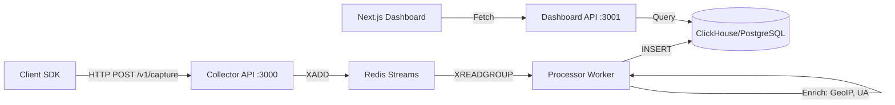

# Analytics System Master Context

> **Purpose**: A comprehensive context file for agents/developers working on this system. Contains all essential information with links to detailed documentation for deep dives.

---

## 1. System Overview

The **Analytics Platform** is built for **Kra** (Kenya Revenue Authority). It is a high-performance system for collecting and visualising user behavioural data, deployed as a single-client solution. Current integrations include:

- **Kra Tax App** (MRI, TOT, NIL filing journeys)
- **CRM System** (WhatsApp & Contact analytics via `crm.chatnation.co.ke`)

### 1.1 Core Vision

### 1.1 Core Vision

Track the complete lifecycle of user journeys across fragmented interactions—from messaging interfaces (WhatsApp) to embedded web environments—as a single, continuous session. Focus on **state-transition logging** and **cross-channel attribution**.

**New Features (Jan 2026):**

- **Public Landing & Showcase Pages**: `/`, `/showcase` for product marketing.
- **User Journey Page**: `/journey` for viewing cross-channel timelines.
- **Direct Event Analytics**: `/whatsapp-analytics` for real-time WhatsApp insights.

**Key Docs:**

- [Project Description](file:///home/saruni/chatnation/analytics/docs/project_description.md) - Executive summary & architectural principles
- [Phased Roadmap](file:///home/saruni/chatnation/analytics/docs/phased_roadmap.md) - Phase 1 (Web) & Phase 2 (WhatsApp) plans

---

## 2. Architecture



### 2.1 Component Summary

| Component            | Location                 | Port | Purpose                                                     |
| -------------------- | ------------------------ | ---- | ----------------------------------------------------------- |
| **Collector API**    | `apps/collector/`        | 3000 | Ingest events, validate, queue to Redis                     |
| **Processor Worker** | `apps/processor/`        | N/A  | Consume queue, enrich (GeoIP/UA), write to DB               |
| **Dashboard API**    | `apps/dashboard-api/`    | 3001 | Query endpoints for analytics data (inc. WhatsApp)          |
| **Dashboard UI**     | `packages/dashboard-ui/` | 3002 | Next.js 14 visualization frontend (Analysis + Public Pages) |
| **SDK**              | `packages/sdk/`          | N/A  | JavaScript tracker for client apps                          |

### 2.2 Shared Libraries (`libs/`)

| Library         | Purpose                                                            |
| --------------- | ------------------------------------------------------------------ |
| `@lib/common`   | Guards, pipes, interceptors, filters, utilities                    |
| `@lib/database` | TypeORM entities, repositories (Event, Session, Identity, Project) |
| `@lib/queue`    | Redis Stream producers/consumers                                   |
| `@lib/events`   | Shared DTOs and event type definitions                             |
| `@lib/crm-api`  | CRM API client library (`client.ts`, `types.ts`)                   |

**Key Docs:**

- [System Architecture](file:///home/saruni/chatnation/analytics/docs/system_architecture.md) - High-level data flow
- [NestJS Architecture](file:///home/saruni/chatnation/analytics/docs/nestjs_architecture.md) - Backend patterns (DI, Repository, Guards)
- [Next.js Dashboard Architecture](file:///home/saruni/chatnation/analytics/docs/nextjs_dashboard_architecture.md) - Frontend structure
- [Event Lifecycle](file:///home/saruni/chatnation/analytics/docs/event_lifecycle.md) - Complete SDK → DB journey trace

---

## 3. Data Model

### 3.1 Identity Hierarchy

```
IDENTIFIED USER (user_id = PIN / Phone)
├── Anonymous ID 1 (Chrome Desktop)
│   ├── Session A
│   └── Session B
└── Anonymous ID 2 (Safari Mobile)
    ├── Session C
    └── Session D
```

| ID Type        | Storage        | Lifetime                  | Source            |
| -------------- | -------------- | ------------------------- | ----------------- |
| `anonymous_id` | localStorage   | Permanent (until cleared) | SDK               |
| `session_id`   | sessionStorage | 30-min inactivity timeout | SDK               |
| `user_id`      | Server-side    | Persistent                | `identify()` call |
| `external_id`  | (Phase 2)      | N/A                       | WhatsApp phone ID |

### 3.2 Event Schema (Required Fields)

| Field          | Type     | Description                                       |
| -------------- | -------- | ------------------------------------------------- |
| `event_id`     | UUID     | Unique event identifier                           |
| `event_name`   | String   | `page_view`, `button_click`, `return_filed`, etc. |
| `timestamp`    | ISO 8601 | Client-side event time                            |
| `anonymous_id` | UUID     | Device/browser ID                                 |
| `session_id`   | UUID     | Current session                                   |
| `context`      | Object   | `{ page, userAgent, library }`                    |
| `properties`   | Object   | Event-specific custom data                        |

### 3.3 Database Schema

| Table        | Engine             | Purpose                                     |
| ------------ | ------------------ | ------------------------------------------- |
| `events`     | MergeTree (CH)     | Primary event storage, partitioned by month |
| `sessions`   | ReplacingMergeTree | Session-level aggregates                    |
| `identities` | ReplacingMergeTree | `anonymous_id` → `user_id` linking          |
| `projects`   | PostgreSQL         | Multi-tenant project config                 |

**Key Docs:**

- [Data Model](file:///home/saruni/chatnation/analytics/docs/data_model.md) - Identity resolution & session logic
- [Database Schema](file:///home/saruni/chatnation/analytics/docs/database_schema.md) - ClickHouse/PostgreSQL DDL
- [Event Schema](file:///home/saruni/chatnation/analytics/docs/event_schema.md) - Field definitions & custom events

---

## 4. SDK & Tracking

### 4.1 SDK Methods

```javascript
analytics.init("WRITE_KEY", { apiEndpoint: "..." });
analytics.page(); // Track page view
analytics.track("event_name", { props }); // Track custom event
analytics.identify("user_id", { traits }); // Link user identity
analytics.reset(); // Clear on logout
```

### 4.2 Tax App Custom Events

| Event                | Trigger           | Key Properties                           |
| -------------------- | ----------------- | ---------------------------------------- |
| `validation_success` | PIN/ID validated  | `obligation_type`                        |
| `otp_success`        | OTP verified      | `method` (sms/whatsapp)                  |
| `return_filed`       | Filing successful | `receipt_number`, `obligation`, `amount` |
| `payment_initiated`  | Pay clicked       | `prn`, `amount`                          |

**Key Docs:**

- [SDK Design](file:///home/saruni/chatnation/analytics/docs/sdk_design.md) - SDK architecture & batching logic
- [Integration Guide](file:///home/saruni/chatnation/analytics/docs/integration_guide.md) - React/Next.js/HTML integration
- [Tracking Guide](file:///home/saruni/chatnation/analytics/docs/tracking_guide.md) - cURL/JS/Python examples
- [External App Test Guide](file:///home/saruni/chatnation/analytics/docs/external_app_test_guide.md) - Testing with Tax App
- [Solutions Architecture](file:///home/saruni/chatnation/analytics/docs/solutions_architecture.md) - Tax App funnels (MRI/TOT/NIL)

---

## 5. API Reference

### 5.1 Collector API (Port 3000)

| Endpoint      | Method | Auth                 | Description           |
| ------------- | ------ | -------------------- | --------------------- |
| `/v1/capture` | POST   | `X-Write-Key` header | Batch event ingestion |
| `/v1/health`  | GET    | None                 | Health check          |

### 5.2 Dashboard API (Port 3001)

| Endpoint                  | Query Params                      | Returns                                         |
| ------------------------- | --------------------------------- | ----------------------------------------------- |
| `/api/dashboard/overview` | `startDate`, `endDate`            | `totalSessions`, `totalUsers`, `conversionRate` |
| `/api/dashboard/funnel`   | `journey`, `startDate`, `endDate` | Funnel steps with counts/percentages            |
| `/api/dashboard/sessions` | `limit`, `offset`                 | Paginated session list                          |
| `/api/dashboard/events`   | `sessionId`                       | Events for a session                            |

### 5.3 Authentication & Multi-Tenancy API

| Endpoint                          | Method | Description                  |
| --------------------------------- | ------ | ---------------------------- |
| `/api/dashboard/auth/signup`      | POST   | Register user + organization |
| `/api/dashboard/auth/login`       | POST   | Login, returns JWT           |
| `/api/dashboard/auth/me`          | GET    | Current user (protected)     |
| `/api/dashboard/tenants`          | GET    | List user's organizations    |
| `/api/dashboard/crm-integrations` | CRUD   | Manage CRM API credentials   |
| `/api/dashboard/crm-integrations` | CRUD   | Manage CRM API credentials   |
| `/api/dashboard/api-keys`         | CRUD   | Generate/revoke SDK keys     |

### 5.4 WhatsApp Analytics API (New)

| Endpoint                                    | Query Params           | Returns                     |
| ------------------------------------------- | ---------------------- | --------------------------- |
| `/api/dashboard/whatsapp-analytics/stats`   | `startDate`, `endDate` | Message volumes, read rates |
| `/api/dashboard/whatsapp-analytics/volume`  | `startDate`, `endDate` | Volume by hour              |
| `/api/dashboard/whatsapp-analytics/heatmap` | `startDate`, `endDate` | Activity day/hour heatmap   |
| `/api/dashboard/whatsapp-analytics/agents`  | `startDate`, `endDate` | Agent performance stats     |

### 5.5 AI Analytics API (New)

Tracks LLM/AI agent performance metrics.

| Endpoint                              | Query Params           | Returns                                                        |
| ------------------------------------- | ---------------------- | -------------------------------------------------------------- |
| `/api/dashboard/ai-analytics/stats`   | `startDate`, `endDate` | Total classifications, avg latency, avg confidence, error rate |
| `/api/dashboard/ai-analytics/intents` | `startDate`, `endDate` | Top intents by count with avg confidence                       |
| `/api/dashboard/ai-analytics/latency` | `startDate`, `endDate` | Latency distribution (ms buckets)                              |
| `/api/dashboard/ai-analytics/errors`  | `startDate`, `endDate` | Error breakdown by type                                        |

**Key Docs:**

- [API Documentation](file:///home/saruni/chatnation/analytics/docs/api_documentation.md) - Full endpoint reference
- [API Spec](file:///home/saruni/chatnation/analytics/docs/api_spec.md) - Request/response formats
- [Multi-Tenancy](file:///home/saruni/chatnation/analytics/docs/multi_tenancy.md) - Auth, tenants, CRM integrations, API keys
- [AI Analytics Technical](file:///home/saruni/chatnation/analytics/docs/architecture/ai_analytics_technical.md) - AI event schemas & queries

---

## 6. CRM Integration & WhatsApp Analytics

> **⚠️ STRATEGY PIVOT (Jan 2026):** We have shifted from CRM-based analytics to **event collection via webhooks**. The CRM API is now used only for operational tasks (sending messages, managing contacts). Analytics data is captured directly via our Collector infrastructure. See [Analytics Strategy Pivot](file:///home/saruni/.gemini/antigravity/brain/8bfcd57f-02c2-48e2-97fe-09de6aaf5b46/analytics_strategy_pivot.md) for details.

The CRM subsystem integrates with `https://crm.chatnation.co.ke` for WhatsApp messaging.

### 6.1 CRM Use (Operational Only)

| Entity       | Key Operations                                        |
| ------------ | ----------------------------------------------------- |
| **Contact**  | `listContacts`, `searchContact`, `createContact`      |
| **Campaign** | `listCampaigns`, `getCampaignReport`, `cloneCampaign` |
| **Message**  | `sendMessage` (outbound only)                         |

### 6.2 Analytics (Event-Based)

Analytics data now flows through our internal event pipeline:

```
CRM Webhooks → Collector API → Redis → Processor → Events Table → Dashboard
```

| Metric            | Source       | Method                                                  |
| ----------------- | ------------ | ------------------------------------------------------- |
| **Response Time** | Events table | SQL: time between `message.received` and `message.sent` |
| **Growth Rate**   | Events table | Count `contact.created` by day                          |
| **Engagement**    | Events table | Campaign funnel events                                  |
| **User Journey**  | Events table | Full event timeline per `userId`                        |

### 6.3 Why We Pivoted

The CRM API has significant limitations for analytics:

- No real-time event stream (polling only)
- No aggregation endpoints
- Rate limits prevent bulk data access
- No session or journey tracking

**Key Docs:**

- [CRM System Context](file:///home/saruni/chatnation/analytics/docs/CRM_SYSTEM_CONTEXT.md) - CRM integration reference
- [CRM Limitations (Technical)](file:///home/saruni/chatnation/analytics/docs/crm_limitations_technical.md) - Engineering details
- [CRM Limitations (Business)](file:///home/saruni/chatnation/analytics/docs/crm_limitations_business.md) - Stakeholder summary
- [WhatsApp Analytics Architecture](file:///home/saruni/chatnation/analytics/docs/whatsapp_analytics_architecture.md) - Event-based approach

---

## 7. Dashboard Features

### 7.1 Views

| View                   | Purpose           | Key Metrics                                    |
| ---------------------- | ----------------- | ---------------------------------------------- |
| **Overview**           | Executive KPIs    | Sessions, Users, Conversion Rate, Avg Duration |
| **Funnel**             | Journey analysis  | Step drop-off for MRI/TOT/NIL                  |
| **Journey**            | User Journey      | Cross-channel timeline (Web + WhatsApp)        |
| **WhatsApp Analytics** | Event-based stats | Response time, heatmaps (from Collector)       |
| **WhatsApp CRM**       | CRM Data          | Contacts, delivery funnels (from CRM API)      |
| **Sessions**           | Session explorer  | Timeline, event properties                     |
| **Real-time**          | Live activity     | Streaming event feed                           |

### 7.2 Tech Stack

| Aspect    | Technology                                    |
| --------- | --------------------------------------------- |
| Framework | Next.js 14 (App Router)                       |
| State     | Zustand (filters), React Query (server state) |
| UI        | shadcn/ui + Tailwind CSS                      |
| Charts    | Recharts                                      |

**Key Docs:**

- [Dashboard Requirements](file:///home/saruni/chatnation/analytics/docs/dashboard_requirements.md) - Views, queries, filters

---

## 8. Development

### 8.1 Quick Start

```bash
# 1. Install dependencies
npm install

# 2. Start infrastructure (Docker)
npm run docker:up

# 3. Start all services
npm run start:dev
```

### 8.2 Key Scripts

| Script                           | Description                                            |
| -------------------------------- | ------------------------------------------------------ |
| `npm run start:dev`              | Start Collector, Processor, Dashboard API concurrently |
| `npm run start:dashboard-ui:dev` | Start Next.js frontend                                 |
| `npm run test`                   | Run unit tests                                         |
| `npm run test:e2e`               | Run E2E tests                                          |
| `npm run db:migrate`             | Run database migrations                                |

### 8.3 Environment Variables

| Variable              | Service                  | Purpose                  |
| --------------------- | ------------------------ | ------------------------ |
| `REDIS_URL`           | All                      | Redis connection string  |
| `CLICKHOUSE_HOST`     | Processor, Dashboard API | ClickHouse database host |
| `MAXMIND_LICENSE_KEY` | Processor                | GeoIP enrichment         |
| `NEXT_PUBLIC_API_URL` | Dashboard UI             | Dashboard API base URL   |

**Key Docs:**

- [Deployment Guide](file:///home/saruni/chatnation/analytics/docs/deployment_guide.md) - K8s/Docker deployment
- [Local Setup (No Docker)](file:///home/saruni/chatnation/analytics/docs/local_setup_no_docker.md) - Native PostgreSQL/Redis setup
- [Scripts Documentation](file:///home/saruni/chatnation/analytics/docs/scripts_documentation.md) - NPM scripts reference

---

## 9. Testing

### 9.1 Test Layers

| Layer       | Scope                 | Tools                    |
| ----------- | --------------------- | ------------------------ |
| Unit        | Functions, validation | Jest                     |
| Integration | API contracts, DB     | Supertest, TestingModule |
| E2E         | Full journey          | Playwright/Cypress       |
| Load        | Throughput            | k6, Artillery            |

### 9.2 CRM API Tests

Live integration tests verify connectivity with the CRM API at `https://crm.chatnation.co.ke`.

```bash
npm test -- --testPathPattern="crm-api"
```

**Key Docs:**

- [Testing Strategy](file:///home/saruni/chatnation/analytics/docs/testing_strategy.md) - Complete test approach

---

## 10. Project Structure

```
analytics/
├── apps/
│   ├── collector/          # Event ingestion (NestJS)
│   ├── processor/          # Event processing worker
│   └── dashboard-api/      # Query API for dashboards
├── libs/
│   ├── common/             # Guards, pipes, utils
│   ├── database/           # Entities, repositories
│   ├── queue/              # Redis producers/consumers
│   ├── events/             # DTOs, event types
│   └── crm-api/            # CRM client library
├── packages/
│   ├── dashboard-ui/       # Next.js frontend
│   └── sdk/                # JavaScript tracking SDK
├── docs/                   # All documentation (30 files)
├── docker-compose.yml      # Local dev infrastructure
└── package.json            # Root workspace config
```

---

## 11. Document Index

### Core Architecture

- [system_architecture.md](file:///home/saruni/chatnation/analytics/docs/system_architecture.md) - High-level overview
- [nestjs_architecture.md](file:///home/saruni/chatnation/analytics/docs/nestjs_architecture.md) - Backend patterns
- [nextjs_dashboard_architecture.md](file:///home/saruni/chatnation/analytics/docs/nextjs_dashboard_architecture.md) - Frontend patterns
- [event_lifecycle.md](file:///home/saruni/chatnation/analytics/docs/event_lifecycle.md) - SDK → DB flow

### Data & Schema

- [data_model.md](file:///home/saruni/chatnation/analytics/docs/data_model.md) - Identity & session management
- [database_schema.md](file:///home/saruni/chatnation/analytics/docs/database_schema.md) - Table definitions
- [event_schema.md](file:///home/saruni/chatnation/analytics/docs/event_schema.md) - Event field specs

### SDK & Integration

- [sdk_design.md](file:///home/saruni/chatnation/analytics/docs/sdk_design.md) - Client SDK architecture
- [integration_guide.md](file:///home/saruni/chatnation/analytics/docs/integration_guide.md) - How to integrate
- [tracking_guide.md](file:///home/saruni/chatnation/analytics/docs/tracking_guide.md) - Send events manually
- [external_app_test_guide.md](file:///home/saruni/chatnation/analytics/docs/external_app_test_guide.md) - Tax App testing

### API

- [api_documentation.md](file:///home/saruni/chatnation/analytics/docs/api_documentation.md) - Endpoint reference
- [api_spec.md](file:///home/saruni/chatnation/analytics/docs/api_spec.md) - API spec

### CRM Integration

- [CRM_SYSTEM_CONTEXT.md](file:///home/saruni/chatnation/analytics/docs/CRM_SYSTEM_CONTEXT.md) - CRM master context
- [crm_api_documentation.md](file:///home/saruni/chatnation/analytics/docs/crm_api_documentation.md) - CRM API endpoints
- [crm_analytics_business_overview.md](file:///home/saruni/chatnation/analytics/docs/crm_analytics_business_overview.md) - Business use cases
- [crm_analytics_dashboard.md](file:///home/saruni/chatnation/analytics/docs/crm_analytics_dashboard.md) - Dashboard specs

### Dashboard

- [dashboard_requirements.md](file:///home/saruni/chatnation/analytics/docs/dashboard_requirements.md) - Views & queries

### Operations

- [deployment_guide.md](file:///home/saruni/chatnation/analytics/docs/deployment_guide.md) - K8s/Docker deployment
- [local_setup_no_docker.md](file:///home/saruni/chatnation/analytics/docs/local_setup_no_docker.md) - Native setup
- [scripts_documentation.md](file:///home/saruni/chatnation/analytics/docs/scripts_documentation.md) - NPM scripts
- [testing_strategy.md](file:///home/saruni/chatnation/analytics/docs/testing_strategy.md) - Test approach

### Authentication & Multi-Tenancy

- [multi_tenancy.md](file:///home/saruni/chatnation/analytics/docs/multi_tenancy.md) - User auth, tenants, CRM integrations, API keys

### Planning

- [project_description.md](file:///home/saruni/chatnation/analytics/docs/project_description.md) - Product spec
- [solutions_architecture.md](file:///home/saruni/chatnation/analytics/docs/solutions_architecture.md) - Tax App integration
- [phased_roadmap.md](file:///home/saruni/chatnation/analytics/docs/phased_roadmap.md) - Development phases

---

> **Usage Tip**: Start here for context, then follow the links to specific docs when you need implementation details.
