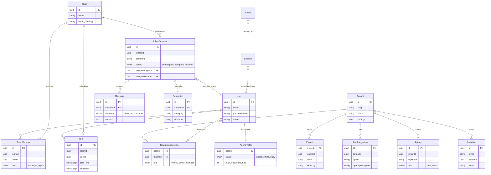

# Database Schema

## Overview
This document defines the current PostgreSQL database schema for the Analytics Platform, derived from the application entities. It supports multi-tenancy, specific agent workflows, and analytics data.

> **Note:** While some analytics tables (`events`) are designed with ClickHouse migration in mind, the current implementation uses PostgreSQL for all entities.

---

## Entity Relationship Diagram (ERD)

---

## 1. Core Identity & Tenancy

### `tenants`
The top-level organization unit.
- **id** (UUID, PK): Unique identifier.
- **slug** (String, Unique): URL-friendly identifier.
- **name** (String): Organization display name.
- **settings** (JSONB): Configuration (branding, **session settings**, timezone).
- **plan** (Enum): Subscription level (`free`, `starter`, `pro`).

### `users`
Global user accounts.
- **id** (UUID, PK): Unique identifier.
- **email** (String, Unique): Login email.
- **passwordHash** (String): Bcrypt hash.
- **name** (String): Display name.

### `tenant_memberships`
Links users to tenants.
- **userId** (UUID, PK, FK): Reference to `users`.
- **tenantId** (UUID, PK, FK): Reference to `tenants`.
- **role** (Enum): Authorization level (`super_admin`, `admin`, `member`, `auditor`).

### `invitations`
Pending tenant memberships.
- **email**: Email of invited user.
- **token**: Secure unique token for acceptance.
- **status**: `pending`, `accepted`, `expired`.

### `role_permissions`
Defines granular permissions for roles.
- **role** (String): The role name (e.g., `admin`).
- **permission** (Enum): Specific capability (e.g., `analytics.view`, `settings.manage`).

---

## 2. Agent System & Teams

### `teams`
Groups of agents for routing and management.
- **name**: Team name (e.g., "Support", "Sales").
- **routingStrategy**: Logic for assigning chats (`round_robin`, etc.).

### `team_members`
Links users to teams.
- **role**: `manager`, `agent`.

### `agent_profiles`
Extension of user profile for agent-specific state.
- **status**: Availability status (`online`, `offline`, `busy`).
- **maxConcurrentChats**: Load limit.

### `shifts`
Scheduled working hours for agents/teams.
- **startTime**, **endTime**: Shift duration.

### `assignment_configs`
Configuration for routing logic.
- **strategy**, **settings**: Rules for distributing chats.

---

## 3. Communication & Inbox

### `inbox_sessions`
Represents a conversation/ticket with a contact.
- **contactId**: Identifier for the end-user (e.g., Phone Number).
- **status**: Lifecycle state (`unassigned`, `assigned`, `resolved`).
- **assignedAgentId**: Agent handling the session.
- **assignedTeamId**: Team responsible for the session.
- **priority**: Integer level for queue sorting.

### `messages`
Individual messages within a session.
- **direction**: `inbound` (from user), `outbound` (from agent).
- **type**: Content type (`text`, `image`, `video`).
- **content**: Message body.

### `resolutions`
Outcome of a session.
- **outcome**: Result status (e.g., `resolved`).
- **category**: Classification of the issue.
- **csatScore**: Customer satisfaction rating.

### `crm_integrations`
Credentials for external CRM/Messaging providers (WhatsApp).
- **apiUrl**: Endpoint for the provider.
- **apiKeyEncrypted**: Encrypted credentials.

---

## 4. Analytics Data

### `events`
High-volume event stream.
- **eventId**: UUID.
- **eventName**, **eventType**: What happened.
- **timestamp**: When it happened.
- **sessionId**, **userId**, **anonymousId**: Who did it.
- **properties** (JSONB): Custom data payload.

### `sessions` (Analytics)
Aggregated visit data.
- **metrics**: `durationSeconds`, `pageCount`, `eventCount`.
- **attribution**: `utmSource`, `referrer`.

### `identities`
Links anonymous browsing to known users.
- **anonymousId** ↔ **userId** mapping.

### `projects`
Scopes analytics data within a tenant.
- **writeKey**: Public key for SDK ingestion.

### `api_keys`
Server-side access keys.
- **type**: `read` (API access), `write` (Ingestion).
