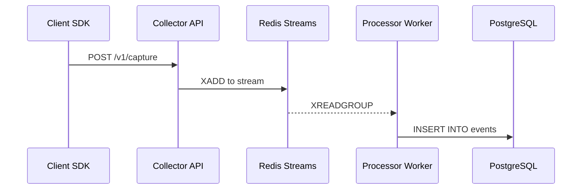

# Event Lifecycle: From SDK to Database

This document traces the complete journey of an analytics event through our system, showing every class, method, and transformation along the way.

---

## Architecture Overview



---

## Phase 1: Client SDK (Browser)

**Location**: `packages/sdk/src/`

### 1.1 Event Triggered

When you call `analytics.track()`, `analytics.page()`, or `analytics.identify()`:

```javascript
// User's code
analytics.track('button_click', { button: 'signup' });
```

**File**: [`packages/sdk/src/index.ts`](file:///home/saruni/chatnation/analytics/packages/sdk/src/index.ts)

| Method | What it does |
|--------|--------------|
| `track(event, properties)` | Creates event payload with `eventType: 'track'` |
| `page(name, properties)` | Creates event payload with `eventType: 'page'` |
| `identify(userId, traits)` | Creates event payload with `eventType: 'identify'` |

### 1.2 Event Queued

Each method calls the internal `enqueue()` function:

```typescript
private enqueue(event: AnalyticsEvent) {
  this.queue.push(event);
  this.scheduleFlush();
}
```

**Batching Logic**:
- Events are queued in memory
- Flushed when: 10 events accumulated OR 5 seconds elapsed
- Persisted to `localStorage` for offline support

### 1.3 HTTP Request Sent

**Method**: `flush()`

```typescript
private async flush() {
  const batch = this.queue.splice(0, 10);
  await fetch(this.apiEndpoint, {
    method: 'POST',
    headers: { 'Content-Type': 'application/json' },
    body: JSON.stringify({ batch })
  });
}
```

**Payload sent to server**:
```json
{
  "batch": [
    {
      "messageId": "uuid-v4",
      "type": "track",
      "event": "button_click",
      "properties": { "button": "signup" },
      "anonymousId": "anon-uuid",
      "timestamp": "2026-01-15T10:00:00Z",
      "context": {
        "page": { "url": "...", "path": "...", "title": "..." },
        "userAgent": "...",
        "locale": "en-US"
      }
    }
  ]
}
```

---

## Phase 2: Collector API (NestJS)

**Location**: `apps/collector/src/`

### 2.1 Request Received

**File**: [`apps/collector/src/capture/capture.controller.ts`](file:///home/saruni/chatnation/analytics/apps/collector/src/capture/capture.controller.ts)

```typescript
@Post('capture')
async capture(@Body() dto: CaptureBatchDto, @Req() req) {
  return this.captureService.processBatch(dto, req);
}
```

| Component | Role |
|-----------|------|
| `@Post('capture')` | Route decorator, maps to `POST /v1/capture` |
| `CaptureBatchDto` | Validates incoming JSON structure |
| `ValidationPipe` | Automatically rejects invalid payloads |
| `WriteKeyGuard` | Authenticates via `X-Write-Key` header |

### 2.2 Validation

**File**: [`libs/events/src/dto/capture-batch.dto.ts`](file:///home/saruni/chatnation/analytics/libs/events/src/dto/capture-batch.dto.ts)

```typescript
export class CaptureBatchDto {
  @IsArray()
  @ValidateNested({ each: true })
  @Type(() => CaptureEventDto)
  batch: CaptureEventDto[];
}
```

If validation fails, NestJS returns `400 Bad Request` automatically.

### 2.3 Processing & Publishing

**File**: [`apps/collector/src/capture/capture.service.ts`](file:///home/saruni/chatnation/analytics/apps/collector/src/capture/capture.service.ts)

```typescript
async processBatch(dto: CaptureBatchDto, req: Request) {
  const events = dto.batch.map(event => ({
    ...event,
    receivedAt: new Date(),
    ipAddress: req.ip,
    tenantId: 'default-tenant',
    projectId: 'default-project',
  }));

  await this.eventProducer.publish(events);
  return { success: true, count: events.length };
}
```

| Method | What it does |
|--------|--------------|
| `processBatch()` | Enriches events with server-side data (IP, timestamp) |
| `eventProducer.publish()` | Sends to Redis Stream |

### 2.4 Redis Stream Producer

**File**: [`libs/queue/src/producers/event.producer.ts`](file:///home/saruni/chatnation/analytics/libs/queue/src/producers/event.producer.ts)

```typescript
async publish(events: QueuedEvent[]) {
  for (const event of events) {
    await this.redis.xadd(
      STREAM_NAME,           // 'analytics:events'
      '*',                   // Auto-generate ID
      'data', JSON.stringify(event)
    );
  }
}
```

**Redis Command Executed**:
```
XADD analytics:events * data '{"messageId":"...","event":"button_click",...}'
```

---

## Phase 3: Message Queue (Redis Streams)

**Location**: Redis (external service)

### 3.1 Stream Storage

Events are stored in Redis as a time-ordered log:
```
analytics:events
├── 1705312800000-0 → {"messageId":"abc","event":"page_view",...}
├── 1705312800001-0 → {"messageId":"def","event":"button_click",...}
└── 1705312800002-0 → {"messageId":"ghi","event":"otp_success",...}
```

### 3.2 Consumer Group

The Processor uses a **Consumer Group** for reliable delivery:
- Group: `analytics-processor-group`
- Consumer: `processor-1`
- Guarantees: At-least-once delivery, auto-acknowledgment

---

## Phase 4: Processor Worker (NestJS)

**Location**: `apps/processor/src/`

### 4.1 Stream Consumer

**File**: [`libs/queue/src/consumers/event.consumer.ts`](file:///home/saruni/chatnation/analytics/libs/queue/src/consumers/event.consumer.ts)

```typescript
async consume(): Promise<QueuedEvent[]> {
  const results = await this.redis.xreadgroup(
    'GROUP', CONSUMER_GROUP, CONSUMER_NAME,
    'COUNT', 100,
    'BLOCK', 5000,
    'STREAMS', STREAM_NAME, '>'
  );
  // Parse and return events
}
```

| Parameter | Value | Purpose |
|-----------|-------|---------|
| `COUNT 100` | Max 100 events per read | Batch processing |
| `BLOCK 5000` | 5 second timeout | Long polling |
| `'>'` | Read new messages only | Skip already-read |

### 4.2 Event Processor Service

**File**: [`apps/processor/src/event-processor/event-processor.service.ts`](file:///home/saruni/chatnation/analytics/apps/processor/src/event-processor/event-processor.service.ts)

```typescript
@Injectable()
export class EventProcessorService implements OnModuleInit {
  async onModuleInit() {
    this.startProcessing();
  }

  private async startProcessing() {
    while (true) {
      const events = await this.eventConsumer.consume();
      if (events.length > 0) {
        await this.processEvents(events);
      }
    }
  }

  private async processEvents(events: QueuedEvent[]) {
    const enriched = events.map(e => this.enrich(e));
    const deduplicated = await this.deduplicate(enriched);
    await this.eventRepository.saveBatch(deduplicated);
  }
}
```

### 4.3 Enrichment

**Methods called during `enrich()`**:

| Step | Method | Output |
|------|--------|--------|
| 1. Parse User-Agent | `parseUserAgent(ua)` | `deviceType`, `osName`, `browserName` |
| 2. GeoIP Lookup | `geoip.lookup(ip)` | `countryCode`, `city` |
| 3. Normalize Fields | `normalizeEvent(e)` | Consistent field names |

```typescript
private enrich(event: QueuedEvent): EnrichedEvent {
  const ua = UAParser(event.userAgent);
  const geo = geoip.lookup(event.ipAddress);

  return {
    ...event,
    deviceType: ua.device.type || 'desktop',
    osName: ua.os.name,
    osVersion: ua.os.version,
    browserName: ua.browser.name,
    browserVersion: ua.browser.version,
    countryCode: geo?.country,
    city: geo?.city,
  };
}
```

### 4.4 Deduplication

**File**: [`libs/database/src/repositories/event.repository.ts`](file:///home/saruni/chatnation/analytics/libs/database/src/repositories/event.repository.ts)

```typescript
async messageIdExists(messageId: string): Promise<boolean> {
  const count = await this.repo.count({ where: { messageId } });
  return count > 0;
}
```

Events with duplicate `messageId` values are skipped to prevent double-counting.

---

## Phase 5: Database (PostgreSQL)

**Location**: `libs/database/src/`

### 5.1 Entity Definition

**File**: [`libs/database/src/entities/event.entity.ts`](file:///home/saruni/chatnation/analytics/libs/database/src/entities/event.entity.ts)

```typescript
@Entity('events')
export class EventEntity {
  @PrimaryColumn('uuid')
  eventId: string;

  @Column('uuid')
  messageId: string;

  @Column()
  eventName: string;

  @Column({ type: 'timestamptz' })
  timestamp: Date;

  @Column({ type: 'jsonb', nullable: true })
  properties: Record<string, unknown>;

  // ... 20+ more columns
}
```

### 5.2 Batch Insert

**File**: [`libs/database/src/repositories/event.repository.ts`](file:///home/saruni/chatnation/analytics/libs/database/src/repositories/event.repository.ts)

```typescript
async saveBatch(events: CreateEventDto[]): Promise<EventEntity[]> {
  const entities = events.map(e => this.repo.create(e));
  return this.repo.save(entities);
}
```

**SQL Generated** (simplified):
```sql
INSERT INTO events (event_id, message_id, event_name, ...)
VALUES 
  ('uuid-1', 'msg-1', 'page_view', ...),
  ('uuid-2', 'msg-2', 'button_click', ...),
  ('uuid-3', 'msg-3', 'otp_success', ...);
```

---

## Complete Flow Summary

| Step | Location | Class/Method | Input | Output |
|------|----------|--------------|-------|--------|
| 1 | Browser | `SDK.track()` | Event name + props | Queued event |
| 2 | Browser | `SDK.flush()` | Batch of events | HTTP POST |
| 3 | Collector | `CaptureController.capture()` | HTTP request | Validated DTO |
| 4 | Collector | `CaptureService.processBatch()` | DTO | Enriched events |
| 5 | Collector | `EventProducer.publish()` | Events | Redis Stream entry |
| 6 | Redis | Stream storage | Entry | Persisted message |
| 7 | Processor | `EventConsumer.consume()` | Stream read | Raw events |
| 8 | Processor | `EventProcessorService.enrich()` | Raw event | Enriched event |
| 9 | Processor | `EventRepository.messageIdExists()` | messageId | Boolean |
| 10 | Processor | `EventRepository.saveBatch()` | Enriched events | DB rows |

---

## Event Types Reference

| Type | Method | Key Fields |
|------|--------|------------|
| `page` | `analytics.page()` | `pagePath`, `pageUrl`, `pageTitle` |
| `track` | `analytics.track()` | `eventName`, `properties` |
| `identify` | `analytics.identify()` | `userId`, `traits` |

---

## Debugging Tips

### View events in Redis
```bash
redis-cli XREAD STREAMS analytics:events 0
```

### View events in PostgreSQL
```bash
psql -d analytics -c "SELECT * FROM events ORDER BY timestamp DESC LIMIT 5;"
```

### Check Collector logs
Look for `[CaptureService]` and `[EventProducer]` log entries.

### Check Processor logs
Look for `[EventProcessorService]` log entries showing "Processed X events".
