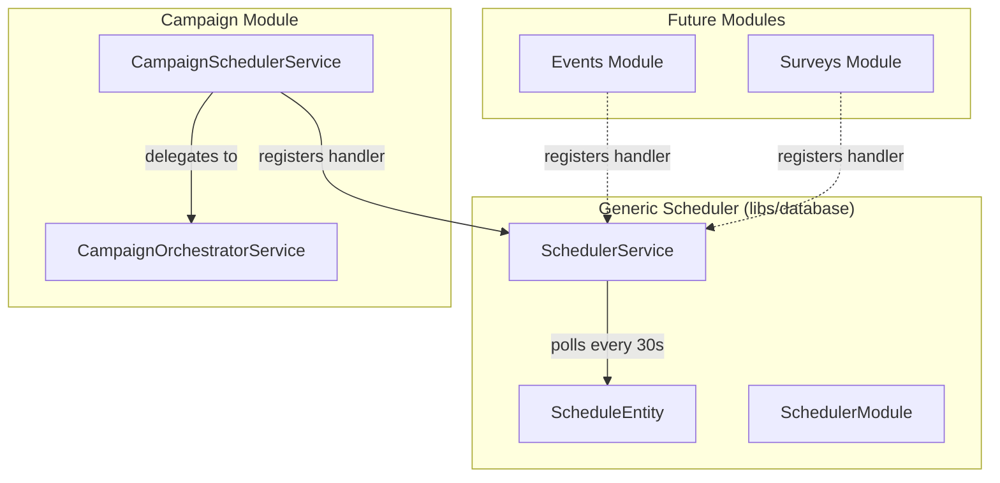

# Scheduling Engine

A reusable, module-agnostic scheduling engine that lives in `libs/database/src/scheduler/`. Any NestJS module can import `SchedulerModule` to gain scheduling capabilities without coupling to campaigns or any other module.

## Architecture



### Callback Registry Pattern

Modules register a **handler function** keyed by `jobType` at startup (via `OnModuleInit`). When the scheduler's cron poller finds a due schedule, it looks up the handler and calls it with the tenant ID and job payload.

This avoids:
- God-service anti-pattern (scheduler doesn't know about campaigns, events, etc.)
- Circular dependencies between modules
- Hard-coded switch/case blocks

## Data Model

### `schedules` Table

| Column | Type | Description |
|--------|------|-------------|
| `id` | UUID (PK) | Auto-generated |
| `tenantId` | VARCHAR(50) | Tenant scope |
| `jobType` | VARCHAR(100) | Handler key (e.g., `"campaign.execute"`) |
| `jobPayload` | JSONB | Data passed to the handler |
| `cronExpression` | VARCHAR(100) | Cron for recurring. Null = one-time |
| `scheduledAt` | TIMESTAMPTZ | One-time execution time |
| `nextRunAt` | TIMESTAMPTZ | Computed next execution |
| `lastRunAt` | TIMESTAMPTZ | Last successful execution |
| `status` | ENUM | `active`, `paused`, `completed`, `failed`, `cancelled` |
| `maxRuns` | INT | Null = unlimited |
| `runCount` | INT | Incremented after each execution |
| `metadata` | JSONB | Optional context (source module, reference IDs) |
| `createdBy` | VARCHAR(100) | User or system identifier |

### Indexes

- `(tenantId, status)` — fast tenant-scoped lookups
- `(nextRunAt)` — efficient due-schedule polling
- `(jobType)` — handler-type filtering

## Usage

### 1. Import SchedulerModule

```typescript
import { SchedulerModule } from "@lib/database";

@Module({
  imports: [SchedulerModule],
  // ...
})
export class YourFeatureModule {}
```

### 2. Register a Handler

```typescript
import { Injectable, OnModuleInit } from "@nestjs/common";
import { SchedulerService } from "@lib/database";

@Injectable()
export class YourService implements OnModuleInit {
  constructor(private readonly schedulerService: SchedulerService) {}

  onModuleInit(): void {
    this.schedulerService.registerHandler(
      "your.job_type",
      async (tenantId, payload) => {
        // Your execution logic here
        const itemId = payload["itemId"] as string;
        await this.doWork(tenantId, itemId);
      },
    );
  }
}
```

### 3. Create a Schedule

```typescript
// One-time schedule
await this.schedulerService.createSchedule({
  tenantId: "tenant-abc",
  jobType: "your.job_type",
  jobPayload: { itemId: "item-123" },
  scheduledAt: new Date("2026-03-01T09:00:00Z"),
});

// Recurring schedule (every Monday at 9am)
await this.schedulerService.createSchedule({
  tenantId: "tenant-abc",
  jobType: "your.job_type",
  jobPayload: { itemId: "item-123" },
  cronExpression: "0 9 * * 1",
  maxRuns: 10,  // Optional: limit to 10 executions
});
```

### 4. Manage Schedules

```typescript
await this.schedulerService.pauseSchedule(scheduleId);
await this.schedulerService.resumeSchedule(scheduleId);
await this.schedulerService.cancelSchedule(scheduleId);
await this.schedulerService.updateSchedule(scheduleId, {
  cronExpression: "0 10 * * 1",  // Change to 10am
});
```

## Cron Expression Reference

Uses standard 5-field cron expressions parsed by `cron-parser` v5:

```
┌───────── minute (0-59)
│ ┌───────── hour (0-23)
│ │ ┌───────── day of month (1-31)
│ │ │ ┌───────── month (1-12)
│ │ │ │ ┌───────── day of week (0-7, Sun=0 or 7)
│ │ │ │ │
* * * * *
```

| Pattern | Description |
|---------|-------------|
| `0 9 * * *` | Daily at 9:00 AM |
| `0 9 * * 1` | Every Monday at 9:00 AM |
| `0 9 1 * *` | First of every month at 9:00 AM |
| `*/15 * * * *` | Every 15 minutes |
| `0 9,18 * * 1-5` | Weekdays at 9:00 AM and 6:00 PM |

## Campaign Integration

The `CampaignSchedulerService` delegates to the generic engine:

1. On startup, registers a `"campaign.execute"` handler
2. The handler calls `CampaignOrchestratorService.execute()`
3. Recurring campaign schedules use `ScheduleEntity` rows
4. Legacy one-time scheduled campaigns (using `Campaign.scheduledAt`) are still polled separately for backward compatibility

## Files

| File | Purpose |
|------|---------|
| `libs/database/src/scheduler/schedule.entity.ts` | TypeORM entity |
| `libs/database/src/scheduler/schedule.types.ts` | Enums, DTOs, handler type |
| `libs/database/src/scheduler/scheduler.service.ts` | Core logic + cron poller |
| `libs/database/src/scheduler/scheduler.module.ts` | NestJS module |
| `apps/dashboard-api/src/campaigns/campaign-scheduler.service.ts` | Campaign adapter |
