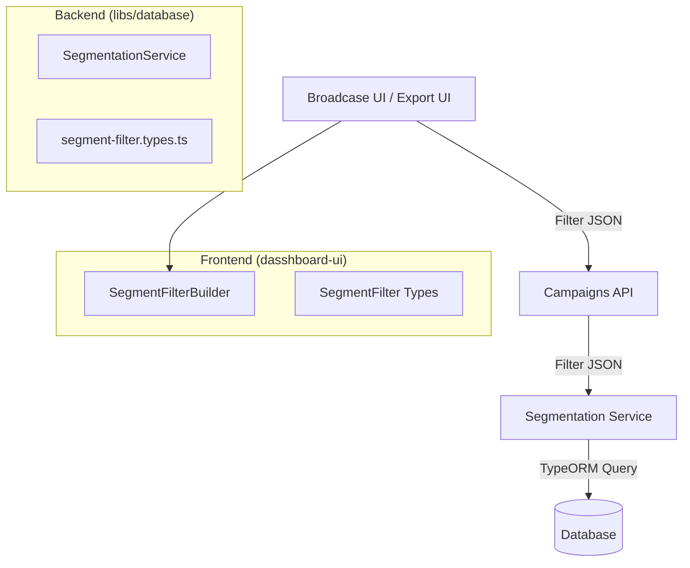

# Segmentation Engine

The Segmentation Engine is a reusable, module-agnostic system for filtering and grouping contacts based on dynamic criteria.

It replaces the legacy `AudienceFilter` system with a more robust architecture that supports:
- Nested logic groups (AND/OR trees)
- Extensible operators
- JSONB metadata filtering
- Module-specific field providers (Events, Surveys, etc.)

## Architecture



## Data Structure

The core data structure is the `SegmentFilter` (Group), which contains a list of conditions or nested groups.

```typescript
type FilterOperator = "eq" | "neq" | "gt" | "contains" | "in" | ...;

interface FilterCondition {
  field: string;
  operator: FilterOperator;
  value: unknown;
}

interface FilterGroup {
  logic: "AND" | "OR";
  conditions: (FilterCondition | FilterGroup)[];
}
```

## Backend Usage

The `SegmentationService` is available in the `DatabaseModule`. Inject it into any service to filter contacts.

### 1. Import and Inject

```typescript
import { SegmentationService, SegmentFilter } from "@lib/database";

@Injectable()
export class MyService {
  constructor(
    private readonly segmentationService: SegmentationService
  ) {}

  async getVipCustomers(filter: SegmentFilter) {
    return this.segmentationService.resolveContacts(tenantId, filter);
  }
}
```

### 2. Available Methods

- **`resolveContacts(tenantId, filter)`**: Returns `ContactEntity[]`.
- **`countContacts(tenantId, filter)`**: Returns `number` (count only).
- **`buildQuery(tenantId, filter)`**: Returns a `SelectQueryBuilder<ContactEntity>` that you can further extend (e.g., add sorting or joins).

### 3. Supported Fields

The engine currently supports these base fields on `ContactEntity`:
- `contactId` (Phone Number)
- `name`
- `email`
- `tags` (Array)
- `paymentStatus`
- `messageCount`, `firstSeen`, `lastSeen`
- `metadata.*` (JSONB fields)

To filter by metadata, use the `metadata.` prefix (e.g., `metadata.company` maps to `metadata->>'company'`).

## Frontend Usage

The `SegmentFilterBuilder` component provides a UI for constructing filters.

### 1. Component

```tsx
import { SegmentFilterBuilder } from "@/components/segmentation/SegmentFilterBuilder";
import { SegmentFilter } from "@/components/segmentation/types";

export function MyPage() {
  const [filter, setFilter] = useState<SegmentFilter>({ 
    logic: "AND", 
    conditions: [] 
  });

  // Define available fields for this context
  const fields = [
    { value: "contactId", label: "Phone Number", type: "string" },
    { value: "messageCount", label: "Messages Sent", type: "number" },
    { value: "tags", label: "Tags", type: "array" },
    { value: "metadata.role", label: "Role", type: "string" },
  ];

  return (
    <SegmentFilterBuilder 
      value={filter} 
      onChange={setFilter} 
      fields={fields} 
    />
  );
}
```

### 2. Field Types & Operators

Most operators are inferred from the field `type`:

| Type | Default Operators |
|:---|:---|
| `string` | eq, neq, contains, starts_with, ends_with, in, is_null |
| `number` | eq, neq, gt, lt, gte, lte, in |
| `date` | eq, neq, gt, lt, gte, lte |
| `array` | contains (has item), contains_any (overlaps), contains_all |
| `boolean` | eq, neq |

## Extending the Engine

### Adding New Global Fields
Modify `SegmentationService.BASE_FIELDS` in `libs/database/src/segmentation/segmentation.service.ts`.

### Adding Module-Specific Fields
Currently, the engine works on the `ContactEntity`. To filter based on related tables (e.g., "Contacts who attended Event X"), you should:
1. Use `buildQuery` to get the base query.
2. Manually add your own `.innerJoin` and `.andWhere`.

*Future Goal: A plugin system to register module-specific query builders automatically.*
