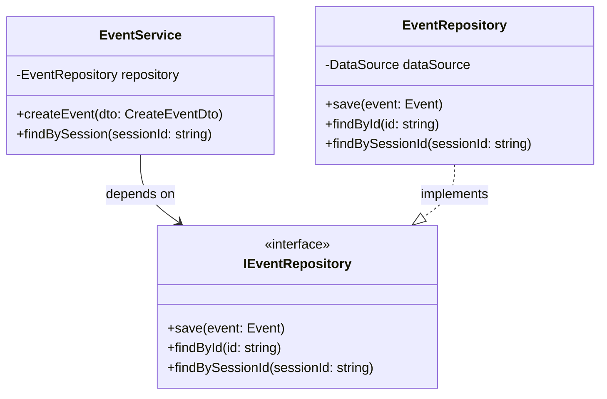
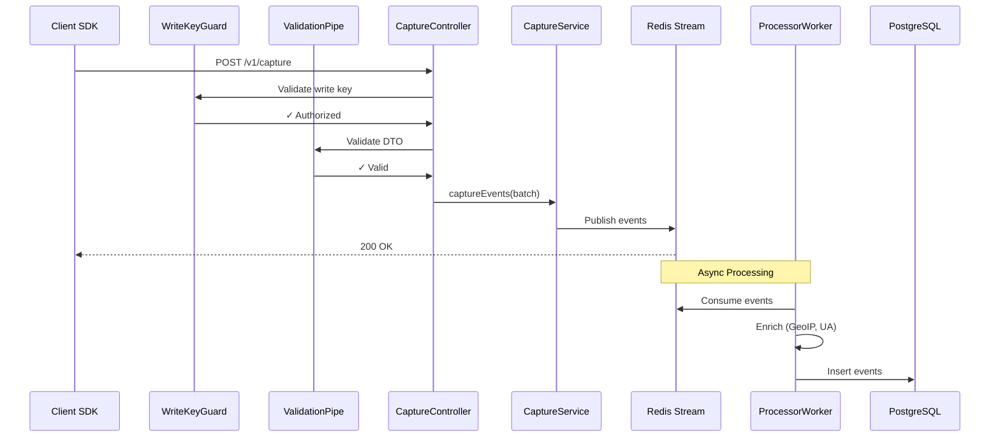
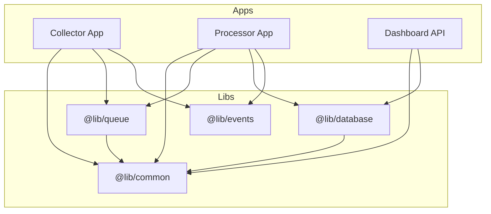

# NestJS Architecture Guide

This document defines the project structure, design patterns, and best practices for the Analytics Service backend built with NestJS.

---

## 1. Core Architecture Principles

### 1.1 Feature-Based Modular Architecture

Each domain feature is self-contained with its own module, controllers, services, and repositories.

```
┌─────────────────────────────────────────────────────────────────┐
│                         AppModule                                │
│  ┌──────────┐  ┌──────────┐  ┌──────────┐  ┌──────────────────┐ │
│  │ Events   │  │ Sessions │  │ Projects │  │ Dashboard        │ │
│  │ Module   │  │ Module   │  │ Module   │  │ Module           │ │
│  └──────────┘  └──────────┘  └──────────┘  └──────────────────┘ │
│  ┌──────────────────────────────────────────────────────────┐   │
│  │                    Shared Module                          │   │
│  │    (Database, Queue, Common Services, Guards, Pipes)      │   │
│  └──────────────────────────────────────────────────────────┘   │
└─────────────────────────────────────────────────────────────────┘
```

### 1.2 Layered Architecture (DDD-Inspired)

Each feature follows a 3-layer architecture:

```
┌────────────────────────────────────────────────────────────┐
│                      Presentation Layer                     │
│   Controllers  •  DTOs  •  Validation Pipes  •  Guards     │
├────────────────────────────────────────────────────────────┤
│                      Application Layer                      │
│   Services  •  Use Cases  •  Event Handlers                │
├────────────────────────────────────────────────────────────┤
│                      Infrastructure Layer                   │
│   Repositories  •  Database  •  Queue  •  External APIs    │
└────────────────────────────────────────────────────────────┘
```

| Layer | Responsibility | NestJS Components |
|-------|----------------|-------------------|
| **Presentation** | Handle HTTP requests, validate input, return responses | Controllers, DTOs, Guards, Interceptors |
| **Application** | Business logic, orchestration, domain rules | Services |
| **Infrastructure** | Data persistence, external integrations | Repositories, Database modules, Queue |

---

## 2. Project Structure

```
analytics/
├── apps/
│   ├── collector/                    # Event ingestion API
│   │   └── src/
│   │       ├── main.ts
│   │       └── collector.module.ts
│   │
│   ├── processor/                    # Event processing worker
│   │   └── src/
│   │       ├── main.ts
│   │       └── processor.module.ts
│   │
│   └── dashboard-api/                # Dashboard query API
│       └── src/
│           ├── main.ts
│           └── dashboard.module.ts
│
├── libs/                             # Shared libraries
│   ├── common/                       # Shared utilities
│   │   └── src/
│   │       ├── decorators/
│   │       ├── filters/
│   │       ├── guards/
│   │       ├── interceptors/
│   │       ├── pipes/
│   │       └── utils/
│   │
│   ├── database/                     # Database module
│   │   └── src/
│   │       ├── database.module.ts
│   │       ├── entities/
│   │       │   ├── event.entity.ts
│   │       │   ├── session.entity.ts
│   │       │   ├── identity.entity.ts
│   │       │   └── project.entity.ts
│   │       └── repositories/
│   │           ├── event.repository.ts
│   │           ├── session.repository.ts
│   │           └── project.repository.ts
│   │
│   ├── queue/                        # Redis queue module
│   │   └── src/
│   │       ├── queue.module.ts
│   │       ├── producers/
│   │       └── consumers/
│   │
│   └── events/                       # Shared event domain
│       └── src/
│           ├── dto/
│           │   ├── capture-batch.dto.ts
│           │   └── event.dto.ts
│           ├── interfaces/
│           └── events.module.ts
│
├── docker-compose.yml
├── nest-cli.json
├── package.json
└── tsconfig.json
```

---

## 3. Design Patterns

### 3.1 Repository Pattern

Abstracts data access, making services database-agnostic.



**Implementation:**

```typescript
// libs/database/src/repositories/event.repository.interface.ts
export interface IEventRepository {
  save(event: Event): Promise<Event>;
  findById(id: string): Promise<Event | null>;
  findBySessionId(sessionId: string): Promise<Event[]>;
}

// libs/database/src/repositories/event.repository.ts
@Injectable()
export class EventRepository implements IEventRepository {
  constructor(
    @InjectRepository(EventEntity)
    private readonly repo: Repository<EventEntity>,
  ) {}

  async save(event: Event): Promise<Event> {
    return this.repo.save(event);
  }

  async findById(id: string): Promise<Event | null> {
    return this.repo.findOne({ where: { id } });
  }
}
```

### 3.2 Dependency Injection

All components use constructor injection for loose coupling and testability.

```typescript
// apps/collector/src/capture/capture.service.ts
@Injectable()
export class CaptureService {
  constructor(
    @Inject('IEventRepository')
    private readonly eventRepo: IEventRepository,
    private readonly queueProducer: EventQueueProducer,
    private readonly validationService: ValidationService,
  ) {}
}
```

### 3.3 DTOs with Validation

All input is validated using `class-validator` decorators.

```typescript
// libs/events/src/dto/capture-batch.dto.ts
export class CaptureEventDto {
  @IsUUID()
  event_id: string;

  @IsString()
  @MaxLength(100)
  event_name: string;

  @IsISO8601()
  timestamp: string;

  @IsUUID()
  anonymous_id: string;

  @IsOptional()
  @IsString()
  user_id?: string;

  @IsObject()
  @ValidateNested()
  @Type(() => EventContextDto)
  context: EventContextDto;

  @IsOptional()
  @IsObject()
  properties?: Record<string, unknown>;
}

export class CaptureBatchDto {
  @IsArray()
  @ValidateNested({ each: true })
  @Type(() => CaptureEventDto)
  @ArrayMaxSize(100)
  batch: CaptureEventDto[];

  @IsISO8601()
  sent_at: string;
}
```

### 3.4 Guards for Authentication

```typescript
// libs/common/src/guards/write-key.guard.ts
@Injectable()
export class WriteKeyGuard implements CanActivate {
  constructor(private readonly projectService: ProjectService) {}

  async canActivate(context: ExecutionContext): Promise<boolean> {
    const request = context.switchToHttp().getRequest();
    const writeKey = request.headers['x-write-key'];
    
    if (!writeKey) return false;
    
    const project = await this.projectService.findByWriteKey(writeKey);
    if (!project) return false;
    
    // Validate origin
    const origin = request.headers['origin'];
    if (!project.allowedOrigins.includes(origin)) return false;
    
    request.project = project;
    return true;
  }
}
```

### 3.5 Interceptors for Response Transformation

```typescript
// libs/common/src/interceptors/response.interceptor.ts
@Injectable()
export class ResponseInterceptor<T> implements NestInterceptor<T, Response<T>> {
  intercept(context: ExecutionContext, next: CallHandler): Observable<Response<T>> {
    return next.handle().pipe(
      map(data => ({
        status: 'success',
        data,
        timestamp: new Date().toISOString(),
      })),
    );
  }
}
```

---

## 4. Request Flow



---

## 5. Module Dependencies



---

## 6. Collector API Module Structure

```
apps/collector/src/
├── main.ts                           # Bootstrap
├── collector.module.ts               # Root module
│
├── capture/                          # Capture feature
│   ├── capture.module.ts
│   ├── capture.controller.ts         # POST /v1/capture
│   ├── capture.service.ts            # Business logic
│   └── capture.controller.spec.ts    # Tests
│
├── health/                           # Health check feature
│   ├── health.module.ts
│   └── health.controller.ts          # GET /v1/health
│
└── config/                           # Configuration
    ├── app.config.ts
    └── cors.config.ts
```

---

## 7. Processor Worker Module Structure

```
apps/processor/src/
├── main.ts                           # Bootstrap worker
├── processor.module.ts               # Root module
│
├── consumer/                         # Queue consumer
│   ├── consumer.module.ts
│   └── event.consumer.ts             # Process events
│
├── enrichers/                        # Data enrichment
│   ├── enrichers.module.ts
│   ├── geoip.enricher.ts             # IP → Location
│   └── useragent.enricher.ts         # UA → Device info
│
└── persistence/                      # Database writes
    ├── persistence.module.ts
    └── event.writer.ts               # Batch insert
```

---

## 8. Dashboard API Module Structure

```
apps/dashboard-api/src/
├── main.ts
├── dashboard.module.ts
│
├── overview/                         # Overview stats
│   ├── overview.module.ts
│   ├── overview.controller.ts        # GET /api/dashboard/overview
│   └── overview.service.ts
│
├── funnel/                           # Funnel analysis
│   ├── funnel.module.ts
│   ├── funnel.controller.ts          # GET /api/dashboard/funnel
│   └── funnel.service.ts
│
├── sessions/                         # Session explorer
│   ├── sessions.module.ts
│   ├── sessions.controller.ts        # GET /api/dashboard/sessions
│   └── sessions.service.ts
│
└── events/                           # Event stream
    ├── events.module.ts
    ├── events.controller.ts          # GET /api/dashboard/events
    └── events.service.ts
```

---

## 9. Shared Libraries

### 9.1 @lib/common

| Component | Purpose |
|-----------|---------|
| `WriteKeyGuard` | Validate project write key |
| `RateLimitGuard` | IP-based rate limiting |
| `ValidationPipe` | Global DTO validation |
| `ResponseInterceptor` | Standard response format |
| `HttpExceptionFilter` | Error response formatting |
| `LoggingInterceptor` | Request/response logging |

### 9.2 @lib/database

| Component | Purpose |
|-----------|---------|
| `DatabaseModule` | TypeORM connection setup |
| `EventEntity` | Event table mapping |
| `SessionEntity` | Session table mapping |
| `IdentityEntity` | Identity table mapping |
| `ProjectEntity` | Project table mapping |
| `EventRepository` | Event CRUD operations |
| `SessionRepository` | Session queries |
| `ProjectRepository` | Project lookup |

### 9.3 @lib/queue

| Component | Purpose |
|-----------|---------|
| `QueueModule` | Redis connection setup |
| `EventQueueProducer` | Publish to stream |
| `EventQueueConsumer` | Consume from stream |

### 9.4 @lib/events

| Component | Purpose |
|-----------|---------|
| `CaptureEventDto` | Single event validation |
| `CaptureBatchDto` | Batch request validation |
| `EventContextDto` | Context object validation |
| `EventInterface` | Shared type definitions |

---

## 10. Configuration Management

Use `@nestjs/config` with validation:

```typescript
// libs/common/src/config/app.config.ts
import { registerAs } from '@nestjs/config';

export default registerAs('app', () => ({
  port: parseInt(process.env.PORT, 10) || 3000,
  environment: process.env.NODE_ENV || 'development',
}));

export default registerAs('database', () => ({
  host: process.env.DB_HOST,
  port: parseInt(process.env.DB_PORT, 10) || 5432,
  username: process.env.DB_USERNAME,
  password: process.env.DB_PASSWORD,
  database: process.env.DB_DATABASE,
}));

export default registerAs('redis', () => ({
  host: process.env.REDIS_HOST || 'localhost',
  port: parseInt(process.env.REDIS_PORT, 10) || 6379,
}));
```

---

## 11. Testing Strategy

| Test Type | Scope | Tools |
|-----------|-------|-------|
| **Unit Tests** | Services, Repositories | Jest, mock DI |
| **Integration Tests** | Controllers + DB | Supertest, TestingModule |
| **E2E Tests** | Full request flow | Supertest |

```typescript
// Example service unit test
describe('CaptureService', () => {
  let service: CaptureService;
  let mockEventRepo: jest.Mocked<IEventRepository>;
  let mockQueueProducer: jest.Mocked<EventQueueProducer>;

  beforeEach(async () => {
    mockEventRepo = { save: jest.fn(), findById: jest.fn() };
    mockQueueProducer = { publish: jest.fn() };

    const module = await Test.createTestingModule({
      providers: [
        CaptureService,
        { provide: 'IEventRepository', useValue: mockEventRepo },
        { provide: EventQueueProducer, useValue: mockQueueProducer },
      ],
    }).compile();

    service = module.get(CaptureService);
  });

  it('should publish events to queue', async () => {
    await service.captureBatch(mockBatch);
    expect(mockQueueProducer.publish).toHaveBeenCalledWith(mockBatch);
  });
});
```

---

## 12. Error Handling

```typescript
// libs/common/src/filters/http-exception.filter.ts
@Catch(HttpException)
export class HttpExceptionFilter implements ExceptionFilter {
  catch(exception: HttpException, host: ArgumentsHost) {
    const ctx = host.switchToHttp();
    const response = ctx.getResponse<Response>();
    const status = exception.getStatus();
    const exceptionResponse = exception.getResponse();

    response.status(status).json({
      status: 'error',
      statusCode: status,
      message: typeof exceptionResponse === 'string' 
        ? exceptionResponse 
        : (exceptionResponse as any).message,
      timestamp: new Date().toISOString(),
    });
  }
}
```

---

## 13. Key NestJS Patterns Summary

| Pattern | Implementation | Benefit |
|---------|----------------|---------|
| **Modules** | Feature-based organization | Encapsulation, lazy loading |
| **Repository** | Interface + Implementation | Database agnostic, testable |
| **DTOs** | class-validator decorators | Type-safe validation |
| **Guards** | WriteKeyGuard, RateLimitGuard | Declarative auth |
| **Interceptors** | Response transformation | Consistent API format |
| **Pipes** | ValidationPipe (global) | Automatic DTO validation |
| **Filters** | HttpExceptionFilter | Consistent error responses |
| **Config** | @nestjs/config + registerAs | Type-safe env vars |
