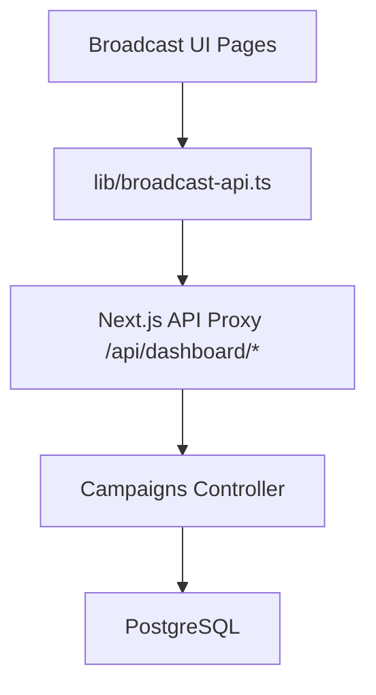

# Broadcast Module Frontend Documentation

This document details the frontend implementation of the Broadcast/Campaign module in the Dashboard UI.

## Overview

The Broadcast module allows users to create, schedule, and monitor WhatsApp campaigns. It interacts with the backend Campaign Module via the standard Dashboard API.

**Location:** `packages/dashboard-ui/app/(dashboard)/broadcast`

## Architecture

### Data Flow

### Key Components

1.  **Pages**
    *   `page.tsx`: Main list view with stats overview and campaign table.
    *   `new/page.tsx`: Multi-step wizard for creating campaigns (Details -> Audience -> Review).
    *   `[id]/page.tsx`: Detailed view with analytics, delivery funnel, and message logs.

2.  **Shared Components** (`/components`)
    *   `AudienceFilterBuilder`: UI for constructing complex audience filters.
    *   `AudiencePreviewCard`: Visualizes audience size and quota impact.
    *   `DeliveryFunnel`: Visualizes the delivery -> read flow.
    *   `QuotaBar`: Shows 24h conversation limits.
    *   `CampaignStatusBadge` & `CampaignTypeBadge`: Consistent status displays.

3.  **API Layer**
    *   `lib/broadcast-api.ts`: Typed wrapper around `fetchWithAuth` for all campaign endpoints.
    *   `lib/broadcast-types.ts`: TypeScript definitions matching backend DTOs.

## Usage

### Creating a Campaign

1.  **Details**: Enter name, select type (Manual/Scheduled), and define message content.
2.  **Audience**: Use the filter builder to target specific users (e.g., by tags, location).
    *   *Preview*: The sidebar updates in real-time to show the estimated recipient count and quota usage.
3.  **Review**: Verify details and launch (or schedule).

### Monitoring

The **Campaign Detail** page provides real-time insights:
*   **Funnel**: Shows drop-offs between Sent, Delivered, and Read.
*   **Message Log**: Individual status of every message sent.
*   **Errors**: Aggregated view of delivery failures (e.g., "invalid_number").

## Development

*   **State Management**: Uses React `useState` and `useEffect` for data fetching.
*   **Styling**: Built with Tailwind CSS and `shadcn/ui` components.
*   **Icons**: `lucide-react`.

## Future Improvements

*   [ ] Add React Query for better caching and background updates.
*   [ ] Support for rich media templates (images, documents).
*   [ ] interactive message previews.
