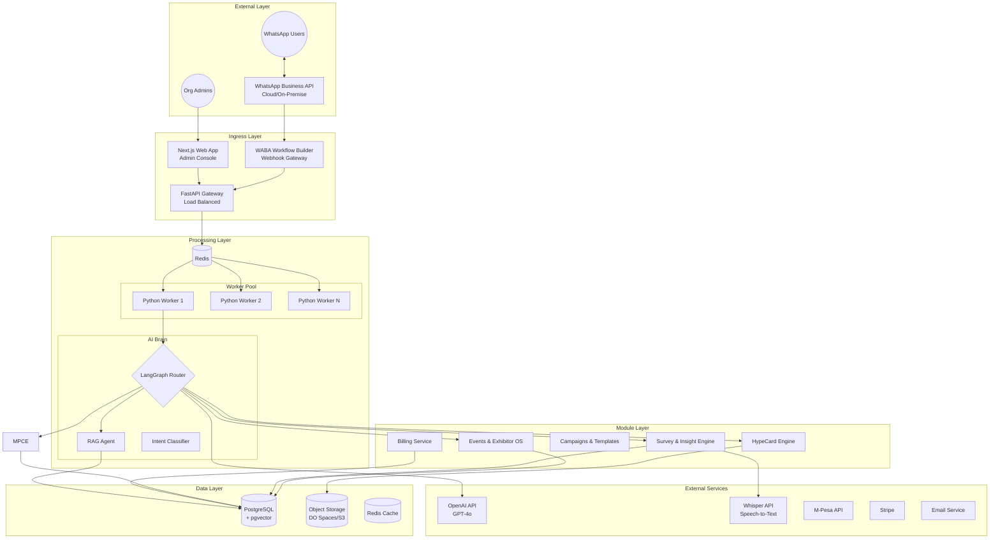
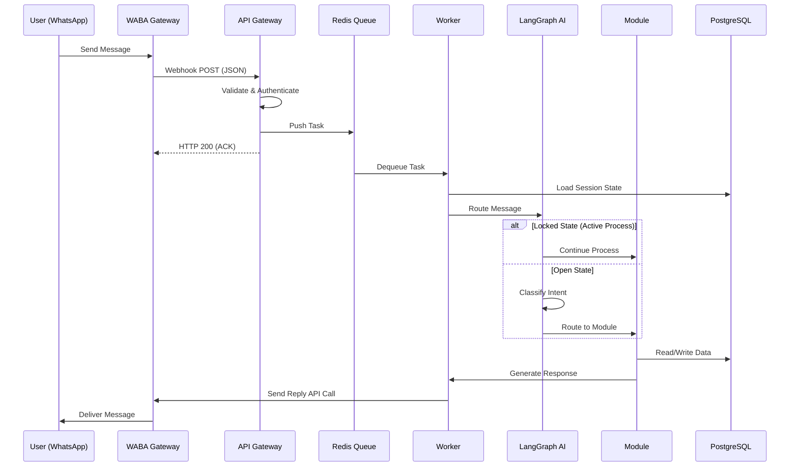
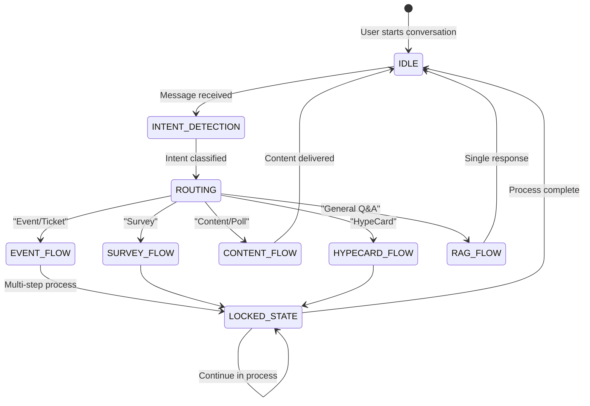
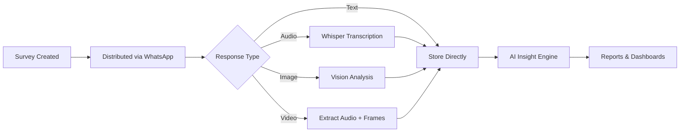
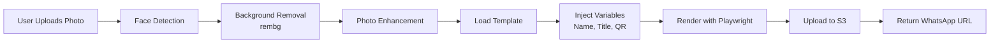
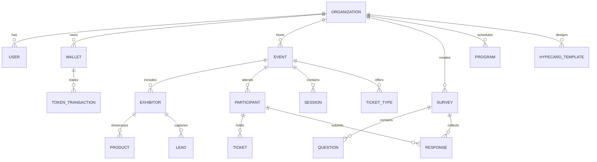
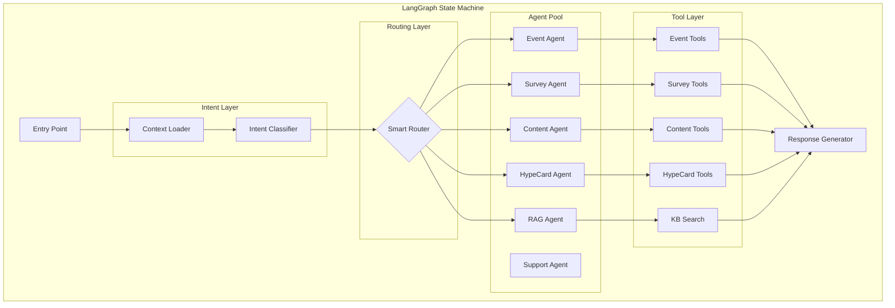
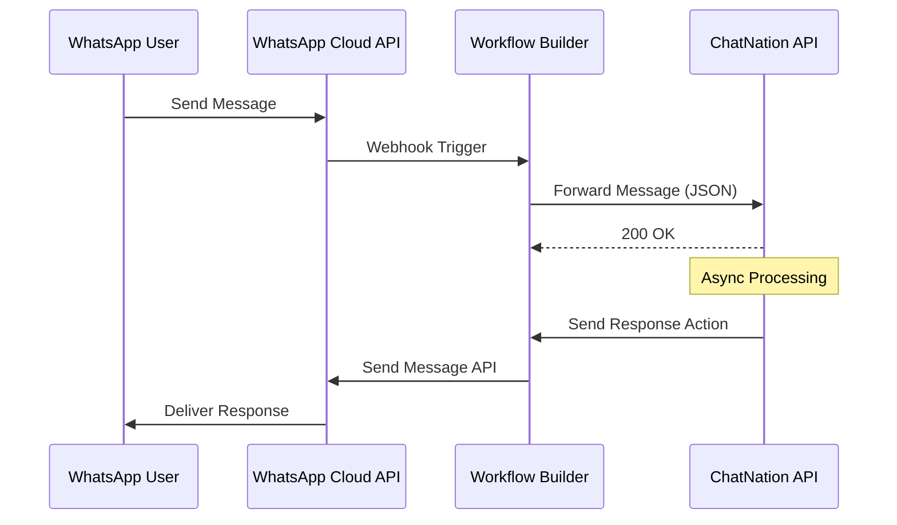

# **CHATNATION CRM — FINAL SYSTEM ARCHITECTURE**

**Version:** 1.0  
**Last Updated:** December 2024  
**Status:** Production-Ready Architecture

---

## **TABLE OF CONTENTS**

1. [Executive Summary](#1-executive-summary)
2. [Platform Overview](#2-platform-overview)
3. [Core Architecture](#3-core-architecture)
4. [Module Specifications](#4-module-specifications)
5. [Technology Stack](#5-technology-stack)
6. [Data Architecture](#6-data-architecture)
7. [AI & Intelligence Layer](#7-ai--intelligence-layer)
8. [Billing & Token Economy](#8-billing--token-economy)
9. [Security Architecture](#9-security-architecture)
10. [Infrastructure & Deployment](#10-infrastructure--deployment)
11. [Integration Patterns](#11-integration-patterns)
12. [Scalability Strategy](#12-scalability-strategy)
13. [Monitoring & Observability](#13-monitoring--observability)
14. [API Design](#14-api-design)
15. [Frontend Architecture](#15-frontend-architecture)
16. [Implementation Roadmap](#16-implementation-roadmap)

---

## **1. EXECUTIVE SUMMARY**

### **What is ChatNation CRM?**

ChatNation is a **multi-tenant AI-powered platform** that enables organizations to engage their audiences through **WhatsApp** with intelligent, conversational experiences. Unlike traditional chatbot builders with hard-coded flows, ChatNation uses a **Central AI Brain** that understands context, manages complex multi-step processes, and delivers personalized interactions.

### **Core Value Proposition**

| For Organizations             | For End Users                   |
| ----------------------------- | ------------------------------- |
| Zero-code WhatsApp engagement | Natural conversation experience |
| AI-powered automation         | No app downloads required       |
| Real-time analytics           | Instant responses 24/7          |
| Predictable token-based costs | Rich multimedia interactions    |

### **Platform Modules**

| Module                               | Purpose                                  | Key Features                               |
| ------------------------------------ | ---------------------------------------- | ------------------------------------------ |
| **EOS** (Events & Exhibitor OS)      | Event management & exhibitor storefronts | Ticketing, booth management, HypeCards     |
| **USI** (Universal Survey & Insight) | Data collection & analysis               | AI surveys, multimedia responses, insights |
| **Campaigns & Templates**           | Scheduled content & broadcasts           | Recurring campaigns, WhatsApp templates, personalization |
| **HypeCard**                         | Viral image generation                   | AI backgrounds, photo processing           |
| **Billing**                          | B2B token economy                        | Prepaid wallets, auto-refill, analytics    |

---

## **2. PLATFORM OVERVIEW**

### **2.1 Operating Models**

The platform supports two distinct operating models:

#### **A. Event Mode**

```
Organizer → Creates Event → Invites Exhibitors → Participants Register → Full Lifecycle
```

#### **B. Independent Mode**

```
Business/Exhibitor → Always-On WhatsApp Storefront → Direct Customer Engagement
```

### **2.2 User Personas**

| Persona                  | Role                                        | Primary Interface        |
| ------------------------ | ------------------------------------------- | ------------------------ |
| **Platform Admin**       | Manages multi-tenant infrastructure         | Internal Dashboard       |
| **Organization Admin**   | Configures their workspace, views analytics | Web Dashboard            |
| **Organizer**            | Creates/manages events, approves exhibitors | Web Dashboard            |
| **Exhibitor**            | Manages booth, products, leads              | Web Dashboard + WhatsApp |
| **Participant/End User** | Interacts with services                     | WhatsApp Only            |

### **2.3 Core Design Principles**

1. **WhatsApp-First**: All end-user interactions happen on WhatsApp
2. **AI-Native**: Intelligence is built into every feature, not bolted on
3. **Multi-Tenant**: Complete data isolation between organizations
4. **Event-Driven**: Asynchronous processing for scalability
5. **Token-Metered**: Transparent, predictable billing for B2B clients

---

## **3. CORE ARCHITECTURE**

### **3.1 High-Level System Diagram**



### **3.2 Request Flow**

#### **Inbound Message Flow (WhatsApp → System)**



### **3.3 State Machine Architecture**

The AI Brain uses a **State Machine** approach instead of traditional flow builders:



**State Types:**

- **IDLE**: No active process, ready for new intent
- **LOCKED**: User is in a multi-step process (survey Q3/5, ticket purchase)
- **WAITING**: System awaiting external event (payment confirmation)

---

## **4. MODULE SPECIFICATIONS**

### **4.1 Module I — Events & Exhibitor OS (EOS)**

**Purpose:** Complete event lifecycle management with exhibitor storefronts

#### **Sub-Components**

| Component         | Responsibility                                 |
| ----------------- | ---------------------------------------------- |
| Event Manager     | Create/configure events, agendas, sessions     |
| Ticketing Engine  | Ticket types, pricing, QR generation, check-in |
| Exhibitor Service | Booth management, product catalogs, leads      |
| Mapping Engine    | Venue layouts, booth locations, navigation     |
| Notification Hub  | Reminders, announcements, alerts               |
| Analytics Engine  | Attendance, engagement, heatmaps               |

#### **Data Entities**

```
Organization
├── Event
│   ├── Sessions
│   ├── Speakers
│   ├── Tickets
│   │   └── Purchases
│   ├── Exhibitors
│   │   ├── Products
│   │   ├── Staff
│   │   └── Leads
│   └── Participants
│       └── CheckIns
└── Venue
    └── BoothMap
```

#### **Key APIs**

```
Events:
  POST   /api/v1/events                    # Create event
  GET    /api/v1/events/{id}               # Get event details
  PUT    /api/v1/events/{id}               # Update event

Tickets:
  POST   /api/v1/events/{id}/tickets       # Create ticket type
  POST   /api/v1/tickets/purchase          # Purchase ticket
  POST   /api/v1/tickets/checkin           # Check in participant

Exhibitors:
  POST   /api/v1/events/{id}/exhibitors    # Add exhibitor
  GET    /api/v1/exhibitors/{id}/leads     # Get captured leads
```

---

### **4.2 Module II — Universal Survey & Insight Engine (USI)**

**Purpose:** AI-powered data collection via WhatsApp with multimedia support

#### **Sub-Components**

| Component             | Responsibility                            |
| --------------------- | ----------------------------------------- |
| Survey Builder        | Drag-and-drop question designer           |
| Logic Engine          | Conditional branching, skip logic, quotas |
| Response Collector    | WhatsApp message parsing, media handling  |
| Transcription Service | Audio → Text via Whisper                  |
| Vision Service        | Image/Video analysis via GPT-4o Vision    |
| Insight Generator     | AI report generation, sentiment analysis  |
| Export Service        | CSV, PDF, API integration                 |

#### **Question Types Supported**

| Category  | Types                                             |
| --------- | ------------------------------------------------- |
| Text      | Short text, Long text, Email, Phone               |
| Selection | Single choice, Multiple choice, Dropdown, Ranking |
| Scale     | Rating (1-5), Likert, NPS, Emoji scale            |
| Media     | Image upload, Audio recording, Video, Document    |
| Special   | Date/Time, Location, Signature                    |

#### **Data Flow**



---

### **4.3 Module III — Campaigns & Templates Engine**

**Purpose:** Scheduled content delivery, recurring campaigns, and template management.

#### **Sub-Components**

| Component              | Responsibility                   |
| ---------------------- | -------------------------------- |
| Campaign Scheduler     | One-time and recurring (cron)    |
| Template Hub           | WhatsApp template management     |
| Broadcast Engine       | Mass message delivery (BullMQ)   |
| Analytics Engine       | Delivery status tracking         |
| Personalization Engine | Contact field placeholder filling|
| Message Delivery (WA)  | WhatsApp Business API integration|

#### **Content Types**

```
Program Structure:
├── Segment
│   ├── Text Message
│   ├── Audio Clip
│   ├── Video
│   ├── Image/Flyer
│   ├── Document (PDF)
│   ├── Poll
│   └── Survey Link
└── Schedule
    ├── One-time
    ├── Daily Recurring
    ├── Weekly Recurring
    └── Event-Triggered
```

#### **Broadcast Delivery Strategy**

| Audience Size    | Strategy                              |
| ---------------- | ------------------------------------- |
| < 1,000          | Immediate serial delivery             |
| 1,000 - 10,000   | Chunked batches (100/batch, 1s delay) |
| 10,000 - 100,000 | Distributed queue with rate limiting  |
| > 100,000        | Scheduled windows + CDN pre-caching   |

---

### **4.4 Module IV — HypeCard Engine**

**Purpose:** Viral personalized image generation

#### **Generation Pipeline**



#### **Template System**

```json
{
  "template_id": "uuid",
  "name": "Tech Conference 2025",
  "canvas": {
    "width": 1080,
    "height": 1080,
    "background": "url-or-gradient"
  },
  "layers": [
    {
      "type": "image",
      "id": "user_photo",
      "position": { "x": 100, "y": 200 },
      "size": { "width": 300, "height": 300 },
      "mask": "circle"
    },
    {
      "type": "text",
      "id": "user_name",
      "position": { "x": 540, "y": 600 },
      "font": "Inter Bold",
      "size": 48,
      "color": "#FFFFFF",
      "variable": "{{name}}"
    },
    {
      "type": "qr",
      "id": "registration_qr",
      "position": { "x": 900, "y": 900 },
      "size": 120,
      "data": "{{registration_url}}"
    }
  ]
}
```

---

## **5. TECHNOLOGY STACK**

### **5.1 Backend Stack**

| Layer                | Technology             | Purpose                     |
| -------------------- | ---------------------- | --------------------------- |
| **API Gateway**      | FastAPI (Python 3.11+) | High-performance async API  |
| **Task Queue**       | Celery + Redis         | Async job processing        |
| **AI Orchestration** | LangGraph              | Stateful AI agent workflows |
| **LLM**              | GPT-4o-mini / GPT-4o   | Reasoning & generation      |
| **Speech-to-Text**   | OpenAI Whisper         | Audio transcription         |
| **Vision**           | GPT-4o Vision          | Image analysis              |
| **Embeddings**       | text-embedding-3-small | Vector search               |

### **5.2 Frontend Stack**

| Layer              | Technology               | Purpose                    |
| ------------------ | ------------------------ | -------------------------- |
| **Framework**      | Next.js 14+ (App Router) | React with SSR/SSG         |
| **Language**       | TypeScript               | Type safety                |
| **Styling**        | Tailwind CSS             | Utility-first CSS          |
| **Components**     | shadcn/ui                | Accessible primitives      |
| **State (Server)** | TanStack Query           | Data fetching & caching    |
| **State (Client)** | Zustand                  | Global state for builders  |
| **Forms**          | React Hook Form + Zod    | Validation                 |
| **Drag & Drop**    | dnd-kit                  | Survey & template builders |
| **Charts**         | Recharts                 | Analytics visualizations   |
| **Maps**           | Leaflet                  | Venue & heatmaps           |

### **5.3 Data Stack**

| Layer              | Technology               | Purpose                   |
| ------------------ | ------------------------ | ------------------------- |
| **Primary DB**     | PostgreSQL 16            | Relational data           |
| **Vector Store**   | pgvector extension       | Embeddings for RAG        |
| **Cache**          | Redis 7                  | Session, queue, real-time |
| **Object Storage** | DigitalOcean Spaces / S3 | Media files               |
| **Search**         | PostgreSQL FTS + pg_trgm | Full-text search          |

### **5.4 Infrastructure Stack**

| Layer                       | Technology             | Purpose                      |
| --------------------------- | ---------------------- | ---------------------------- |
| **Hosting**                 | DigitalOcean (Coolify) | Docker-based PaaS            |
| **Container Orchestration** | Docker Compose / Swarm | Multi-container management   |
| **Reverse Proxy**           | Traefik                | SSL, routing, load balancing |
| **CI/CD**                   | GitHub Actions         | Automated deployments        |
| **Monitoring**              | Prometheus + Grafana   | Metrics & dashboards         |
| **Logging**                 | Loki + Promtail        | Centralized logs             |
| **Error Tracking**          | Sentry                 | Exception monitoring         |

---

## **6. DATA ARCHITECTURE**

### **6.1 Multi-Tenancy Model**

We use **Schema-based isolation** at the application level with **Row-Level Security (RLS)** in PostgreSQL:

```sql
-- Every table includes organization_id
CREATE TABLE events (
    id UUID PRIMARY KEY,
    organization_id UUID NOT NULL REFERENCES organizations(id),
    name VARCHAR(255),
    ...
);

-- Row-Level Security Policy
ALTER TABLE events ENABLE ROW LEVEL SECURITY;

CREATE POLICY org_isolation ON events
    USING (organization_id = current_setting('app.current_org')::uuid);
```

### **6.2 Core Database Schema**



### **6.3 Data Categories**

| Category            | Storage             | Example                                      |
| ------------------- | ------------------- | -------------------------------------------- |
| **Structured**      | PostgreSQL Tables   | Users, Events, Tickets, Transactions         |
| **Semi-Structured** | JSONB Columns       | Survey schemas, Form state, Preferences      |
| **Vector**          | pgvector            | Knowledge base embeddings, FAQ vectors       |
| **Binary**          | Object Storage (S3) | Images, Audio, Video, PDFs                   |
| **Ephemeral**       | Redis               | Session state, Real-time poll counts, Queues |

### **6.4 Key Tables Overview**

```sql
-- Core Platform
organizations, users, roles, permissions, api_keys

-- Billing
wallets, token_transactions, token_purchases, token_bundles

-- Module I: Events
events, sessions, speakers, venues, booth_maps
ticket_types, tickets, participants, check_ins
exhibitors, exhibitor_staff, products, leads

-- Module II: Surveys
surveys, questions, question_logic, responses, response_items

-- Module III: Campaigns
campaigns, campaign_messages, campaign_schedules, templates

-- Module IV: HypeCard
hypecard_templates, template_layers, generated_cards

-- AI & Knowledge
knowledge_bases, documents, embeddings, conversation_history
```

---

## **7. AI & INTELLIGENCE LAYER**

### **7.1 LangGraph Agent Architecture**



### **7.2 RAG Implementation**

```python
# Simplified RAG Flow
async def rag_query(org_id: str, query: str) -> str:
    # 1. Generate embedding
    query_embedding = await openai.embeddings.create(
        model="text-embedding-3-small",
        input=query
    )

    # 2. Vector search in pgvector
    results = await db.execute("""
        SELECT content, metadata,
               1 - (embedding <=> $1) as similarity
        FROM embeddings
        WHERE organization_id = $2
        ORDER BY embedding <=> $1
        LIMIT 5
    """, query_embedding, org_id)

    # 3. Generate response with context
    context = "\n".join([r.content for r in results])
    response = await openai.chat.completions.create(
        model="gpt-4o-mini",
        messages=[
            {"role": "system", "content": f"Context:\n{context}"},
            {"role": "user", "content": query}
        ]
    )

    return response.choices[0].message.content
```

### **7.3 AI Features by Module**

| Module       | AI Capabilities                                                              |
| ------------ | ---------------------------------------------------------------------------- |
| **Core**     | Intent classification, Entity extraction, Sentiment analysis                 |
| **Events**   | FAQ answering, Booth recommendations, Agenda suggestions                     |
| **Surveys**  | Auto-generate questions, Transcribe audio, Analyze images, Generate insights |
| **Content**  | Write content, Summarize feedback, Personalize recommendations               |
| **HypeCard** | Generate backgrounds, Enhance photos, Auto-position elements                 |

---

## **8. BILLING & TOKEN ECONOMY**

### **8.1 Billing Model Summary**

- **B2B Prepaid**: Organizations purchase token bundles
- **End Users Free**: No charges to WhatsApp users
- **Pay-Per-Use**: Tokens debited as features are consumed
- **Auto-Refill**: Automatic top-ups below threshold

### **8.2 Token Consumption Overview**

| Category         | Token Range         |
| ---------------- | ------------------- |
| Basic Actions    | 0.5 - 2 tokens      |
| AI Features      | 2 - 10 tokens       |
| Broadcasts       | 2 - 5 per 100 users |
| Reports          | 10 - 25 tokens      |
| Premium Features | 3 - 10 tokens       |

### **8.3 Wallet Operations**

```
Operations:
├── Purchase → Credit tokens to wallet
├── Debit → Consume tokens for action
├── Reserve → Hold tokens for scheduled action
├── Release → Return reserved tokens (cancellation)
├── Refund → Return tokens (failed action)
└── Transfer → Move between sub-wallets
```

_Full billing architecture details in `billing_architecture.md`_

---

## **9. SECURITY ARCHITECTURE**

### **9.1 Authentication & Authorization**

| Layer              | Mechanism                                         |
| ------------------ | ------------------------------------------------- |
| **Admin Users**    | JWT with refresh tokens, OAuth (Google/Microsoft) |
| **API Clients**    | API Keys with scopes                              |
| **WhatsApp Users** | Phone number verification via WABA                |
| **Inter-Service**  | Internal API keys + IP allowlist                  |

### **9.2 Authorization Model**

```
Permission Hierarchy:
├── Platform Admin (SuperUser)
├── Organization Owner
│   ├── Organization Admin
│   │   ├── Event Manager
│   │   ├── Survey Manager
│   │   └── Content Manager
│   ├── Exhibitor Admin
│   │   └── Exhibitor Staff
│   └── Viewer (Read-only)
└── Participant (No admin access)
```

### **9.3 Data Security**

| Concern             | Mitigation                               |
| ------------------- | ---------------------------------------- |
| **Data at Rest**    | AES-256 encryption (PostgreSQL + S3)     |
| **Data in Transit** | TLS 1.3 everywhere                       |
| **PII Protection**  | Field-level encryption for phone numbers |
| **Multi-Tenancy**   | Row-Level Security (RLS)                 |
| **API Security**    | Rate limiting, Input validation, CORS    |
| **Secrets**         | HashiCorp Vault / DO Secrets             |

### **9.4 Compliance Considerations**

- **GDPR**: Data export, deletion requests, consent tracking
- **Kenya DPA**: Local data residency option, privacy notices
- **WhatsApp Policy**: Opt-in requirements, 24-hour window compliance

---

## **10. INFRASTRUCTURE & DEPLOYMENT**

### **10.1 Container Architecture**

```yaml
# Docker Compose Overview
services:
  # Frontend
  nextjs-admin:
    image: chatnation/admin:latest
    ports: ["3000:3000"]
    environment:
      - NEXT_PUBLIC_API_URL=http://api:8000

  # Backend API
  fastapi-core:
    image: chatnation/api:latest
    ports: ["8000:8000"]
    depends_on: [postgres, redis]

  # Worker (Heavy Processing)
  python-worker:
    image: chatnation/worker:latest
    deploy:
      replicas: 3
    depends_on: [redis, postgres]

  # Scheduler
  celery-beat:
    image: chatnation/worker:latest
    command: celery -A core beat

  # Database
  postgres-db:
    image: postgres:16-alpine
    volumes: [postgres_data:/var/lib/postgresql/data]

  # Cache & Queue
  redis-cache:
    image: redis:7-alpine
    volumes: [redis_data:/data]
```

### **10.2 Scaling Strategy**

| Component   | Scaling Method           | Trigger           |
| ----------- | ------------------------ | ----------------- |
| API Gateway | Horizontal (replicas)    | CPU > 70%         |
| Workers     | Horizontal (replicas)    | Queue depth > 100 |
| PostgreSQL  | Vertical + Read Replicas | Connections > 80% |
| Redis       | Vertical                 | Memory > 70%      |

### **10.3 Environment Tiers**

| Environment     | Purpose      | Config               |
| --------------- | ------------ | -------------------- |
| **Development** | Local dev    | SQLite + local Redis |
| **Staging**     | Testing      | Mirror production    |
| **Production**  | Live traffic | Full HA setup        |

---

## **11. INTEGRATION PATTERNS**

### **11.1 WhatsApp Integration**



### **11.2 Payment Integration**

| Provider        | Use Case       | Integration           |
| --------------- | -------------- | --------------------- |
| **M-Pesa**      | Kenya payments | Daraja API (STK Push) |
| **Stripe**      | Card payments  | Checkout + Webhooks   |
| **iPay**        | Multi-method   | API Integration       |
| **Flutterwave** | Pan-African    | REST API              |

### **11.3 External Service Connectors**

```
Outbound:
├── WhatsApp Cloud API → Message delivery
├── OpenAI API → LLM, Embeddings, Whisper, Vision
├── M-Pesa Daraja → Payment processing
├── SMTP/SendGrid → Email notifications
├── SMS Gateway → Fallback notifications
└── Google Maps → Venue geocoding

Inbound (Webhooks):
├── /webhooks/whatsapp → Message events
├── /webhooks/mpesa → Payment callbacks
├── /webhooks/stripe → Card payment events
└── /webhooks/waba-status → Delivery receipts
```

---

## **12. SCALABILITY STRATEGY**

### **12.1 Horizontal Scaling Points**

| Component            | Current | Scale Target | Method        |
| -------------------- | ------- | ------------ | ------------- |
| API Instances        | 2       | 10+          | Load balancer |
| Worker Processes     | 4       | 50+          | Queue-based   |
| Database Connections | 100     | 1000+        | PgBouncer     |
| Redis                | 1       | Cluster      | Redis Cluster |

### **12.2 Performance Targets**

| Metric            | Target  | Rationale         |
| ----------------- | ------- | ----------------- |
| API Latency (p95) | < 200ms | WhatsApp UX       |
| Worker Processing | < 3s    | Conversation flow |
| Webhook Response  | < 500ms | WABA requirement  |
| Database Query    | < 50ms  | Real-time updates |

### **12.3 Caching Strategy**

| Cache Layer       | Data                    | TTL       |
| ----------------- | ----------------------- | --------- |
| **Redis Session** | User conversation state | 24h       |
| **Redis Query**   | Frequent DB queries     | 5m        |
| **CDN (Spaces)**  | HypeCard images         | Permanent |
| **Browser**       | Static assets           | 1 week    |

---

## **13. MONITORING & OBSERVABILITY**

### **13.1 Metrics Collection**

```yaml
# Key Metrics
business:
  - messages_processed_total
  - tokens_consumed_total
  - surveys_completed_total
  - hypecards_generated_total

performance:
  - http_request_duration_seconds
  - celery_task_duration_seconds
  - db_query_duration_seconds

infrastructure:
  - container_cpu_usage
  - container_memory_usage
  - postgres_connections_active
  - redis_queue_depth
```

### **13.2 Alerting Rules**

| Alert                | Condition           | Severity |
| -------------------- | ------------------- | -------- |
| High Error Rate      | 5xx > 1%            | Critical |
| Queue Backlog        | depth > 1000        | Warning  |
| Database Connections | > 80%               | Warning  |
| Worker Failure       | 3 consecutive fails | Critical |
| Disk Space           | > 85%               | Warning  |

### **13.3 Logging Structure**

```json
{
  "timestamp": "2024-12-09T12:00:00Z",
  "level": "INFO",
  "service": "api",
  "trace_id": "abc123",
  "organization_id": "org-uuid",
  "user_id": "user-uuid",
  "action": "survey.response.submitted",
  "metadata": {
    "survey_id": "survey-uuid",
    "question_number": 5
  }
}
```

---

## **14. API DESIGN**

### **14.1 API Conventions**

- **Base URL**: `https://api.chatnation.io/v1`
- **Authentication**: Bearer token (JWT) or API Key
- **Content-Type**: `application/json`
- **Pagination**: Cursor-based (`?cursor=xxx&limit=50`)
- **Errors**: RFC 7807 Problem Details

### **14.2 Response Format**

```json
// Success
{
  "data": { ... },
  "meta": {
    "cursor": "next_cursor",
    "total": 100
  }
}

// Error
{
  "type": "https://api.chatnation.io/errors/insufficient-balance",
  "title": "Insufficient Token Balance",
  "status": 402,
  "detail": "Your organization requires 50 tokens but only has 30",
  "instance": "/api/v1/surveys/send"
}
```

### **14.3 Key Endpoints Summary**

```
Auth:
  POST /auth/login
  POST /auth/refresh
  POST /auth/logout

Organizations:
  GET  /organizations/me
  PUT  /organizations/me

Billing:
  GET  /billing/wallet
  POST /billing/purchase
  GET  /billing/transactions

Events:
  CRUD /events
  CRUD /events/{id}/exhibitors
  CRUD /events/{id}/tickets

Surveys:
  CRUD /surveys
  POST /surveys/{id}/send
  GET  /surveys/{id}/responses

Campaigns:
  CRUD /campaigns
  POST /campaigns/{id}/send
  GET  /campaigns/analytics
  CRUD /templates
  POST /templates/import

HypeCards:
  CRUD /templates
  POST /templates/{id}/generate
```

---

## **15. FRONTEND ARCHITECTURE**

### **15.1 Application Structure**

```
/app
├── (auth)/                    # Public auth pages
│   ├── login/
│   └── register/
├── (dashboard)/               # Protected admin area
│   ├── layout.tsx             # Sidebar + Header
│   ├── page.tsx               # Command Center
│   │
│   ├── events/                # Module I
│   │   ├── page.tsx           # Events list
│   │   └── [id]/
│   │       ├── overview/
│   │       ├── exhibitors/
│   │       └── map-editor/
│   │
│   ├── surveys/               # Module II
│   │   ├── builder/[id]/      # DnD Builder
│   │   └── results/[id]/      # Analytics
│   │
│   ├── campaigns/             # Module III
│   │   ├── scheduler/         # Calendar/Schedule view
│   │   ├── new/               # Campaign Wizard
│   │   └── analytics/         # Delivery reports
│   │
│   ├── templates/             # Template Hub
│   │
│   ├── hypecards/             # Module IV
│   │   ├── studio/[id]/       # Visual editor
│   │   └── gallery/
│   │
│   ├── billing/               # Wallet & Purchases
│   └── settings/
│
└── api/                       # API routes (BFF)
```

### **15.2 Key Components**

| Component            | Purpose                    | Complexity |
| -------------------- | -------------------------- | ---------- |
| `SurveyBuilder`      | Drag-and-drop form builder | High       |
| `HypeCardStudio`     | Visual template designer   | High       |
| `WhatsAppPreview`    | Message preview component  | Medium     |
| `AnalyticsDashboard` | Real-time charts           | Medium     |
| `EventMapEditor`     | Leaflet-based booth mapper | Medium     |

### **15.3 State Management**

```
Global State (Zustand):
├── uiStore → Sidebar, modals, theme
├── surveyBuilderStore → Draft survey being edited
├── hypeCardStore → Template being designed
└── userStore → Current user, permissions

Server State (TanStack Query):
├── events → List, detail, mutations
├── surveys → List, responses, analytics
├── billing → Wallet, transactions
└── analytics → Real-time polling data
```

---

## **16. IMPLEMENTATION ROADMAP**

### **Phase 1: Foundation**

- [ ] Core API structure (FastAPI)
- [ ] Database schema (PostgreSQL + pgvector)
- [ ] Authentication system (JWT)
- [ ] Multi-tenancy (Organizations, RLS)
- [ ] Basic admin dashboard (Next.js)
- [ ] WhatsApp webhook integration

### **Phase 2: Core Modules**

- [ ] LangGraph AI router
- [ ] Module I: Events (Basic CRUD, Ticketing)
- [ ] Module II: Surveys (Builder, Basic responses)
- [x] Module III: Campaigns (Templates, Recurring, Analytics)
- [ ] Module IV: HypeCard (Templates, Generation)

### **Phase 3: Billing & AI**

- [ ] Token wallet system
- [ ] M-Pesa integration
- [ ] AI features (RAG, Transcription, Vision)
- [ ] Usage tracking & analytics
- [ ] Auto-refill & alerts

### **Phase 4: Polish & Scale**

- [ ] Advanced analytics dashboards
- [ ] Performance optimization
- [ ] Monitoring & alerting
- [ ] Documentation
- [ ] Beta launch

### **Phase 5: Enterprise**

- [ ] Sub-wallets & budget controls
- [ ] Custom branding (white-label)
- [ ] API marketplace
- [ ] Advanced integrations
- [ ] General availability

---

## **APPENDIX**

### **A. Acronyms**

| Acronym | Meaning                                   |
| ------- | ----------------------------------------- |
| EOS     | Events & Exhibitor Operating System       |
| USI     | Universal Survey & Insight Engine         |
| Campaigns | Campaigns & WhatsApp Template Engine |
| WABA    | WhatsApp Business API                     |
| RAG     | Retrieval-Augmented Generation            |
| RLS     | Row-Level Security                        |
| LLM     | Large Language Model                      |

### **B. Related Documents**

- `System Development.md` — Original module specifications
- `design_draft.md` — Initial architecture draft
- `frontend_draft.md` — Frontend architecture details
- `billing_architecture.md` — Complete billing system design

---

_This architecture document provides the foundation for building a scalable, maintainable, and revenue-generating platform. It should be treated as a living document and updated as the system evolves._
