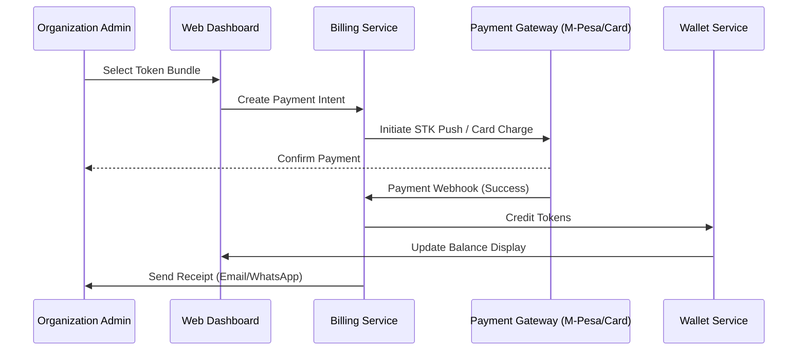
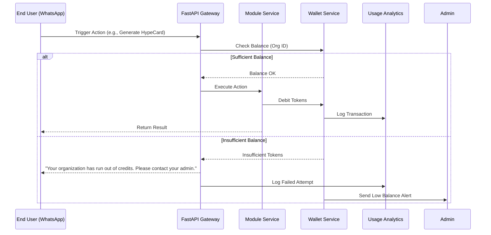
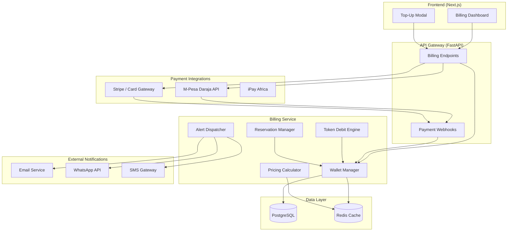

# **B2B TOKEN BILLING & WALLET ARCHITECTURE**

**Project Name:** ChatNation CRM  
**Module:** Billing & Token Economy  
**Model:** B2B Prepaid Token Wallet System

---

## **1. CORE BILLING PHILOSOPHY**

The platform operates on a **B2B prepaid token-based billing model**:

- **End users (participants/audience) are NEVER charged** — they interact freely via WhatsApp.
- **Businesses (Organizations/Exhibitors) pay** — they purchase token bundles and consume tokens as their users engage with AI features, content, surveys, etc.
- **Tokens are debited automatically** as actions are performed by users of that business.
- **Businesses can monitor, refill, and set alerts** on their token wallets.

This model ensures:
- ✅ **Predictable costs** for businesses
- ✅ **No friction** for end users
- ✅ **Strong recurring revenue** for the platform
- ✅ **Clear value attribution** to AI-powered features

---

## **2. TOKEN WALLET STRUCTURE**

### **A. Wallet Hierarchy**

```
Platform (ChatNation)
│
├── Organization Wallet (e.g., "TechExpo 2025", "Faith Church", "Classic FM")
│   │
│   ├── Main Balance (Prepaid Tokens)
│   │
│   ├── Reserved Balance (For scheduled actions)
│   │
│   └── Sub-Wallets (Optional)
│       ├── Event-Specific Wallet (e.g., "Annual Gala 2025")
│       ├── Department Wallet (e.g., "Marketing", "HR")
│       └── Exhibitor Allocation (For event organizers distributing to exhibitors)
```

### **B. Wallet Attributes**

| Attribute | Description |
|-----------|-------------|
| `wallet_id` | Unique identifier (UUID) |
| `organization_id` | FK to the owning organization |
| `balance` | Current available tokens (integer) |
| `reserved_balance` | Tokens reserved for scheduled actions |
| `lifetime_purchased` | Total tokens ever purchased |
| `lifetime_consumed` | Total tokens ever spent |
| `low_balance_threshold` | Alert trigger level |
| `auto_refill_enabled` | Boolean for automatic top-ups |
| `auto_refill_amount` | Tokens to purchase on auto-refill |
| `currency` | KES / USD / EUR |
| `created_at` | Timestamp |
| `updated_at` | Timestamp |

---

## **3. TOKEN PRICING TIERS**

### **A. Token Bundles (Prepaid Purchase Options)**

| Bundle Name | Tokens | Price (KES) | Price (USD) | Bonus | Best For |
|-------------|--------|-------------|-------------|-------|----------|
| **Starter** | 500 | 2,500 | $20 | — | Small businesses, testing |
| **Growth** | 2,000 | 8,000 | $60 | +200 free | SMEs, regular use |
| **Professional** | 5,000 | 18,000 | $140 | +750 free | Active organizations |
| **Enterprise** | 20,000 | 60,000 | $450 | +4,000 free | High-volume clients |
| **Custom** | Negotiated | Custom | Custom | Custom | Large enterprises, governments |

### **B. Token Value**

**1 Token ≈ KES 5 (~$0.04 USD)**

This allows fine-grained billing for all actions, from simple messages to complex AI operations.

---

## **4. TOKEN CONSUMPTION RATES**

### **A. Module I — Events & Exhibitor OS**

| Action | Tokens |
|--------|--------|
| Create Event Workspace | 50 |
| Generate HypeCard (Basic) | 2 |
| Generate HypeCard (AI Background) | 5 |
| HypeCard Photo Enhancement | 1 |
| Animated HypeCard | 3 |
| QR Code Generation | 1 |
| Send Event Reminder (per 100 users) | 2 |
| AI Booth Recommendation | 1 |
| Real-time Heat Map Update | 5/hour |
| Post-Event Analytics Report | 20 |
| AI Executive Summary | 25 |

### **B. Module II — Survey & Insight Engine**

| Action | Tokens |
|--------|--------|
| Create Survey | 5 |
| AI-Generated Survey | 10 |
| Send Survey (per 100 recipients) | 3 |
| Collect Response (Text) | 0.5 |
| Collect Response (Audio - Transcription) | 2 |
| Collect Response (Image - Analysis) | 2 |
| Collect Response (Video - Analysis) | 5 |
| AI Insight Report Generation | 15 |
| Real-time Dashboard (per day) | 3 |
| Export Responses (CSV/PDF) | 2 |

### **C. Module III — Content & Engagement Engine**

| Action | Tokens |
|--------|--------|
| Create Daily Program | 5 |
| Schedule Content (Text) | 1 |
| Schedule Content (Audio) | 2 |
| Schedule Content (Video) | 3 |
| Broadcast Message (per 1,000 users) | 5 |
| Run Poll | 2 |
| AI Content Generation | 5 |
| AI Feedback Summary | 10 |
| Personalized Feed Activation (per user) | 1 |
| Analytics Dashboard (per day) | 2 |

### **D. Module IV — HypeCard Engine**

| Action | Tokens |
|--------|--------|
| Basic HypeCard Generation | 2 |
| AI Background Generation | 5 |
| Photo Enhancement | 1 |
| Animated Card (MP4) | 3 |
| High-Resolution Download | 1 |
| Multi-Format Output (each variant) | 1 |

### **E. Core Platform Actions**

| Action | Tokens |
|--------|--------|
| WhatsApp Conversation (per message with AI) | 0.5 |
| RAG Query (Knowledge Base Search) | 1 |
| Voice Message Transcription | 2 |
| Image Analysis (Vision AI) | 2 |
| Document Processing (PDF/OCR) | 3 |
| AI Rewrite/Optimize Content | 2 |

---

## **5. BILLING EVENTS & LIFECYCLE**

### **A. Token Purchase Flow**



### **B. Token Consumption Flow**



---

## **6. WALLET MANAGEMENT FEATURES**

### **A. Organization Dashboard Features**

| Feature | Description |
|---------|-------------|
| **Balance Overview** | Real-time token balance, reserved, and available |
| **Usage Analytics** | Charts showing consumption by module, feature, time |
| **Transaction History** | Detailed log of every token debit with action type |
| **Top-Up** | Direct purchase of token bundles |
| **Auto-Refill** | Configure automatic purchases when balance drops below threshold |
| **Alerts** | Email/WhatsApp notifications for low balance, high usage spikes |
| **Budget Caps** | Set daily/weekly/monthly spending limits |
| **Sub-Wallet Management** | Create and allocate tokens to departments/events |
| **Export Reports** | Download billing statements (PDF/CSV) |

### **B. Alert Configuration**

| Alert Type | Trigger | Channels |
|------------|---------|----------|
| Low Balance Warning | Balance < 20% of last purchase | Email, WhatsApp, Dashboard |
| Critical Low Balance | Balance < 100 tokens | Email, WhatsApp, SMS |
| High Usage Spike | >300% of daily average | Email, Dashboard |
| Auto-Refill Success | After automatic top-up | Email |
| Auto-Refill Failed | Payment failed | Email, WhatsApp, SMS |
| Monthly Summary | 1st of each month | Email |

---

## **7. RESERVATION SYSTEM (SCHEDULED ACTIONS)**

For scheduled broadcasts, surveys, or content delivery:

### **Flow:**

1. **Admin Schedules Action**  
   - E.g., "Send survey to 5,000 users on Monday 9AM"
   
2. **System Calculates Cost**  
   - 5,000 users × 0.03 tokens/user = 150 tokens

3. **Tokens are RESERVED**  
   - Moved from `balance` to `reserved_balance`
   - Ensures funds are available when action executes

4. **Action Executes**  
   - Reserved tokens are debited
   - `reserved_balance` decreases
   - Transaction logged with actual consumption

5. **Partial Execution Handling**  
   - If only 4,000 users receive survey (1,000 failed)
   - Only 120 tokens debited
   - 30 tokens returned to main balance

---

## **8. DATA ARCHITECTURE**

### **A. Core Tables**

```sql
-- Wallet Table
CREATE TABLE wallets (
    id UUID PRIMARY KEY DEFAULT gen_random_uuid(),
    organization_id UUID NOT NULL REFERENCES organizations(id),
    balance INTEGER NOT NULL DEFAULT 0,
    reserved_balance INTEGER NOT NULL DEFAULT 0,
    lifetime_purchased BIGINT NOT NULL DEFAULT 0,
    lifetime_consumed BIGINT NOT NULL DEFAULT 0,
    low_balance_threshold INTEGER DEFAULT 100,
    auto_refill_enabled BOOLEAN DEFAULT FALSE,
    auto_refill_amount INTEGER,
    auto_refill_bundle_id UUID REFERENCES token_bundles(id),
    currency VARCHAR(3) DEFAULT 'KES',
    created_at TIMESTAMPTZ DEFAULT NOW(),
    updated_at TIMESTAMPTZ DEFAULT NOW(),
    CONSTRAINT positive_balance CHECK (balance >= 0),
    CONSTRAINT positive_reserved CHECK (reserved_balance >= 0)
);

-- Token Transactions Table
CREATE TABLE token_transactions (
    id UUID PRIMARY KEY DEFAULT gen_random_uuid(),
    wallet_id UUID NOT NULL REFERENCES wallets(id),
    transaction_type VARCHAR(20) NOT NULL, -- 'purchase', 'debit', 'refund', 'transfer', 'reservation', 'release'
    amount INTEGER NOT NULL,
    balance_before INTEGER NOT NULL,
    balance_after INTEGER NOT NULL,
    module VARCHAR(50), -- 'events', 'surveys', 'content', 'hypecard', 'core'
    action VARCHAR(100), -- 'generate_hypecard', 'send_broadcast', etc.
    reference_id UUID, -- FK to the specific action (survey_id, broadcast_id, etc.)
    metadata JSONB, -- Additional context
    created_at TIMESTAMPTZ DEFAULT NOW(),
    created_by UUID REFERENCES users(id)
);

-- Token Bundles Table
CREATE TABLE token_bundles (
    id UUID PRIMARY KEY DEFAULT gen_random_uuid(),
    name VARCHAR(50) NOT NULL,
    tokens INTEGER NOT NULL,
    bonus_tokens INTEGER DEFAULT 0,
    price_kes DECIMAL(10,2) NOT NULL,
    price_usd DECIMAL(10,2),
    is_active BOOLEAN DEFAULT TRUE,
    created_at TIMESTAMPTZ DEFAULT NOW()
);

-- Purchases Table
CREATE TABLE token_purchases (
    id UUID PRIMARY KEY DEFAULT gen_random_uuid(),
    wallet_id UUID NOT NULL REFERENCES wallets(id),
    bundle_id UUID REFERENCES token_bundles(id),
    tokens_purchased INTEGER NOT NULL,
    bonus_tokens INTEGER DEFAULT 0,
    amount_paid DECIMAL(10,2) NOT NULL,
    currency VARCHAR(3) NOT NULL,
    payment_method VARCHAR(20), -- 'mpesa', 'card', 'bank_transfer', 'credit'
    payment_reference VARCHAR(100),
    payment_status VARCHAR(20) DEFAULT 'pending', -- 'pending', 'completed', 'failed', 'refunded'
    receipt_number VARCHAR(50),
    metadata JSONB,
    created_at TIMESTAMPTZ DEFAULT NOW(),
    completed_at TIMESTAMPTZ
);

-- Sub-Wallets Table (Optional allocations)
CREATE TABLE sub_wallets (
    id UUID PRIMARY KEY DEFAULT gen_random_uuid(),
    parent_wallet_id UUID NOT NULL REFERENCES wallets(id),
    name VARCHAR(100) NOT NULL,
    type VARCHAR(20), -- 'event', 'department', 'exhibitor'
    reference_id UUID, -- event_id, exhibitor_id, etc.
    allocated_tokens INTEGER NOT NULL DEFAULT 0,
    consumed_tokens INTEGER NOT NULL DEFAULT 0,
    is_active BOOLEAN DEFAULT TRUE,
    created_at TIMESTAMPTZ DEFAULT NOW(),
    updated_at TIMESTAMPTZ DEFAULT NOW()
);

-- Usage Alerts Log
CREATE TABLE usage_alerts (
    id UUID PRIMARY KEY DEFAULT gen_random_uuid(),
    wallet_id UUID NOT NULL REFERENCES wallets(id),
    alert_type VARCHAR(50) NOT NULL,
    threshold INTEGER,
    balance_at_alert INTEGER,
    channels_notified TEXT[], -- ['email', 'whatsapp', 'sms']
    acknowledged BOOLEAN DEFAULT FALSE,
    acknowledged_at TIMESTAMPTZ,
    acknowledged_by UUID REFERENCES users(id),
    created_at TIMESTAMPTZ DEFAULT NOW()
);
```

### **B. Indexes for Performance**

```sql
CREATE INDEX idx_token_transactions_wallet ON token_transactions(wallet_id);
CREATE INDEX idx_token_transactions_created ON token_transactions(created_at);
CREATE INDEX idx_token_transactions_module ON token_transactions(module);
CREATE INDEX idx_token_purchases_wallet ON token_purchases(wallet_id);
CREATE INDEX idx_wallets_org ON wallets(organization_id);
CREATE INDEX idx_sub_wallets_parent ON sub_wallets(parent_wallet_id);
```

---

## **9. API ENDPOINTS**

### **A. Wallet Management**

```
GET    /api/v1/billing/wallet                    # Get org wallet details
GET    /api/v1/billing/wallet/balance            # Quick balance check
GET    /api/v1/billing/wallet/transactions       # Paginated transaction history
GET    /api/v1/billing/wallet/usage-stats        # Usage analytics
POST   /api/v1/billing/wallet/alerts             # Configure alerts
PUT    /api/v1/billing/wallet/auto-refill        # Set auto-refill preferences
```

### **B. Token Purchases**

```
GET    /api/v1/billing/bundles                   # List available bundles
POST   /api/v1/billing/purchase                  # Initiate purchase
POST   /api/v1/billing/purchase/{id}/confirm     # Confirm after payment
GET    /api/v1/billing/purchases                 # Purchase history
GET    /api/v1/billing/purchases/{id}/receipt    # Download receipt
```

### **C. Sub-Wallets**

```
GET    /api/v1/billing/sub-wallets               # List sub-wallets
POST   /api/v1/billing/sub-wallets               # Create sub-wallet
PUT    /api/v1/billing/sub-wallets/{id}          # Update allocation
DELETE /api/v1/billing/sub-wallets/{id}          # Deactivate sub-wallet
POST   /api/v1/billing/sub-wallets/{id}/transfer # Transfer tokens
```

### **D. Internal Services (Not exposed publicly)**

```
POST   /internal/billing/reserve                 # Reserve tokens for scheduled action
POST   /internal/billing/debit                   # Debit tokens for completed action
POST   /internal/billing/release                 # Release reserved tokens (cancellation)
POST   /internal/billing/refund                  # Refund tokens (failed action)
GET    /internal/billing/check                   # Pre-check if org has sufficient balance
```

---

## **10. BILLING SERVICE ARCHITECTURE**



---

## **11. PAYMENT GATEWAY INTEGRATION**

### **A. M-Pesa (Primary for Kenya)**

**STK Push Flow:**
1. User selects bundle → Frontend calls `/billing/purchase`
2. Backend initiates STK Push via Daraja API
3. User enters M-Pesa PIN on phone
4. M-Pesa sends callback to `/webhooks/mpesa`
5. Tokens credited to wallet

**PayBill (Manual) Flow:**
1. User pays to PayBill number with Account = `ORG_ID`
2. M-Pesa C2B callback → `/webhooks/mpesa/c2b`
3. System matches payment to organization
4. Tokens credited

### **B. Card Payments (Stripe/Flutterwave)**

1. User selects bundle → Stripe Checkout session created
2. User completes payment on Stripe-hosted page
3. Stripe webhook → `/webhooks/stripe`
4. Tokens credited

### **C. Bank Transfer (Enterprise)**

1. Invoice generated with bank details
2. Finance team confirms receipt manually OR
3. Bank API integration auto-detects payment
4. Tokens credited upon confirmation

---

## **12. FRAUD PREVENTION & SECURITY**

| Measure | Implementation |
|---------|----------------|
| **Rate Limiting** | Max 100 API calls/minute per organization |
| **Transaction Signing** | HMAC signature on all debit requests |
| **Audit Trail** | Immutable transaction log with user attribution |
| **Duplicate Prevention** | Idempotency keys on purchases and debits |
| **Balance Locks** | Pessimistic locking on concurrent wallet updates |
| **Payment Verification** | Verify M-Pesa callbacks against Daraja Query API |
| **Anomaly Detection** | Alert on unusual spending patterns |
| **Admin Approval** | Large purchases (>50,000 tokens) require approval |

---

## **13. REPORTING & ANALYTICS**

### **A. Organization Reports**

| Report | Frequency | Contents |
|--------|-----------|----------|
| Daily Usage Summary | Daily | Tokens spent by module, top features |
| Weekly Billing Report | Weekly | Spend trend, remaining balance, forecast |
| Monthly Invoice | Monthly | Detailed breakdown, PDF statement |
| Cost-Per-User Analysis | On-demand | Average tokens per end user |
| Module Efficiency | On-demand | ROI per module (surveys sent vs insights generated) |

### **B. Platform Admin Reports (Internal)**

| Report | Purpose |
|--------|---------|
| Revenue by Organization | Track top spenders |
| Token Velocity | Rate of token consumption across platform |
| Churn Risk | Organizations with declining usage |
| Refund Analysis | Track refunds and failed payments |
| Bundle Performance | Which bundles sell most |

---

## **14. INTEGRATION WITH OTHER MODULES**

Each module integrates with the Billing Service via internal APIs:

### **Example: HypeCard Generation**

```python
# In HypeCard Service
async def generate_hypecard(org_id: str, user_data: dict, options: dict):
    # Calculate cost
    cost = 2  # Base cost
    if options.get("ai_background"):
        cost += 5
    if options.get("photo_enhancement"):
        cost += 1
    
    # Pre-check balance
    has_balance = await billing_client.check_balance(org_id, cost)
    if not has_balance:
        raise InsufficientBalanceError("Organization has insufficient tokens")
    
    # Execute generation
    card = await render_hypecard(user_data, options)
    
    # Debit tokens
    await billing_client.debit(
        org_id=org_id,
        amount=cost,
        module="hypecard",
        action="generate",
        reference_id=card.id,
        metadata={"options": options}
    )
    
    return card
```

---

## **15. MIGRATION & ROLLOUT PLAN**

### **Phase 1: Core Wallet System**
- Wallet tables and basic CRUD
- Manual top-up via admin
- Simple debit tracking

### **Phase 2: Payment Integration**
- M-Pesa STK Push
- Card payments (Stripe)
- Automated billing

### **Phase 3: Advanced Features**
- Sub-wallets
- Auto-refill
- Budget caps
- Alerts

### **Phase 4: Enterprise Features**
- Bulk pricing
- Invoice-based billing
- Multi-currency support
- SLA-backed credits

---

## **16. SUCCESS METRICS**

| Metric | Target |
|--------|--------|
| Token Purchase Conversion | >15% of trial users |
| Average Token Lifetime | <30 days (healthy consumption) |
| Auto-Refill Adoption | >25% of paying orgs |
| Payment Success Rate | >98% |
| Support Tickets (Billing) | <5% of total tickets |
| Revenue per Organization | >$50/month average |

---

This billing architecture creates a **sustainable, scalable revenue engine** for ChatNation while ensuring a frictionless experience for end users and transparent cost management for businesses.
