# Events CRM — System Design & User Journey Diagrams
> Developer Reference Document · All roles · All flows · Mermaid-ready

---

## Table of Contents
1. [System Architecture Overview](#1-system-architecture-overview)
2. [Role & Permission Matrix](#2-role--permission-matrix)
3. [Organizer (Super Admin) Journey](#3-organizer-super-admin-journey)
4. [Exhibitor / Speaker / Presenter Journey](#4-exhibitor--speaker--presenter-journey)
5. [End User — General Tier Journey](#5-end-user--general-tier-journey)
6. [End User — Gold Tier Journey](#6-end-user--gold-tier-journey)
7. [End User — Platinum Tier Journey](#7-end-user--platinum-tier-journey)
8. [Entry & Attendance Validation Flow](#8-entry--attendance-validation-flow)
9. [Hypecard Generation Flow](#9-hypecard-generation-flow)
10. [Lead Capture & Post-Event Comms Flow](#10-lead-capture--post-event-comms-flow)
11. [Notification & Messaging Flow](#11-notification--messaging-flow)
12. [Entity Relationship Overview](#12-entity-relationship-overview)

---

## 1. System Architecture Overview

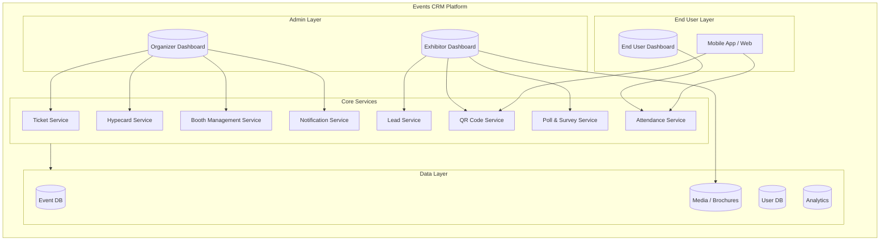

---

## 2. Role & Permission Matrix

```mermaid
graph LR
    subgraph Roles["Role Hierarchy"]
        ORG[🏛 Organizer\nSuper Admin]
        EXH[🎤 Exhibitor/Speaker\nSmaller Admin]
        GEN[👤 End User General]
        GOLD[🥇 End User Gold]
        PLAT[💎 End User Platinum]
    end

    subgraph Permissions["Permission Blocks"]
        P1[Event Creation & Settings]
        P2[Ticketing & Pricing]
        P3[Hypecard Generation]
        P4[Booth Assignment & Layout]
        P5[User Role Management]
        P6[Exhibitor Booth Management]
        P7[Product Upload]
        P8[Lead Capture QR]
        P9[Brochure Upload]
        P10[Polls & Surveys - Send]
        P11[Thank You / Messages]
        P12[View Own Ticket & Hypecard]
        P13[Attend General Sessions]
        P14[Gold-Exclusive Sessions]
        P15[Platinum Private Rooms & Resources]
    end

    ORG --> P1
    ORG --> P2
    ORG --> P3
    ORG --> P4
    ORG --> P5

    EXH --> P6
    EXH --> P7
    EXH --> P8
    EXH --> P9
    EXH --> P10
    EXH --> P11

    GEN --> P12
    GEN --> P13

    GOLD --> P12
    GOLD --> P13
    GOLD --> P14

    PLAT --> P12
    PLAT --> P13
    PLAT --> P14
    PLAT --> P15
```

---

## 3. Organizer (Super Admin) Journey

```mermaid
flowchart TD
    A([Start: Login / Register as Organizer]) --> B[Create New Event]
    B --> C{Eventbrite Integration?}
    C -- Yes --> C1[Import from Eventbrite\nor Sync Settings]
    C -- No --> C2[Manual Event Setup]
    C1 --> D
    C2 --> D

    D[Configure Event Details\nName · Date · Venue · Capacity] --> E[Define Ticket Tiers]
    E --> E1[General Tier Setup\nPrice · Qty · Access Rules]
    E --> E2[Gold Tier Setup\nPrice · Qty · Perks · Sessions]
    E --> E3[Platinum Tier Setup\nPrice · Qty · Private Rooms · Resources]

    E1 & E2 & E3 --> F[Publish Tickets & Pricing]

    F --> G[Generate Hypecards]
    G --> G1[Select Template]
    G1 --> G2[Set Branding: Logo · Colors · Copy]
    G2 --> G3[Map to Ticket Tiers\nGeneral / Gold / Platinum variants]
    G3 --> G4[Publish & Assign Hypecards]

    G4 --> H[Booth Management Module]
    H --> H1[Define Floor Layout / Map]
    H1 --> H2[Create Booth Slots]
    H2 --> H3[Assign Exhibitor/Speaker to Booth]
    H3 --> H4{Booth Accepted?}
    H4 -- No --> H3
    H4 -- Yes --> H5[Booth Confirmed & Published]

    H5 --> I[Manage Exhibitor Admins]
    I --> I1[Send Exhibitor Invitation]
    I1 --> I2[Assign Role: Exhibitor / Speaker / Presenter]
    I2 --> I3[Set Permissions per Exhibitor]

    I3 --> J[Pre-Event Dashboard]
    J --> J1[Monitor Registration Numbers]
    J --> J2[Check Tier Distribution\nGeneral · Gold · Platinum]
    J --> J3[View Booth Setup Progress]
    J --> J4[Send Event Announcements]

    J4 --> K{Event Day}
    K --> K1[Monitor Attendance in Real-Time]
    K1 --> K2[View QR Scan Logs]
    K2 --> K3[Handle Entry Exceptions\nInvalid QR · No-Show · VIP Walk-In]

    K3 --> L[Post-Event]
    L --> L1[Analytics Dashboard\nAttendance · Tier Breakdown · Booth Traffic]
    L --> L2[Export Data / Reports]
    L --> L3[Collect Exhibitor Reports]
    L3 --> M([End])
```

---

## 4. Exhibitor / Speaker / Presenter Journey

```mermaid
flowchart TD
    A([Start: Receive Organizer Invitation]) --> B[Accept Invite & Activate Account]
    B --> C[First Login → Exhibitor Dashboard]

    C --> D[Booth Setup Phase]
    D --> D1[View Assigned Booth Location\nFloor Map]
    D1 --> D2[Upload Booth Branding\nBanner · Logo · Bio]
    D2 --> D3[Add Products / Services]
    D3 --> D4{All Products Ready?}
    D4 -- No → add more --> D3
    D4 -- Yes --> D5[Upload Digital Brochures\nPDF / Links]

    D5 --> E[QR Code Generation]
    E --> E1[Generate Lead Capture QR\nper Booth or per Campaign]
    E1 --> E2[Generate Brochure Share QR\nper Product / Session]
    E2 --> E3[Download & Print QR Assets]

    E3 --> F[Polls & Surveys Setup]
    F --> F1[Create Poll Questions]
    F1 --> F2[Create Survey Forms]
    F2 --> F3[Schedule: During or Post-Event]
    F3 --> F4[Assign to End-User Tier\nAll · Gold · Platinum]

    F4 --> G{Event Day}

    G --> G1[Booth Open — Live Dashboard]
    G1 --> G2[End User Scans Lead QR\nat Booth]
    G2 --> G3[Lead Captured:\nName · Email · Tier · Timestamp]
    G3 --> G4[Tag Lead: Hot · Warm · Cold]
    G4 --> G5[Brochure Sent Automatically\nto End User Dashboard]

    G5 --> G6[Real-Time Lead List\nUpdates in Dashboard]
    G6 --> G7{Poll / Survey Triggered?}
    G7 -- Yes --> G8[Push Poll to Scanned User]
    G7 -- No --> G9[Continue Booth Activity]
    G8 --> G9

    G9 --> H[Post-Event Actions]
    H --> H1[Review All Captured Leads]
    H1 --> H2[Filter by Tier · Tag · Session]
    H2 --> H3[Send Thank You Notes\nPersonalized per Lead]
    H3 --> H4{Send Survey?}
    H4 -- Yes --> H5[Send Post-Event Survey\nto Lead List]
    H4 -- No --> H6[Mark Lead as Contacted]
    H5 --> H6

    H6 --> H7[Export Lead Report]
    H7 --> I([End])
```

---

## 5. End User — General Tier Journey

```mermaid
flowchart TD
    A([Start: Receive Event Invitation\nEmail / SMS / Link]) --> B[Click Invite Link]
    B --> C{Already Has Account?}
    C -- No --> C1[Register: Name · Email · Phone]
    C -- Yes --> C2[Login]
    C1 & C2 --> D[Invitation Validated\nTier Assigned: GENERAL]

    D --> E[Generate Ticket]
    E --> E1[Ticket Created with Unique QR Code]
    E1 --> E2[View Ticket in Dashboard]

    E2 --> F[Generate Hypecard]
    F --> F1[Choose Hypecard Template\nGeneral variants only]
    F1 --> F2[Personalize: Name · Photo optional]
    F2 --> F3[Share Hypecard via Social / Link]

    F3 --> G[Pre-Event Dashboard]
    G --> G1[View Event Info\nSchedule · Venue · Map]
    G1 --> G2[View Assigned Sessions\nGeneral Access Only]
    G2 --> G3[Download Brochures Received\nfrom Exhibitors]

    G3 --> H{Event Day}
    H --> H1[Arrive at Venue]
    H1 --> H2[Open Mobile Ticket / QR Code]
    H2 --> H3[Staff Scans General Entry QR]
    H3 --> H4{QR Valid?}
    H4 -- No --> H5[Flag for Manual Check]
    H4 -- Yes --> H6[Attendance Marked ✓\nEntry Granted]

    H5 --> H6
    H6 --> I[Access General Sessions &\nExhibitor Booths]
    I --> I1[Scan Exhibitor Lead QR\nto Exchange Info]
    I1 --> I2[Receive Brochures to Dashboard]
    I2 --> I3[Complete Polls / Surveys\nReceived from Exhibitors]

    I3 --> J[Post-Event]
    J --> J1[Receive Thank You Notes\nfrom Exhibitors]
    J1 --> J2[Complete Post-Event Surveys]
    J2 --> J3[View Event Summary in Dashboard]
    J3 --> K([End])
```

---

## 6. End User — Gold Tier Journey

```mermaid
flowchart TD
    A([Start: Receive Gold-Tier Invitation]) --> B[Register / Login]
    B --> C[Invitation Validated\nTier Assigned: GOLD 🥇]

    C --> D[Generate Gold Ticket]
    D --> D1[Ticket Generated with\nGold QR Code & Branding]

    D1 --> E[Generate Gold Hypecard]
    E --> E1[Access Gold Template Library\nEnhanced Designs]
    E1 --> E2[Personalize & Share]

    E2 --> F[Pre-Event Dashboard — Gold View]
    F --> F1[View Full Schedule Including\nGold-Exclusive Sessions]
    F1 --> F2[Reserve Seat in\nGold Sessions / Panels]
    F2 --> F3[View Reserved Seating Map]
    F3 --> F4[Download Pre-Event Briefing\nGold Content Package]

    F4 --> G{Event Day}
    G --> G1[Arrive at Venue]
    G1 --> G2[Dedicated Gold Entry Lane]
    G2 --> G3[Scan Gold QR Code]
    G3 --> G4{Validated?}
    G4 -- No --> G5[Gold Concierge Handles Exception]
    G4 -- Yes --> G6[Attendance Marked ✓\nGold Access Unlocked]

    G5 --> G6
    G6 --> G7[Access Gold Lounge Area]
    G7 --> G8[Attend General + Gold Sessions]
    G8 --> G9[Reserved Seating Confirmed\nin Gold Sessions]

    G9 --> G10[Interact at Exhibitor Booths]
    G10 --> G11[Gold Badge Visible to Exhibitors\nPriority Lead Tagging]
    G11 --> G12[Receive Priority Brochures\n& Exclusive Offers]

    G12 --> H[Post-Event]
    H --> H1[Access Gold Post-Event Content\nRecordings · Slides]
    H1 --> H2[Receive Priority Thank You Notes]
    H2 --> H3[Complete Surveys\nGold-Targeted]
    H3 --> H4[View Gold Analytics\nSessions Attended · Booths Visited]
    H4 --> I([End])
```

---

## 7. End User — Platinum Tier Journey

```mermaid
flowchart TD
    A([Start: Receive Platinum VIP Invitation\nPersonalized & Exclusive]) --> B[Dedicated Onboarding Call\nor VIP Welcome Email]
    B --> C[Register / Login\nPlatinum Profile Setup]
    C --> D[Invitation Validated\nTier Assigned: PLATINUM 💎]

    D --> E[Generate Platinum Ticket]
    E --> E1[Premium Ticket: Gold-Foil Design\nUnique Platinum QR]

    E1 --> F[Generate Platinum Hypecard]
    F --> F1[VIP Template Library\nExclusive Platinum Designs]
    F1 --> F2[Personalize with Title · Company · Photo]
    F2 --> F3[Share via Personal VIP Link]

    F3 --> G[Pre-Event — Platinum Dashboard]
    G --> G1[View Full Program incl.\nPlatinum-Only Sessions]
    G1 --> G2[Access Private Room Booking\nSelect Preferred Meeting Rooms]
    G2 --> G3[View Reserved Platinum Seating\nFront Rows / VIP Section]
    G3 --> G4[Download Platinum Resource Kit\nExclusive Reports · Whitepapers]
    G4 --> G5[Concierge Chat Available\nDirect Organizer Line]

    G5 --> H{Event Day}
    H --> H1[VIP Arrival — Private Entrance]
    H1 --> H2[Dedicated Platinum Host\nGreets & Escorts]
    H2 --> H3[Scan Platinum QR — Priority Lane]
    H3 --> H4{Validated?}
    H4 -- No --> H5[Instant Concierge Resolution]
    H4 -- Yes --> H6[Attendance Marked ✓\nFull VIP Access Unlocked]

    H5 --> H6

    H6 --> H7[Access Platinum Lounge\nRefreshments · Networking Area]
    H7 --> H8[Attend All Tiers of Sessions\nIncluding Platinum-Only Keynotes]
    H8 --> H9[Private Room Sessions\nBooked Pre-Event or On Demand]

    H9 --> H10[Exhibitor Interactions]
    H10 --> H11[Platinum Badge Triggers\nVIP Lead Priority at Every Booth]
    H11 --> H12[Exhibitors Notified of Platinum Visitor]
    H12 --> H13[Receive Exclusive Offers &\nWhite-Glove Brochure Delivery]

    H13 --> I[Post-Event — Platinum Aftercare]
    I --> I1[Full Content Library Access\nAll Recordings · Premium Resources]
    I1 --> I2[Personal Thank You\nfrom Organizer & Key Speakers]
    I2 --> I3[VIP Networking Continuation\nPrivate Group / Slack / Community]
    I3 --> I4[Targeted Survey with\nPlatinum Feedback Priority]
    I4 --> I5[Platinum Badge for LinkedIn\nOptional Verified Attendee Badge]
    I5 --> J([End])
```

---

## 8. Entry & Attendance Validation Flow

> This flow is shared across all tiers. The tier determines the lane and access level.

```mermaid
sequenceDiagram
    autonumber
    actor User as End User
    participant App as Mobile App
    participant Scanner as Entry Scanner / Staff
    participant API as Attendance API
    participant DB as Event Database
    participant Notif as Notification Service

    User->>App: Open Ticket Screen
    App->>App: Render QR Code\nfrom Encrypted Token
    User->>Scanner: Present QR (Screen or Printout)
    Scanner->>API: POST /validate-qr { token, event_id }

    API->>DB: Lookup Token
    DB-->>API: Return { user_id, tier, status }

    alt Token Invalid / Expired
        API-->>Scanner: ❌ REJECTED — Show Error
        Scanner->>User: Manual verification required
    else Already Scanned
        API-->>Scanner: ⚠️ DUPLICATE — Already Checked In
    else Valid Token
        API->>DB: Mark attendance = true\nTimestamp = NOW()
        DB-->>API: Confirmed
        API-->>Scanner: ✅ APPROVED\n{ name, tier, photo }
        Scanner->>User: Entry Granted
        API->>Notif: Trigger "Welcome" Push Notification\nPersonalized per Tier
        Notif->>App: "Welcome, [Name]! 🎉\nYou're checked in as [Tier]"
    end
```

---

## 9. Hypecard Generation Flow

```mermaid
flowchart TD
    A([Trigger: Invitation Accepted\n+ Ticket Generated]) --> B[Hypecard Service Called]
    B --> C{User Tier?}

    C -- General --> D1[Load General Template Pool]
    C -- Gold --> D2[Load Gold Template Pool\n+ Gold Branding Layer]
    C -- Platinum --> D3[Load Platinum Template Pool\n+ Platinum VIP Branding]

    D1 & D2 & D3 --> E[User Selects or Auto-Assigns Template]

    E --> F[Inject Personalization Data]
    F --> F1[Name · Profile Photo optional]
    F1 --> F2[Tier Badge · Event Name · Date]
    F2 --> F3[Unique Attendee ID / QR]

    F3 --> G{Customization Enabled?}
    G -- Yes --> G1[User Edits:\nBackground · Font · Colors\nwithin Tier-Locked Options]
    G -- No --> G2[Use Default Auto-Generated]
    G1 & G2 --> H[Preview Hypecard]

    H --> I{Approved?}
    I -- No → Re-edit --> G1
    I -- Yes --> J[Save & Publish Hypecard]
    J --> J1[Hypecard URL Generated\nPublic Shareable Link]
    J1 --> J2[Available in Dashboard]
    J2 --> J3[Share Options:\nInstagram · LinkedIn · Twitter · WhatsApp · Copy Link]

    J3 --> K([End: Hypecard Live])
```

---

## 10. Lead Capture & Post-Event Comms Flow

```mermaid
sequenceDiagram
    autonumber
    actor EU as End User
    participant App as User App
    participant QR as QR Scanner (Booth)
    participant LS as Lead Service
    participant ExhDB as Exhibitor Dashboard
    actor EXH as Exhibitor

    Note over EU,EXH: During Event — Booth Interaction

    EU->>QR: Scans Booth Lead QR
    QR->>LS: POST /capture-lead\n{ exhibitor_id, user_id, event_id }
    LS->>LS: Fetch User Profile + Tier
    LS-->>ExhDB: New Lead Added\n{ name, email, tier, timestamp }
    ExhDB-->>EXH: 🔔 Push: "New Lead: [Name] — [Tier]"

    EXH->>ExhDB: Tag Lead: Hot / Warm / Cold
    ExhDB->>LS: Update lead_tag
    LS->>App: Send Brochure to User Dashboard
    App-->>EU: 🔔 "You received a brochure from [Exhibitor]"

    Note over EU,EXH: Post-Event — Follow-Up

    EXH->>ExhDB: Select Lead Segment for Outreach
    EXH->>ExhDB: Compose Thank You Note
    ExhDB->>LS: POST /send-message\n{ lead_ids[], message, type: "thank_you" }
    LS->>App: Deliver Message to User Dashboard
    App-->>EU: 🔔 "New message from [Exhibitor]"

    EXH->>ExhDB: Send Post-Event Survey\nto Hot Leads
    ExhDB->>LS: POST /send-survey\n{ lead_ids[], survey_id }
    LS->>App: Deliver Survey to User
    EU->>App: Complete Survey
    App->>LS: POST /submit-survey { responses }
    LS-->>ExhDB: Survey Results Updated in Real-Time
```

---

## 11. Notification & Messaging Flow

```mermaid
flowchart TD
    A[Trigger Source] --> B{Trigger Type}

    B -- Invitation Sent by Organizer --> N1[Invitation Email + In-App\nwith Ticket Generation CTA]
    B -- Ticket Generated --> N2[Ticket Confirmation\n+ Hypecard Prompt]
    B -- QR Scanned at Entry --> N3[Welcome Notification\nPersonalized by Tier]
    B -- Exhibitor Lead Captured --> N4[Brochure Received Notification]
    B -- Exhibitor Sent Message --> N5[New Message Alert]
    B -- Poll / Survey Triggered --> N6[Survey / Poll Received]
    B -- Thank You Sent --> N7[Thank You Note Alert]
    B -- Post-Event --> N8[Content Available Alert\nRecordings · Summary]

    N1 & N2 --> C[Delivery Channel Router]
    N3 & N4 & N5 --> C
    N6 & N7 & N8 --> C

    C --> D{User Channel Preference}
    D -- Email --> E[Email Service\nSendGrid / SES]
    D -- SMS --> F[SMS Gateway\nTwilio / Africa's Talking]
    D -- Push --> G[Push Notification\nFirebase FCM]
    D -- In-App --> H[In-App Bell Icon\nDashboard Inbox]

    E & F & G & H --> I[Notification Logged\nin Analytics DB]
    I --> J{Opened / Interacted?}
    J -- No + 24h --> K[Retry / Follow-Up]
    J -- Yes --> L[Mark Delivered & Engaged]
```

---

## 12. Entity Relationship Overview

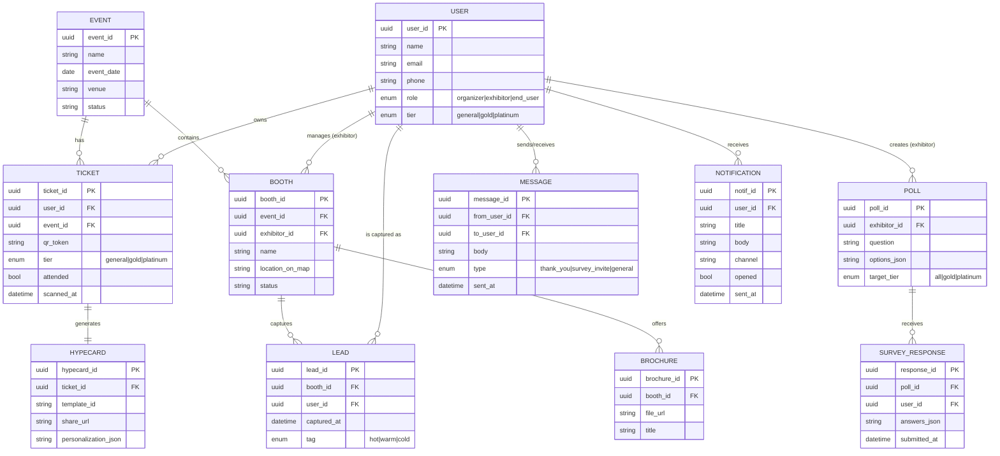

---

## Developer Implementation Notes

### API Endpoints Summary

| Endpoint | Method | Role | Description |
|---|---|---|---|
| `/events` | POST | Organizer | Create event |
| `/events/:id/tickets/tiers` | POST | Organizer | Define ticket tiers |
| `/events/:id/booths` | POST | Organizer | Create booth slots |
| `/booths/:id/assign` | PATCH | Organizer | Assign exhibitor |
| `/tickets/generate` | POST | End User | Generate ticket from invite |
| `/tickets/:id/hypecard` | POST | End User | Generate hypecard |
| `/attendance/validate` | POST | System/Scanner | Validate QR & mark attendance |
| `/leads/capture` | POST | Exhibitor | Capture lead via QR scan |
| `/leads/:id/tag` | PATCH | Exhibitor | Tag a lead |
| `/brochures` | POST | Exhibitor | Upload brochure |
| `/polls` | POST | Exhibitor | Create poll/survey |
| `/polls/:id/send` | POST | Exhibitor | Send poll to leads |
| `/messages/send` | POST | Exhibitor | Send thank you / message |
| `/notifications` | GET | All | Get user notifications |

### Key Business Rules
- **Platinum users** must always be routed to a dedicated lane; scanner UI must surface tier prominently.
- **Gold users** must have reserved seating honored; check against `seat_reservation` table before entry confirmation.
- **QR tokens** must be single-use per event day (revalidation on re-entry if permitted by organizer setting).
- **Hypecard templates** are gated by tier; API must enforce tier-template relationship on generate call.
- **Exhibitors** can only capture leads from users who have scanned their specific booth QR — no cross-booth access.
- **Thank you notes and surveys** can only be sent to leads in the exhibitor's own lead list.
- All **messages and notifications** must be stored for audit and allow users to mark as read/dismiss.

---

*Last Updated: February 2026 · Events CRM v1.0 · For Development Use*
