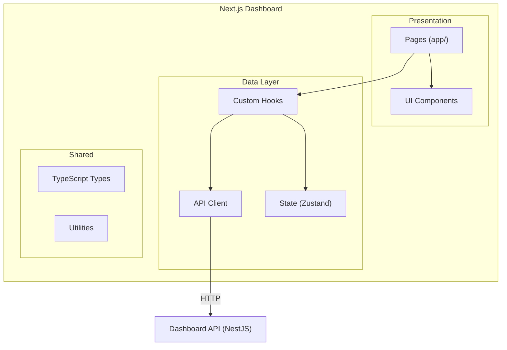

# Next.js Dashboard Architecture Guide

This document defines the project structure, patterns, and best practices for the Analytics Dashboard UI built with Next.js 14 (App Router).

---

## 1. Architecture Overview



---

## 2. Project Structure

```
packages/dashboard-ui/
├── app/                              # Next.js App Router
│   ├── layout.tsx                    # Root layout
│   ├── page.tsx                      # Overview (/)
│   ├── globals.css                   # Global styles
│   │
│   ├── funnel/
│   │   └── page.tsx                  # Funnel analysis
│   │
│   ├── sessions/
│   │   ├── page.tsx                  # Session list
│   │   └── [id]/
│   │       └── page.tsx              # Session detail
│   │
│   └── realtime/
│       └── page.tsx                  # Real-time activity
│
├── components/
│   ├── ui/                           # Base components
│   │   ├── button.tsx
│   │   ├── card.tsx
│   │   ├── table.tsx
│   │   ├── select.tsx
│   │   └── date-picker.tsx
│   │
│   ├── charts/                       # Visualization
│   │   ├── funnel-chart.tsx
│   │   ├── stat-card.tsx
│   │   ├── line-chart.tsx
│   │   └── event-timeline.tsx
│   │
│   ├── layout/                       # Layout components
│   │   ├── sidebar.tsx
│   │   ├── header.tsx
│   │   └── nav-link.tsx
│   │
│   └── filters/                      # Filter components
│       ├── date-range-filter.tsx
│       ├── obligation-filter.tsx
│       └── device-filter.tsx
│
├── hooks/                            # Custom hooks
│   ├── use-overview.ts
│   ├── use-funnel.ts
│   ├── use-sessions.ts
│   ├── use-events.ts
│   └── use-filters.ts
│
├── lib/                              # Utilities
│   ├── api.ts                        # API client
│   ├── utils.ts                      # Helper functions
│   └── constants.ts                  # App constants
│
├── store/                            # State management
│   ├── filter-store.ts               # Global filters
│   └── project-store.ts              # Active project
│
├── types/                            # TypeScript
│   ├── api.ts                        # API response types
│   ├── events.ts                     # Event types
│   └── dashboard.ts                  # Dashboard types
│
├── public/                           # Static assets
├── package.json
├── tailwind.config.js                # Tailwind config
├── next.config.js
└── tsconfig.json
```

---

## 3. Key Patterns

### 3.1 Data Fetching with React Query

Use TanStack Query (React Query) for server state management:

```typescript
// hooks/use-overview.ts
import { useQuery } from '@tanstack/react-query';
import { api } from '@/lib/api';
import { useFilterStore } from '@/store/filter-store';

export function useOverview() {
  const { dateRange, obligation } = useFilterStore();
  
  return useQuery({
    queryKey: ['overview', dateRange, obligation],
    queryFn: () => api.getOverview({
      startDate: dateRange.start,
      endDate: dateRange.end,
      obligation,
    }),
    staleTime: 30 * 1000, // 30 seconds
  });
}
```

### 3.2 API Client

```typescript
// lib/api.ts
const API_BASE = process.env.NEXT_PUBLIC_API_URL || 'http://localhost:3001';

class ApiClient {
  private async fetch<T>(endpoint: string, params?: Record<string, string>): Promise<T> {
    const url = new URL(`${API_BASE}${endpoint}`);
    if (params) {
      Object.entries(params).forEach(([key, value]) => {
        if (value) url.searchParams.set(key, value);
      });
    }
    
    const res = await fetch(url.toString());
    if (!res.ok) throw new Error(`API Error: ${res.status}`);
    
    const json = await res.json();
    return json.data;
  }
  
  getOverview(params: OverviewParams) {
    return this.fetch<OverviewResponse>('/api/dashboard/overview', params);
  }
  
  getFunnel(params: FunnelParams) {
    return this.fetch<FunnelResponse>('/api/dashboard/funnel', params);
  }
  
  getSessions(params: SessionsParams) {
    return this.fetch<SessionsResponse>('/api/dashboard/sessions', params);
  }
  
  getEvents(sessionId: string) {
    return this.fetch<EventsResponse>(`/api/dashboard/events`, { sessionId });
  }
}

export const api = new ApiClient();
```

### 3.3 Global Filter State (Zustand)

```typescript
// store/filter-store.ts
import { create } from 'zustand';
import { persist } from 'zustand/middleware';

interface FilterState {
  dateRange: { start: string; end: string };
  obligation: 'all' | 'mri' | 'tot' | 'nil';
  deviceType: string[];
  
  setDateRange: (range: { start: string; end: string }) => void;
  setObligation: (ob: string) => void;
  setDeviceType: (types: string[]) => void;
}

export const useFilterStore = create<FilterState>()(
  persist(
    (set) => ({
      dateRange: {
        start: new Date(Date.now() - 7 * 24 * 60 * 60 * 1000).toISOString().split('T')[0],
        end: new Date().toISOString().split('T')[0],
      },
      obligation: 'all',
      deviceType: [],
      
      setDateRange: (range) => set({ dateRange: range }),
      setObligation: (obligation) => set({ obligation }),
      setDeviceType: (deviceType) => set({ deviceType }),
    }),
    { name: 'analytics-filters' }
  )
);
```

### 3.4 Reusable Chart Components

```typescript
// components/charts/stat-card.tsx
interface StatCardProps {
  title: string;
  value: string | number;
  change?: number;
  loading?: boolean;
}

export function StatCard({ title, value, change, loading }: StatCardProps) {
  if (loading) {
    return <Card className="animate-pulse" />;
  }
  
  return (
    <Card>
      <CardHeader>
        <CardTitle className="text-sm text-muted-foreground">{title}</CardTitle>
      </CardHeader>
      <CardContent>
        <div className="text-2xl font-bold">{value}</div>
        {change !== undefined && (
          <p className={cn('text-xs', change >= 0 ? 'text-green-500' : 'text-red-500')}>
            {change >= 0 ? '↑' : '↓'} {Math.abs(change)}%
          </p>
        )}
      </CardContent>
    </Card>
  );
}
```

### 3.5 Page Component Pattern

```typescript
// app/page.tsx (Overview)
'use client';

import { useOverview } from '@/hooks/use-overview';
import { StatCard } from '@/components/charts/stat-card';
import { DateRangeFilter } from '@/components/filters/date-range-filter';

export default function OverviewPage() {
  const { data, isLoading, error } = useOverview();
  
  if (error) {
    return <ErrorState message="Failed to load overview" />;
  }
  
  return (
    <div className="space-y-6">
      <div className="flex justify-between items-center">
        <h1 className="text-2xl font-bold">Overview</h1>
        <DateRangeFilter />
      </div>
      
      <div className="grid grid-cols-1 md:grid-cols-2 lg:grid-cols-4 gap-4">
        <StatCard
          title="Total Sessions"
          value={data?.totalSessions?.toLocaleString() ?? '-'}
          loading={isLoading}
        />
        <StatCard
          title="Unique Users"
          value={data?.totalUsers?.toLocaleString() ?? '-'}
          loading={isLoading}
        />
        <StatCard
          title="Conversion Rate"
          value={data ? `${(data.conversionRate * 100).toFixed(1)}%` : '-'}
          loading={isLoading}
        />
        <StatCard
          title="Avg Session Duration"
          value={data ? formatDuration(data.avgSessionDuration) : '-'}
          loading={isLoading}
        />
      </div>
    </div>
  );
}
```

---

## 4. Dashboard Pages

### 4.1 Overview Page

| Component | Data Source | Visualization |
|-----------|-------------|---------------|
| Total Sessions | `/overview` | Stat card |
| Unique Users | `/overview` | Stat card |
| Conversion Rate | `/overview` | Stat card + sparkline |
| Session Duration | `/overview` | Stat card |
| Sessions Over Time | `/overview` | Line chart |

### 4.2 Funnel Page

| Component | Data Source | Visualization |
|-----------|-------------|---------------|
| Journey Selector | Static | Dropdown (MRI/TOT/NIL) |
| Funnel Steps | `/funnel` | Horizontal bar chart |
| Drop-off Analysis | Computed | Percentage labels |

### 4.3 Sessions Page

| Component | Data Source | Visualization |
|-----------|-------------|---------------|
| Session Table | `/sessions` | Paginated table |
| Filters | Local state | Filter chips |
| Session Detail | `/events` | Event timeline |

### 4.4 Real-time Page

| Component | Data Source | Visualization |
|-----------|-------------|---------------|
| Live Event Feed | WebSocket | Scrolling list |
| Active Users | Computed | Counter |

---

## 5. Component Library

Using **shadcn/ui** for base components (Tailwind-based, customizable):

| Component | Source | Usage |
|-----------|--------|-------|
| Button | shadcn/ui | Actions |
| Card | shadcn/ui | Stat containers |
| Table | shadcn/ui | Session list |
| Select | shadcn/ui | Filters |
| DatePicker | shadcn/ui | Date range |
| Dialog | shadcn/ui | Event details |
| Skeleton | shadcn/ui | Loading states |

---

## 6. Chart Library

Using **Recharts** for visualizations:

| Chart Type | Component | Usage |
|------------|-----------|-------|
| Line | `<LineChart>` | Time series |
| Bar | `<BarChart>` | Funnels |
| Area | `<AreaChart>` | Session trends |

---

## 7. Styling Approach

| Aspect | Tool |
|--------|------|
| Framework | Tailwind CSS |
| Components | shadcn/ui |
| Dark Mode | `next-themes` |
| Icons | Lucide Icons |
| Animations | Tailwind animate |

---

## 8. TypeScript Types

```typescript
// types/dashboard.ts
export interface OverviewData {
  totalSessions: number;
  totalUsers: number;
  conversionRate: number;
  avgSessionDuration: number;
}

export interface FunnelStep {
  name: string;
  count: number;
  percent: number;
}

export interface Session {
  sessionId: string;
  startedAt: string;
  duration: number;
  eventCount: number;
  converted: boolean;
  deviceType: string;
  entryPage: string;
}

export interface Event {
  eventId: string;
  eventName: string;
  timestamp: string;
  properties: Record<string, unknown>;
}
```

---

## 9. Environment Variables

```env
# .env.local
NEXT_PUBLIC_API_URL=http://localhost:3001
NEXT_PUBLIC_PROJECT_KEY=default
```
