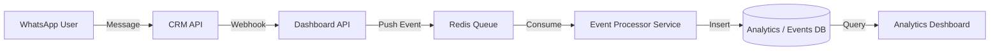

# Technical Specification: WhatsApp Analytics Event Architecture

## 1. Executive Summary
This document defines the architecture for the "Unified Event Stream" approach to WhatsApp Analytics. Instead of building a separate "Sync Service" to poll the CRM, we will leverage the existing **Redis -> Processor -> Postgres** pipeline used by Web Analytics. This enables real-time tracking of growth, response times, and agent performance.

## 2. Architecture Diagram



## 3. Implementation Steps

### Phase 1: Event Producer (Dashboard API)

**Goal:** Capture CRM webhooks and push them to the Redis queue.

1.  **Create `WhatsappWebhookController`** in `apps/dashboard-api`.
2.  **Define Event Types:**
    *   `whatsapp.message.received`
    *   `whatsapp.message.sent`
    *   `whatsapp.status.updated` (delivered, read)
3.  **Queue Injection:**
    *   Inject `QueueService` into the controller.
    *   Push standardized event payload:
    ```typescript
    {
      eventName: 'message_received',
      channelType: 'whatsapp',
      userId: body.contact.phone, // Identity
      timestamp: new Date(),
      properties: {
        direction: 'inbound',
        contentLength: body.message.text.length,
        hasMedia: !!body.message.media
      }
    }
    ```

### Phase 2: Event Processor (Worker)

**Goal:** Consume WhatsApp events and save to the `events` table.

1.  **Update `EventProcessorService` (`apps/processor`):**
    *   Modify `enrichEvent()` to handle `channelType: 'whatsapp'`.
    *   **Skip** `UseragentEnricher` (not applicable).
    *   **Skip** `GeoipEnricher` (unless IP is provided by webhook).
2.  **Identity Resolution:**
    *   Ensure `userId` is mapped correctly to `whatsapp_number`.

### Phase 3: Analytics Queries (Dashboard)

**Goal:** Replace "N/A" UI with SQL queries against the `events` table.

| Metric | SQL Logic |
| :--- | :--- |
| **Response Time** | Join `message_received` with next `message_sent` by `userId`, avg(diff). |
| **Growth Rate** | Count distinct `userId` where `event_name = 'first_contact'` group by day. |
| **Peak Hours** | Count `message_received` group by `hour(timestamp)`. |

## 4. Database Schema

We reuse the existing `events` table. No new migrations required unless specific WhatsApp metadata columns are needed (most can go in `properties` JSONB).

## 5. Feasibility Analysis

*   **Infrastructure:** ✅ Exists (Redis, Processor, Postgres).
*   **Complexity:** 🟢 Low (Code changes only, no new infra).
*   **Scale:** ✅ Redis handles high throughput burst traffic from webhooks.
*   **Latency:** ✅ Near Real-time (< 5s delay).

## 6. Next Steps
1.  Developer to implement `WhatsappWebhookController`.
2.  Developer to update `EventProcessorService` to accept `whatsapp` channel.
3.  Deploy and verify events appearing in DB.
